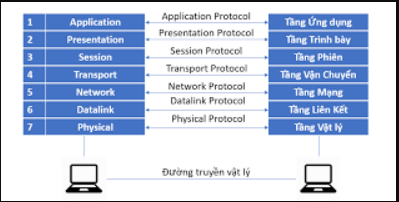

# Tìm hiểu về mô hình OSI và TCP/IP
## Mô hình OSI
MÔ hình OSI(Open systems Interconnection) là mô hình tham chiếu kết nối hệ thống mở. Nó được chia làm 7 tầng để ta tham chiếu các quá trình kết nối truyền thông và giao thức mạng giữa các máy tính

### Mô hình OSI sẽ gồm 7 tầng :
#### Application: 
Cung cấp ứng dụng kết nối giao tiếp với người dùng và còn cung cấp cả cơ chế tiếp cận người dùng. 
#### Presentation: 
Thông ngôn dữ liệu,cấu trúc dữ liệu ,định dạng dữ liệu và cung cấp vài cơ chế mã hóa.
#### Session: 
Truyền thông giữa 2 host.Quản lý các phiên làm việc, nó duy trì cho các phiên làm việc nào truyền đúng dữ liệu về phiên đấy như nghe nhạc thì dữ liệu sẽ truyền đúng về phần nghe nhạc
#### Transport: 
Quản lý các thiết bị đầu cuối end to end.Thiết lập và duy trì một kết nối ảo
#### Network(Tầng mạng): 
Phân phối dữ liệu trên đường truyền vật lý. Định vị đường đi tối ưu của các gói tin.Đánh địa chỉ logic(ip)
#### Data link : 
Giúp dữ liêuj truy cập vào đường truyền vật lý ở phía dưới.Quy định các loại dữ liệu sẽ được truyền đi như thế nào
#### Physical(Tầng vật lý): 
Nó định nghiac về phần cơ , điện ,quang.
### Quá trình truyền dữ liệu đi của dữa liệu thông qua tham chiếu OSI
Nếu ta định nghĩa máy 1 là máy gửi và máy 2 là máy nhận thì quá trình sẽ được gửi đi như sau: Ở mỗi tầng ở máy 1 sẽ được gắn vào 1 header để định nghĩa tầng đó và sẽ được gửi tới máy 2 và ở máy 2 sẽ phá vỡ header ở từng tầng và từ đó ta nhận được 1 gói tin hoàn chỉnh 

### Mô hình TCP/IP:
MÔ hinhf TCP/IP cũng tương tự mô hình OSI nhưng nó đã được gộp lại và rút gọn thành 4 tầng. (application, Presentation,sesion) chuyển thành tầng (application).(transport)giữ nguyên là (transport).(Network) chuyển thành (internet).(data link ,physical) chuyển thành (network access).

### Chi tiết các tầng trong TCP/IP
#### Applicayion :
##### File transfer : FTP, TFTP, Network file system
##### E- mail : SMTP
##### Remote login : Telnet, rlogin
##### Network management: SNMP
##### Name management : Domain name system
#### Transport :
Các tính chất của tầng transport
- Tổ chức ghép nối các phiên làm việc
- Phân mảnh dữ liệu :chia nhỏ dữ liệu thành nhiều segment
- Điều khiển luồng : Khi các đường truyền quá tải hoặc lỗi thì sẽ được gọi ra
- Truyền theo hướng kết nối và truyền không theo hướng kết nối :khi truyền theo hướng kết nối ta cần phải thiết lập một kết nối luận lý còn cái kia thì không
- Truyền theo hướng tin cậy : Dữ liệu bên B nhận phải hoàn chỉnh và thông báo lại cho bên A là nhận được rồi

Hai giao thưcs quan trọng TCP và UDP
- TCP là truyền theo hướng tin cậy , phải có kết nối luận lý rồi mới bắt dầu truyền . Ứng dụng cho e-mail,dowloading,file sharing
- UDP là truyền theo hướng tổng lực, như tên nó sẽ không cần kết nối luận lý mà cứ thế tổng lực truyền gói tin không cần biết bên kia có nhận được đày đủ không. Ứng dụng cho voice streaming , video streaming

Một số port thông dụng
- TCP 20 : FTP (Data)
- TCP 21 : FTP (Control)
- TCP 22 : SSH.
- TCP 23 : Telnet.
- TCP 25 : SMTP.
- UDP 53 : DNS.
- UDP 67 : DHCP（Server）
- UDP 68 : DHCP（Client）
- TCP 80 : HTTP
- TCP 110 : POP3
- UDP 123 : NTP
- TCP 443 : HTTPS
- WELL KNOWN PORT NUMBERS 0~1023