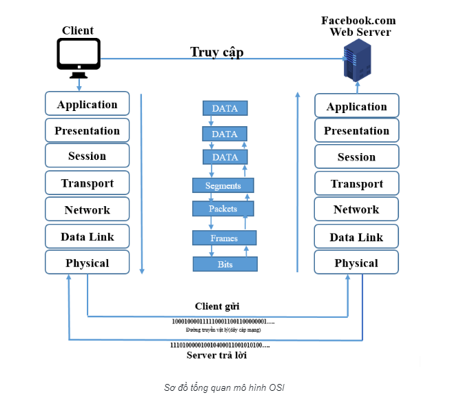

 Tìm hiểu về mô hình OSI và TCP/IP
## Mô hình OSI
MÔ hình OSI(Open systems Interconnection) là mô hình tham chiếu kết nối hệ thống mở. Nó được chia làm 7 tầng để ta tham chiếu các quá trình kết nối truyền thông và giao thức mạng giữa các máy tính

### Mô hình OSI sẽ gồm 7 tầng :
#### 1.Application: 
- Cung cấp giao diện sử dụng cho người dùng (như chorme,facebook,...)
- Thực hiện chức năng chuyển file , trong đó giải quyết các vấn đề như không tương thích cách đặt tên
- Cung cấp các dịch vụ tiêu biểu cho người dùng như Web ,mail,dns,dhcp,ftp.

#### 2.Presentation: 
- Giải quyết vấn đề liên quan đến cú pháp ,ngữ nghĩa của thông tin như chuyển đổi thông tin theo một chuẩn nào đó được 2 bên sử dụng (mã ASCII - EBCDIC)
- Nén, giãn dữ liệu để giản số bit truyền trên mạng
- Mã hóa dữ liệu để thực hiện quyền truy cập
- Các giao thức tiêu biểu tầng Presentation sử dụng : XDR(Extreme Dynamic Range), ASN.1 (Abstract Syntax Notation One), SMB (Server Message Block), AFP (Alpha-fetoprotein), NCP (Network Control Protocol).
#### 3.Session: 
- Tầng này cho phép người sử dụng trên các máy khác nhau thiết lập ,duy trì, hủy bỏ ,đồng bộ phiên truyền thông giữa họ
- Quản lý token : Cơ chế thẻ bài được phiên cung cấp tránh hiện tượng tranh chấp đường truyền trên mạng
- Thực hiện đồng bộ : Thực hiện với các dữ liệu lớn băngf cách thêm vào các thông tin kiểm tra sửa lỗi.
- Các giao thức tiêu biểu tầng Session sử dụng : ASAP, TLS, ISO 8327 / CCITT X.225, RPC, NetBIOS, ASP
#### 4.Transport: 
- Kiểm soát việc truyền tin từ nút tới nút (end to end),bắt đầu từ tầng này các thực thể đã có thể nói chuyện logic với nhau
- Thực hiện ghép kênh với kênh . Mỗi ứng dụng có thể gửi đi theo nhiều con đường . Một đường truyền có thể được nhiều ứng dụng sử dụng. Phân kênh/ hợp kênh giải quyết vấn đề chia sẻ dữ liệu cho các ứng dụng
- Khắc phục sai sót trong quá trình truyền tinh. Việc khắc phục sai sót được thực hiện trên nhiều tầng nhưng hiệu quả ở tầng cao nhất. Việc khắc phục sai sót ở tầng transport là hợp lý nhất.
- Các giao thức tiêu biểu ở tầng transport sử dụng :TCP,UDP,RTP,SCTP.
#### 5.Network(Tầng mạng): 
- Vấn đề chủ chốt của tầng mạng là định tuyến , định rõ các gói tin được truyền theo những con đường nào từ nguồn tới đích
- Con đường này có thể cố định, ít bị thay đổi, được thiết lập khi bắt đầu liên kết hay thay đổi tùy theo trạng thái của mạng
- Nếu có nhiều gói tin truyền trên mạng có thể gây ra tắc nghẽn ,tầng mạng giải quyết vấn đề này
- Thực hiện chức năng giao tiếp với các mạng bao gồm đánh địa chỉ IP ,cắt hợp gói tin sao cho phù hợp với các mạng, Xác định đường đi từ nguồn tới đich bằng địa chỉ IP
- Ngoài ra tầng mạng còn thực hiện một số các chức năng kế toán khác như một số firewall được cài đặt trên tầng này để hệ thống thống kê các gói tin truyền qua hay ngăn cấm hoặc cho phép gói tin của giao thức nào đó
- Các giao thức tiêu biểu network sử dụng : IP,ICMP,IGMP,IPX...
#### 6.Data link : 
- Tầng này có nhiệm vụ truyền dữ liệu giữa các mạng kề nhau trong một mạng diện rộng hoặc giữac các nút trong một segment mạng cục bộ
- Ngoài ra tầng data link còn kiểm soát lỗi đường truyền , thông lượng
- Tầng này thực hiện việc đóng gói thông tin thành các frame ,gửi các frame một cách tuần tự trên mạng , xử lý các thông báo xác nhận (Acknowleggement frame) do bên nhận gửi về
- Xác định ranh giới giữa các frame bằng cách ghi một số byte đặc biệt vào đầu và cuối frame.
- Các giao thức tiêu biểu tầng data link sử dụng : Ethernet, token ring, Frame ,wifi
#### 7.Physical(Tầng vật lý): 
- Tầng vật lý liên quan đến truyền các bit giữa các máy bằng truyền thông vật lý, cấu trúc của dữ liệu không được quan tâm đến
- Tầng vật lý quan tâm đến mối ghép cơ khí .điện tử và môi trường truyền bên dưới nó
- Các thông tin được mã hóa thành các bit 0-1 tương tự như tín hiệu bật tắt điện
### Quá trình truyền dữ liệu đi của dữa liệu thông qua tham chiếu OSI

- Bước 1: ở tầng application người dùng sẽ đưa thông tin cần gửi vào máy tính như văn bản, hình ảnh sau đó dữ liệu sẽ được chuyển xuống tầng 6 để chuyển dữ liệu thành dạng chung, mã hóa dữ liệu và nén dữ liệu. Dữ liệu tiếp tục đi xuống tầng session tầng này bổ xung thông tin cho phiên giao dịch 
- Bước 2: Tiếp theo đóng gói toàn bộ thông tin ở tầng session đưa xuống tầng transport .Lúc này toàn bộ goí tin ở tầng trên sẽ được tầng transport coi như là data và bắt đầu đóng gói các header (TCP/UDP header) , phần này sẽ được gọi là segment và segment sẽ được đưa xuống tầng network
- Bước 3 : ở tầng network sẽ được đóng thêm IP header vào segment chuyển tên thành packet
- Bước 4 :packet tiếp tục được đưa xuống tầng data link và packet được bọc thêm ethernet header và phần kiểm tra lỗi FCS lúc này được gọi là frame và được đưa xuống tầng physical và được truyền tải sang máy khác dưới dạng bit nhị phân
- Bước 5 :Ở máy nhận bên kia sau khi nhận được gói tin sẽ truyền theo hướng ngược lại từ tầng vật lý lên application.Ở mỗi tầng tương ứng nó sẽ gỡ các header mà mỗi tầng đã gắn vào nó khi đến tầng application ta sẽ nhận được đúng những thứ mà ta gửi đi ở tầng application

### Mô hình TCP/IP:
MÔ hinhf TCP/IP cũng tương tự mô hình OSI nhưng nó đã được gộp lại và rút gọn thành 4 tầng. (application, Presentation,sesion) chuyển thành tầng (application).(transport)giữ nguyên là (transport).(Network) chuyển thành (internet).(data link ,physical) chuyển thành (network access).

### Chi tiết các tầng trong TCP/IP
#### Tầng Applicayion trong TCP/IP:
- File transfer : FTP, TFTP, Network file system
- E- mail : SMTP
- Remote login : Telnet, rlogin
- Network management: SNMP
- Name management : Domain name system
#### Tầng Transport trong TCP/IP:
Các tính chất của tầng transport
- Tổ chức ghép nối các phiên làm việc
- Phân mảnh dữ liệu :chia nhỏ dữ liệu thành nhiều segment
- Điều khiển luồng : Khi các đường truyền quá tải hoặc lỗi thì sẽ được gọi ra
- Truyền theo hướng kết nối và truyền không theo hướng kết nối :khi truyền theo hướng kết nối ta cần phải thiết lập một kết nối luận lý còn cái kia thì không
- Truyền theo hướng tin cậy : Dữ liệu bên B nhận phải hoàn chỉnh và thông báo lại cho bên A là nhận được rồi

Hai giao thưcs quan trọng TCP và UDP
- TCP là truyền theo hướng tin cậy , phải có kết nối luận lý rồi mới bắt dầu truyền . Ứng dụng cho e-mail,dowloading,file sharing
- UDP là truyền theo hướng tổng lực, như tên nó sẽ không cần kết nối luận lý mà cứ thế tổng lực truyền gói tin không cần biết bên kia có nhận được đày đủ không. Ứng dụng cho voice streaming , video streaming

Một số port thông dụng
- TCP 20 : FTP (Data)
- TCP 21 : FTP (Control)
- TCP 22 : SSH.
- TCP 23 : Telnet.
- TCP 25 : SMTP.
- UDP 53 : DNS.
- UDP 67 : DHCP（Server）
- UDP 68 : DHCP（Client）
- TCP 80 : HTTP
- TCP 110 : POP3
- UDP 123 : NTP
- TCP 443 : HTTPS
- WELL KNOWN PORT NUMBERS 0~1023

Quá trình của một kết nối luận lý

Quá trình này gọi là bắt tay 3 bước :bên A sẽ gưi send1 và bên B nhận được vẽ gửi ACK 2 về A thông báo rằng đã nhận đc và bên A sẽ gửi tiếp send2 tiếp tục. Quas trình này sẽ liên tục.
 ### Tầng Internet trong TCP/ip
 Giao thức IPv4 là quan trọng nhất của tầng này 

 Định nghĩa
- Là giao thức internet phiên bản 4 và là phương thức đầu tiên được sử dụng rộng rãi
- Địa chỉ ipv4 gồm 32 bit nhị phân và được chia làm 4 octet được biểu diễn ở dạng thập phân và ngăn cách nhau bằng dấu chấm

VD: 192.168.10.119
Phân loại ipv4

Lớp A
- Gồm 1 octet đầu làm netwwork và 3 octet cuối làm host
- Bit đầu tiên luôn là 0
- Địa chỉ lớp A gồm 1.0.0.0-126.0.0.0 và 127.0.0.0 làm loopback

Lớp B
- Gồm 2 octet đầu làm netwwork và 2 octet sau làm host
- 2 Bit đàu tiên là 10
- Địa chỉ lớp B gồm 128.0.0.0-191.255.0.0

Lớp C
- Gồm 3 octet đầu là netwwork và 1 octet sau làm host
- Ba bít đầu luôn là 110
- Địa chỉ lớp C gồm 192.0.0.0-223.255.255.0

Lớp D
224.0.0.0-239.255.255.255

Lớp E
Từ 240.0.0.0 trở đi

IP public và ip private
- Public ip được sử dụng cho các gói tin đi ra ngoài internet
- private ip đucowj sử dụng cho các gói tin trong mạng nội bộ,có thể được sử dụng lặp đi lặp lại trong các mạng LAN khác nhau
- Dải địa chỉ IP private
lớp A :10.X.X.X
lớp B : 172.16.X.X
Lớp C :192.168.X.X

Các kiểu định tuyến 
-  Broadcast 
 trong trường hợp này, Một gói broadcast chuyển đến tất cả những thiết bị tham gia trong một mạng cục bộ, mà không cần phải được quy định rõ ràng như một máy nhận. Do đó broadcast nên được giới hạn trong những phần riêng của mạng, và không được router chuyển tiếp. Tất cả các bit host đều bằng 1.
- Anycast
là một phương pháp sử dụng các địa chỉ mạng và định tuyến để gửi dữ liệu từ một nguồn duy nhất đến một trong những nút của một nhóm các thiết bị, dựa trên căn bản là gần nhất, ít tốn kém nhất, khỏe mạnh nhất, tuyến ít bị nghẽn nhất
- Multicast
được sử dụng để mô tả cách thức truyền tin được gửi từ 1 điểm đến nhiều điểm khác
- unicast
 được sử dụng trong mạng máy tính để mô tả cách thức truyền tin được gửi từ 1 điểm đến 1 điểm khác.
- Chia subnet
- Mượn n bit từ Host để lấy làm Network.
- Số subnet : 2^n
- Số host/subnet 2^m - 2 (m là số bit làm Host )

### Tầng access network trong TCP/IP
Tầng này mô tả về phần vật lý được sử dụng như cable ,điện, thiết bị model... Các gói tin sẽ được chuyển thành nhị phân và được truyền đi dưới dạng tín hiệu điện .Tầng này không quá tập trung nhiều
