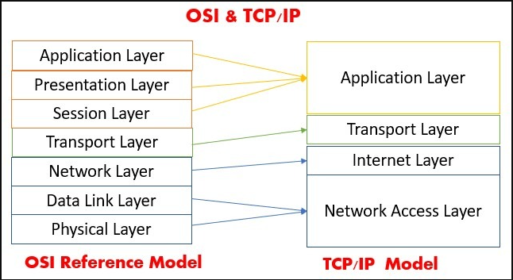

 Tìm hiểu về mô hình OSI và TCP/IP
## Mô hình OSI
MÔ hình OSI(Open systems Interconnection) là mô hình tham chiếu kết nối hệ thống mở. Nó được chia làm 7 tầng để ta tham chiếu các quá trình kết nối truyền thông và giao thức mạng giữa các máy tính

### Mô hình OSI sẽ gồm 7 tầng :
#### 1.Application: 
- Cung cấp giao diện sử dụng cho người dùng (như chorme,facebook,...)
- Thực hiện chức năng chuyển file , trong đó giải quyết các vấn đề như không tương thích cách đặt tên
- Cung cấp các dịch vụ tiêu biểu cho người dùng như Web ,mail,dns,dhcp,ftp.

#### 2.Presentation: 
- Giải quyết vấn đề liên quan đến cú pháp ,ngữ nghĩa của thông tin như chuyển đổi thông tin theo một chuẩn nào đó được 2 bên sử dụng (mã ASCII - EBCDIC)
- Nén, giãn dữ liệu để giản số bit truyền trên mạng
- Mã hóa dữ liệu để thực hiện quyền truy cập
- Các giao thức tiêu biểu tầng Presentation sử dụng : XDR(Extreme Dynamic Range), ASN.1 (Abstract Syntax Notation One), SMB (Server Message Block), AFP (Alpha-fetoprotein), NCP (Network Control Protocol).
#### 3.Session: 
- Tầng này cho phép người sử dụng trên các máy khác nhau thiết lập ,duy trì, hủy bỏ ,đồng bộ phiên truyền thông giữa họ
- Quản lý token : Cơ chế thẻ bài được phiên cung cấp tránh hiện tượng tranh chấp đường truyền trên mạng
- Thực hiện đồng bộ : Thực hiện với các dữ liệu lớn băngf cách thêm vào các thông tin kiểm tra sửa lỗi.
- Các giao thức tiêu biểu tầng Session sử dụng : ASAP, TLS, ISO 8327 / CCITT X.225, RPC, NetBIOS, ASP
#### 4.Transport: 
- Kiểm soát việc truyền tin từ nút tới nút (end to end),bắt đầu từ tầng này các thực thể đã có thể nói chuyện logic với nhau
- Thực hiện ghép kênh với kênh . Mỗi ứng dụng có thể gửi đi theo nhiều con đường . Một đường truyền có thể được nhiều ứng dụng sử dụng. Phân kênh/ hợp kênh giải quyết vấn đề chia sẻ dữ liệu cho các ứng dụng
- Khắc phục sai sót trong quá trình truyền tinh. Việc khắc phục sai sót được thực hiện trên nhiều tầng nhưng hiệu quả ở tầng cao nhất. Việc khắc phục sai sót ở tầng transport là hợp lý nhất.
- Các giao thức tiêu biểu ở tầng transport sử dụng :TCP,UDP,RTP,SCTP.
#### 5.Network(Tầng mạng): 
- Vấn đề chủ chốt của tầng mạng là định tuyến , định rõ các gói tin được truyền theo những con đường nào từ nguồn tới đích
- Con đường này có thể cố định, ít bị thay đổi, được thiết lập khi bắt đầu liên kết hay thay đổi tùy theo trạng thái của mạng
- Nếu có nhiều gói tin truyền trên mạng có thể gây ra tắc nghẽn ,tầng mạng giải quyết vấn đề này
- Thực hiện chức năng giao tiếp với các mạng bao gồm đánh địa chỉ IP ,cắt hợp gói tin sao cho phù hợp với các mạng, Xác định đường đi từ nguồn tới đich bằng địa chỉ IP
- Ngoài ra tầng mạng còn thực hiện một số các chức năng kế toán khác như một số firewall được cài đặt trên tầng này để hệ thống thống kê các gói tin truyền qua hay ngăn cấm hoặc cho phép gói tin của giao thức nào đó
- Các giao thức tiêu biểu network sử dụng : IP,ICMP,IGMP,IPX...
#### 6.Data link : 
- Tầng này có nhiệm vụ truyền dữ liệu giữa các mạng kề nhau trong một mạng diện rộng hoặc giữac các nút trong một segment mạng cục bộ
- Ngoài ra tầng data link còn kiểm soát lỗi đường truyền , thông lượng
- Tầng này thực hiện việc đóng gói thông tin thành các frame ,gửi các frame một cách tuần tự trên mạng , xử lý các thông báo xác nhận (Acknowleggement frame) do bên nhận gửi về
- Xác định ranh giới giữa các frame bằng cách ghi một số byte đặc biệt vào đầu và cuối frame.
- Các giao thức tiêu biểu tầng data link sử dụng : Ethernet, token ring, Frame ,wifi
#### 7.Physical(Tầng vật lý): 
- Tầng vật lý liên quan đến truyền các bit giữa các máy bằng truyền thông vật lý, cấu trúc của dữ liệu không được quan tâm đến
- Tầng vật lý quan tâm đến mối ghép cơ khí .điện tử và môi trường truyền bên dưới nó
- Các thông tin được mã hóa thành các bit 0-1 tương tự như tín hiệu bật tắt điện
### Quá trình truyền dữ liệu đi của dữa liệu thông qua tham chiếu OSI

- Bước 1: ở tầng application người dùng sẽ đưa thông tin cần gửi vào máy tính như văn bản, hình ảnh sau đó dữ liệu sẽ được chuyển xuống tầng 6 để chuyển dữ liệu thành dạng chung, mã hóa dữ liệu và nén dữ liệu. Dữ liệu tiếp tục đi xuống tầng session tầng này bổ xung thông tin cho phiên giao dịch 
- Bước 2: Tiếp theo đóng gói toàn bộ thông tin ở tầng session đưa xuống tầng transport .Lúc này toàn bộ goí tin ở tầng trên sẽ được tầng transport coi như là data và bắt đầu đóng gói các header (TCP/UDP header) , phần này sẽ được gọi là segment và segment sẽ được đưa xuống tầng network
- Bước 3 : ở tầng network sẽ được đóng thêm IP header vào segment chuyển tên thành packet
- Bước 4 :packet tiếp tục được đưa xuống tầng data link và packet được bọc thêm ethernet header và phần kiểm tra lỗi FCS lúc này được gọi là frame và được đưa xuống tầng physical và được truyền tải sang máy khác dưới dạng bit nhị phân
- Bước 5 :Ở máy nhận bên kia sau khi nhận được gói tin sẽ truyền theo hướng ngược lại từ tầng vật lý lên application.Ở mỗi tầng tương ứng nó sẽ gỡ các header mà mỗi tầng đã gắn vào nó khi đến tầng application ta sẽ nhận được đúng những thứ mà ta gửi đi ở tầng application

### Mô hình TCP/IP:
MÔ hinhf TCP/IP cũng tương tự mô hình OSI nhưng nó đã được gộp lại và rút gọn thành 4 tầng. 
- (application, Presentation,sesion) chuyển thành tầng (application).
- (transport)giữ nguyên là (transport).
- (Network) chuyển thành (internet).
- (data link ,physical) chuyển thành (network access).

### Chi tiết các tầng trong TCP/IP
#### 1 Tầng Application 
- Tầng này có vai trò giao tiếp dữ liệu giữa 2 máy khác nhau
- Cung cấp cho các ứng dụng các trao đổi chuẩn hóa ,giao tiếp dữ liệu giữa 2 máy khác nhau thông qua các dịch vụ mạng khác nhau
- Một số ứng dụng phổ biến ở tầng này :Telnet, FTP, SMTP, DNS, HTTP, HTTPS, Mail
#### 2 Tầng Transport 
- Tầng giao thức này nằm dưới tầng Ứng dụng , Tầng giao vận (Host-to-Host Transport Layer hay thường gọi là Transport Layer)
- Hai giao thức quan trọng nhất của tầng này là Transmission Control Protocol (TCP) và User Datagram Protocol (UDP). 
- TCP cung cấp dịch vụ chuyển giao thông tin có kết nối (connection-oriented), nó bao gồm cả việc kiểm tra và sửa lỗi.
- UDP cung cấp dịch vụ kém tin cậy hơn (unreliable) và không thiết lập liên kết trước (connectionless)
- Cả hai giao thức đều chuyển giao thông tin giữa tầng ứng dụng và tầng Internet. Chương trình ứng dụng có thể lựa chọn dịch vụ nào thích hợp với nó

Một số port thông dụng
- TCP 20 : FTP (Data)
- TCP 21 : FTP (Control)
- TCP 22 : SSH.
- TCP 23 : Telnet.
- TCP 25 : SMTP.
- UDP 53 : DNS.
- UDP 67 : DHCP（Server）
- UDP 68 : DHCP（Client）
- TCP 80 : HTTP
- TCP 110 : POP3
- UDP 123 : NTP
- TCP 443 : HTTPS
- WELL KNOWN PORT NUMBERS 0~1023

 ### 3 Tầng Internet trong TCP/ip
 - Chức năng quan trọng nhất của tầng Internet chịu trách nhiệm định tuyến (dẫn đường) cho các gói tin và chọn lựa con đường tối ưu để truyền các gói tin từ trạm nguồn tới trạm đích
 - Chức năng tiếp theo đóng gói dữ liệu thành các gói được gọi là IP Packet
 - IP Packet chứa địa chỉ IP nguồn và  địa chỉ IP đích (nó giống như việc 1 bức thư có địa chỉ người gửi và địa chỉ người nhận).
 - Khi các gói tin được gửi tới địa chỉ IP đích các gói dữ liệu có thể xuất hiện theo thứ tự khác với thứ tự được gửi đi. Nhiệm vụ của các lớp cao hơn là sắp xếp lại chúng để đưa chúng đến các ứng dụng mạng thích hợp hoạt động ở lớp Application
 - Các giao thức chính ở tầng internet :IP (Internet Protocol) ,ICMP (Internet Control Message Protocol) ,ARP (Address Resolution Protocol) ,RARP (Reverse Address Resolution Protocol) ,IGMP (Internet Group Management Protocol).

### Tầng access network trong TCP/IP
- Bao gồm các giao thức chỉ hoạt động trên một liên kết - thành phần mạng kết nối các nút hoặc máy chủ trong mạng. Các giao thức trong lớp thấp nhất này bao gồm Ethernet cho mạng cục bộ và Giao thức phân giải địa chỉ .
- Chức năng chính của tầng này là đóng gói thông tin packet của tầng internet thành các frame được truyền dẫn trên mạng và chuyển địa chỉ ip thành địa chỉ vậy lý sử dụng bơi bởi mạng máy tính
- Một trong số các điểm mạnh của bộ  Giao thức TCP/IP là địa chỉ của nó được phối hợp sao cho trên mạng Internet không có một thiết bị mạng nào cùng tên. Địa chỉ này phải được chuyển đổi thích hợp với địa chỉ mạng vật lý nơi mà dữ liệu được truyền đi.
## So sánh hai mô hinh OSI và TCP/IP
### Giống nhau
- Cả 2 mô hình đều có kiến trúc phân lớp
- Cả 2 mô hình đều có tầng network và transport
- cả 2 mô hình cùng sử dụng kỹ thuật chuyển packet
### Khác nhau 
| Mô hình OSI | Mô hình TCP/IP |
| ----------- |:--------------:|
| left foo    | right foo      |
| left bar    | right bar      |
| left baz    | right baz      |
 