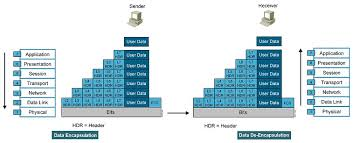
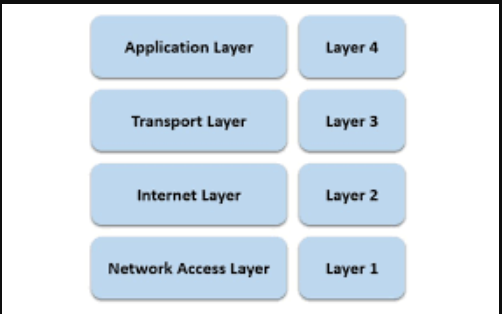
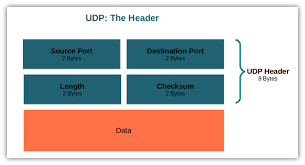
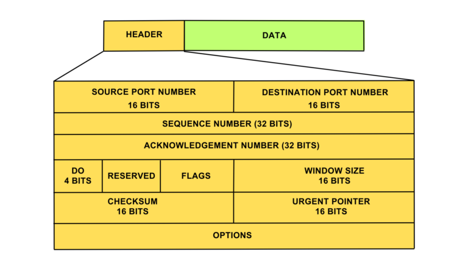

# Tìm hiểu về mô hình OSI và TCP/IP
## Mô hình OSI
MÔ hình OSI(Open systems Interconnection) là mô hình tham chiếu kết nối hệ thống mở. Nó được chia làm 7 tầng để ta tham chiếu các quá trình kết nối truyền thông và giao thức mạng giữa các máy tính

### Mô hình OSI sẽ gồm 7 tầng :
#### Application: 
Cung cấp ứng dụng kết nối giao tiếp với người dùng và còn cung cấp cả cơ chế tiếp cận người dùng. 
#### Presentation: 
Thông ngôn dữ liệu,cấu trúc dữ liệu ,định dạng dữ liệu và cung cấp vài cơ chế mã hóa.
#### Session: 
Truyền thông giữa 2 host.Quản lý các phiên làm việc, nó duy trì cho các phiên làm việc nào truyền đúng dữ liệu về phiên đấy như nghe nhạc thì dữ liệu sẽ truyền đúng về phần nghe nhạc
#### Transport: 
Quản lý các thiết bị đầu cuối end to end.Thiết lập và duy trì một kết nối ảo
#### Network(Tầng mạng): 
Phân phối dữ liệu trên đường truyền vật lý. Định vị đường đi tối ưu của các gói tin.Đánh địa chỉ logic(ip)
#### Data link : 
Giúp dữ liêuj truy cập vào đường truyền vật lý ở phía dưới.Quy định các loại dữ liệu sẽ được truyền đi như thế nào
#### Physical(Tầng vật lý): 
Nó định nghiac về phần cơ , điện ,quang.
### Quá trình truyền dữ liệu đi của dữa liệu thông qua tham chiếu OSI
Nếu ta định nghĩa máy 1 là máy gửi và máy 2 là máy nhận thì quá trình sẽ được gửi đi như sau: Ở mỗi tầng ở máy 1 sẽ được gắn vào 1 header để định nghĩa tầng đó và sẽ được gửi tới máy 2 và ở máy 2 sẽ phá vỡ header ở từng tầng và từ đó ta nhận được 1 gói tin hoàn chỉnh 

### Mô hình TCP/IP:
MÔ hinhf TCP/IP cũng tương tự mô hình OSI nhưng nó đã được gộp lại và rút gọn thành 4 tầng. (application, Presentation,sesion) chuyển thành tầng (application).(transport)giữ nguyên là (transport).(Network) chuyển thành (internet).(data link ,physical) chuyển thành (network access).

### Chi tiết các tầng trong TCP/IP
#### Tầng Applicayion trong TCP:
- File transfer : FTP, TFTP, Network file system
- E- mail : SMTP
- Remote login : Telnet, rlogin
- Network management: SNMP
- Name management : Domain name system
#### Tầng Transport trong TCP:
Các tính chất của tầng transport
- Tổ chức ghép nối các phiên làm việc
- Phân mảnh dữ liệu :chia nhỏ dữ liệu thành nhiều segment
- Điều khiển luồng : Khi các đường truyền quá tải hoặc lỗi thì sẽ được gọi ra
- Truyền theo hướng kết nối và truyền không theo hướng kết nối :khi truyền theo hướng kết nối ta cần phải thiết lập một kết nối luận lý còn cái kia thì không
- Truyền theo hướng tin cậy : Dữ liệu bên B nhận phải hoàn chỉnh và thông báo lại cho bên A là nhận được rồi

Hai giao thưcs quan trọng TCP và UDP
- TCP là truyền theo hướng tin cậy , phải có kết nối luận lý rồi mới bắt dầu truyền . Ứng dụng cho e-mail,dowloading,file sharing
- UDP là truyền theo hướng tổng lực, như tên nó sẽ không cần kết nối luận lý mà cứ thế tổng lực truyền gói tin không cần biết bên kia có nhận được đày đủ không. Ứng dụng cho voice streaming , video streaming

Một số port thông dụng
- TCP 20 : FTP (Data)
- TCP 21 : FTP (Control)
- TCP 22 : SSH.
- TCP 23 : Telnet.
- TCP 25 : SMTP.
- UDP 53 : DNS.
- UDP 67 : DHCP（Server）
- UDP 68 : DHCP（Client）
- TCP 80 : HTTP
- TCP 110 : POP3
- UDP 123 : NTP
- TCP 443 : HTTPS
- WELL KNOWN PORT NUMBERS 0~1023

Quá trình của một kết nối luận lý

Quá trình này gọi là bắt tay 3 bước :bên A sẽ gưi send1 và bên B nhận được vẽ gửi ACK 2 về A thông báo rằng đã nhận đc và bên A sẽ gửi tiếp send2 tiếp tục. Quas trình này sẽ liên tục.
 ### Tầng Internet trong TCP
 Giao thức IPv4 là quan trọng nhất của tầng này 

 Định nghĩa
- Là giao thức internet phiên bản 4 và là phương thức đầu tiên được sử dụng rộng rãi
- Địa chỉ ipv4 gồm 32 bit nhị phân và được chia làm 4 octet được biểu diễn ở dạng thập phân và ngăn cách nhau bằng dấu chấm

VD: 192.168.10.119
Phân loại ipv4

Lớp A
- Gồm 1 octet đầu làm netwwork và 3 octet cuối làm host
- Bit đầu tiên luôn là 0
- Địa chỉ lớp A gồm 1.0.0.0-126.0.0.0 và 127.0.0.0 làm loopback

Lớp B
- Gồm 2 octet đầu làm netwwork và 2 octet sau làm host
- 2 Bit đàu tiên là 10
- Địa chỉ lớp B gồm 128.0.0.0-191.255.0.0

Lớp C
- Gồm 3 octet đầu là netwwork và 1 octet sau làm host
- Ba bít đầu luôn là 110
- Địa chỉ lớp C gồm 192.0.0.0-223.255.255.0

Lớp D
224.0.0.0-239.255.255.255

Lớp E
Từ 240.0.0.0 trở đi

IP public và ip private
- Public ip được sử dụng cho các gói tin đi ra ngoài internet
- private ip đucowj sử dụng cho các gói tin trong mạng nội bộ,có thể được sử dụng lặp đi lặp lại trong các mạng LAN khác nhau
- Dải địa chỉ IP private
lớp A :10.X.X.X
lớp B : 172.16.X.X
Lớp C :192.168.X.X

Các kiểu định tuyến 
-  Broadcast 
 trong trường hợp này, Một gói broadcast chuyển đến tất cả những thiết bị tham gia trong một mạng cục bộ, mà không cần phải được quy định rõ ràng như một máy nhận. Do đó broadcast nên được giới hạn trong những phần riêng của mạng, và không được router chuyển tiếp. Tất cả các bit host đều bằng 1.
- Anycast
là một phương pháp sử dụng các địa chỉ mạng và định tuyến để gửi dữ liệu từ một nguồn duy nhất đến một trong những nút của một nhóm các thiết bị, dựa trên căn bản là gần nhất, ít tốn kém nhất, khỏe mạnh nhất, tuyến ít bị nghẽn nhất
- Multicast
được sử dụng để mô tả cách thức truyền tin được gửi từ 1 điểm đến nhiều điểm khác
- unicast
 được sử dụng trong mạng máy tính để mô tả cách thức truyền tin được gửi từ 1 điểm đến 1 điểm khác.
- Chia subnet
- Mượn n bit từ Host để lấy làm Network.
- Số subnet : 2^n
- Số host/subnet 2^m - 2 (m là số bit làm Host )

### Tầng access network
Tầng này mô tả về phần vật lý được sử dụng như cable ,điện, thiết bị model... Các gói tin sẽ được chuyển thành nhị phân và được truyền đi dưới dạng tín hiệu điện .Tầng này không quá tập trung nhiều
