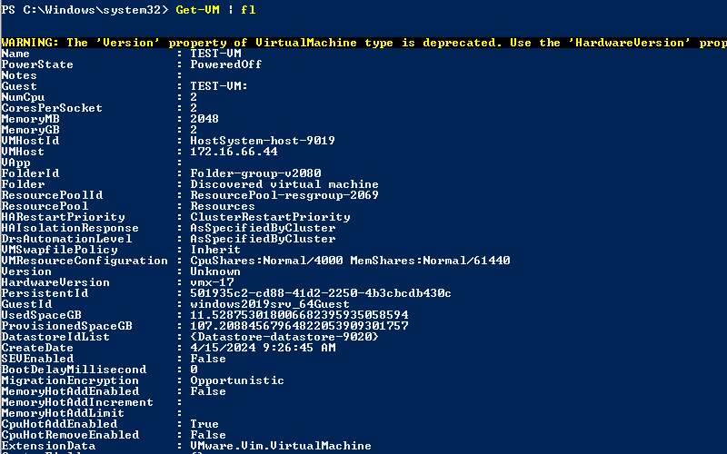
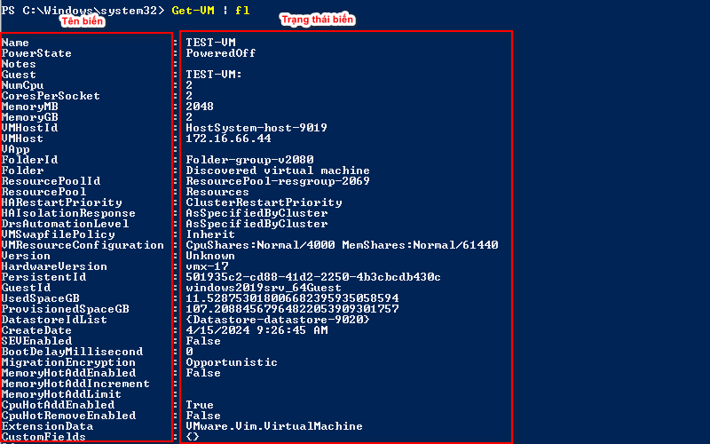
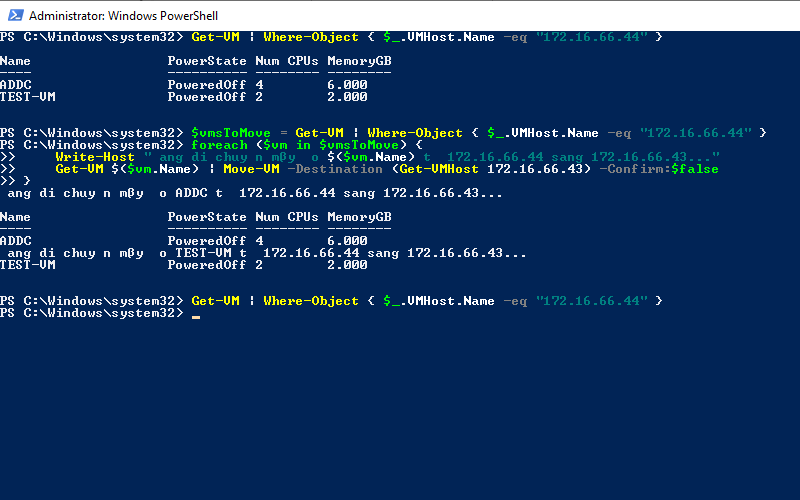
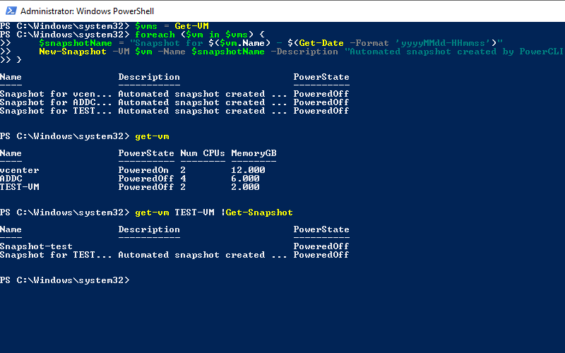
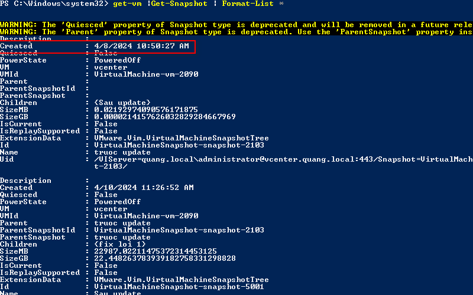

- [1. Cấu trúc khi sử dụng lệnh](#1-cấu-trúc-khi-sử-dụng-lệnh)
# 1. Cấu trúc khi sử dụng lệnh
Để sử dụng được thành thạo Powercli ta cần phải hiểu pipe(|). Ta sẽ hiểu đơn giản pipe(|) giúp ta ngăn cách các câu lệnh và đầu ra của câu lệnh trước chính là đầu vào của câu lệnh sau. Chính vì thế ta sẽ có cấu trúc sử dụng Powercli như sau.
```
[Object] | [Action]
```
Ví dụ nhé:
```
Get-VM | fl
```
Lúc này GET-VM dùng để lấy ra các Object còn Action là hành động F1. Câu lệnh trên sẽ lấy ra tất cả các VM trên vCenter sau đó in ra chi tiết thông tin máy theo cấu trúc F1 (đã quy định từ nhà phát triển).

# 2. Một số ví dụ về cách sử dụng của cấu trúc lệnh
Lệnh where-object được sử dụng để truy vấn , so sánh các thuộc tính trong Object ta đã chọn trước đó và lọc ra xem thuộc tính nào trùng với điều kiện ta đưa ra. Cấu trúc sử dụng where-object.
```
[Object] | where-object { expression }
```
Hãy nhìn vào ví dụ sau đây
```
PS C:\Windows\system32> Get-VM | where-object {$_.PowerState -eq "PoweredOff"}

Name                 PowerState Num CPUs MemoryGB
----                 ---------- -------- --------
TEST-VM              PoweredOff 2        2.000
vCLS-3d00e645-554... PoweredOff 1        0.125
```
Đầu tiên ta sẽ sử dụng lệnh Get-VM để lấy ra các VM sau đó sử dụng where-object để lọc ra xem VM nào đang ở trạng thái PoweredOff.

Sau khi đọc ví dụ này bạn sẽ có thắc mắc làm thế nào để ta có thể lấy ra được các biến để so sánh? Điều này rất đơn giản vì trong ví dụ ở phần 1 ta đã có câu lệnh lấy ra thông tin chi tiết của các VM và trong đó cũng có chi tiết về các biến rồi.


Bây giờ bạn hãy thử thực hành liệt kê ra các VM có NumCPU lớn hơn 2 xem sau đó hãy quay lại đây và xem đáp án nhé.
Các ký hiệu so sánh có thể bạn chưa biết.
- eq: So sánh bằng
- ne: So sánh khác
- lt: So sánh nhỏ hơn
- le: So sánh nhỏ hơn hoặc bằng
- gt: So sánh lớn hơn
- ge: So sánh lớn hơn hoặc bằng

```
PS C:\Windows\system32> Get-VM | where-object {$_.NumCpu -gt 2}

Name                 PowerState Num CPUs MemoryGB
----                 ---------- -------- --------
ADDC                 PoweredOn  4        6.000
```
# 3. Vòng lặp trong PowerCLI
Vòng lặp cho phép bạn thực hiện cùng một thao tác nhiều lần đối với các đối tượng đã chọn, chúng ta có thể lặp lại một hành động nhất định nhiều lần. Dưới đây là cấu trúc sử dụng vòng lặp.
```
foreach ($var in $vars){
Do something…
}
```
Bây giờ ta hãy triển khai ví dụ thực tế. Mình có 1 bài toán đặt ra là bây giờ host 2 đang ở trạng thái cảnh báo và muốn bảo trì nên cần chuyển hết tất cả máy ảo từ host 2 sang host 1 để không làm gián đoạn dịch vụ thì cần làm như thế nào?
Đầu tiên việc cần làm là ta phải lấy được danh sách các VM mà đang có trên host 2, ở đây host 2 của mình có tên 172.16.66.44, Nếu các bạn muốn biết tên các host của mình thì có thể dùng lệnh get-vmhost.
```
PS C:\Windows\system32> Get-VM | Where-Object { $_.VMHost.Name -eq "172.16.66.44" }

Name                 PowerState Num CPUs MemoryGB
----                 ---------- -------- --------
TEST-VM              PoweredOff 2        2.000
ADDC                 PoweredOn  4        6.000
vCLS-3d00e645-554... PoweredOff 1        0.125
```
Như vậy ta đa lấy được ra các VM trong host 2, việc ta cần làm tiếp theo là gắn nó vào biến và sử dụng vòng lặp để chuyển toàn bộ VM sang host1 (172.16.66.43). Và đây sẽ là kết quả cuối cùng.
```
# Lấy danh sách các máy ảo trên máy chủ nguồn (172.16.66.44)
$vmsToMove = Get-VM | Where-Object { $_.VMHost.Name -eq "172.16.66.44" }

# Lặp qua danh sách các máy ảo và di chuyển sang máy chủ đích (172.16.66.43)
foreach ($vm in $vmsToMove) {
    Write-Host "Đang di chuyển máy ảo $($vm.Name) từ 172.16.66.44 sang 172.16.66.43..."
    Get-VM $($vm.Name) | Move-VM -Destination (Get-VMHost 172.16.66.43) -Confirm:$false
}
```
Bạn có thể tham khảo lệnh này nếu muốn chọn vị trí data storage lưu máy ảo.
```
$vmsToMove = Get-VM | Where-Object { $_.VMHost.Name -eq "172.16.66.43" }
foreach ($vm in $vmsToMove) {
$vmName = $vm.Name
Move-VM -VM $vmName -Destination 172.16.66.43 -Datastore ISCSI-p1 -Confirm:$false
}
```

Ta sẽ lấy thêm một ví dụ nữa để các bạn có thể hiểu rằng sử dụng PowerCLI vô cùng tiện lợi. Bây giờ ta muốn tạo snapshot vào một thời điểm cố định cho toàn bộ máy ảo thì làm như thế nào? Nếu ta sử dụng GUI thì sẽ phải vào từng con máy ảo rồi sau đó thực hiện snapshot, nếu lên đến 100 máy thì sẽ rất mất thời gian. Thay vì đó ta có thể sử dụng vòng lặp để lấy ra danh sách máy ảo sau đó thực hiện snapshot. Toàn bộ script sẽ ở bên dưới đây.
```$vms = Get-VM
foreach ($vm in $vms) {
    $snapshotName = "Snapshot for $($vm.Name) - $(Get-Date -Format 'yyyyMMdd-HHmmss')"
    New-Snapshot -VM $vm -Name $snapshotName -Description "Automated snapshot created by PowerCLI"
}
```

# 4. Một số bài tập áp dụng
Bài 1: Tìm tất cả các bản snapshot đã tạo ra trong vòng 1 ngày đổ lại (có thể hơn).

Để giải quyết được yêu cầu bài toán này thì ta cần phải xem tất cả thuộc tính của các bản snapshot. Ta có thể tham khảo lệnh.
```
get-vm |Get-Snapshot | Format-List *
```

Lúc này ta đã có thuộc tính created chỉ thời gian tạo ra snapshot. Bây giờ ta cần làm là sử dụng where-object để lọc ra các template có thời gian tạo trong ngày hôm nay.
```
$today = Get-Date -Format "yyyy-MM-dd"
get-vm |Get-Snapshot | Where-Object { $_.Created -ge $today }
```
[](anh/6.png)
# 5. Tổng kết
Bài viết này cung cấp cho bạn cái nhìn tổng quan hơn về PowerCLI.PowerCLI là một công cụ hoàn toàn hữu ích cho các bạn nếu muốn tự động hóa các công việc trên vCenter. Những nội dung mà mình cung cấp trên 2 bài viết này chỉ là phần mở đầu giúp các bạn làm quen với công cụ mới khi bạn sử dụng sẽ gặp thêm khó khăn khi sử dụng. Nhưng chỉ cần các bạn áp dụng theo đúng những công thức mình đã chỉ ra thì sẽ giúp bạn tiết kiệm được rất nhiều thời gian

# Tài liệu tham khảo
https://www.nakivo.com/blog/basic-powercli-scripting-vmware-vsphere/