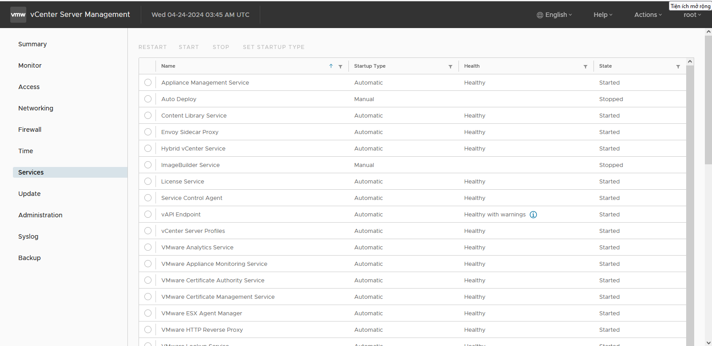
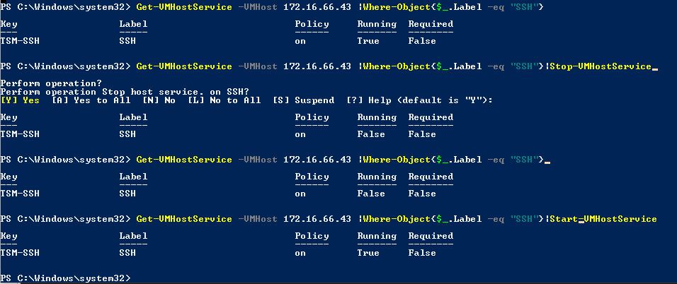

- [Một số lưu ý khi sử dụng power cli](#một-số-lưu-ý-khi-sử-dụng-power-cli)
  - [1. Các service chạy trên VAMI](#1-các-service-chạy-trên-vami)
  - [2. Lưu ý khi tạo snapshot](#2-lưu-ý-khi-tạo-snapshot)
  - [3. Event và task trong vCenter](#3-event-và-task-trong-vcenter)
    - [3.1 Event](#31-event)
    - [3.2 Task](#32-task)
- [Tài liệu tham khảo](#tài-liệu-tham-khảo)
# Một số lưu ý khi sử dụng power cli
- Tất cả những gì mà ta thao tác với vCenter bằng GUI thì ta đều thao tác được bằng PowerCLI
## 1. Các service chạy trên VAMI
- Trên VAMI của vCenter ta có thể nhìn thấy các service đang chạy và đang hoạt động
  
- Tương tự ta có thể xem service trên PowerCLI bằng lệnh
  ```
  Get-Service
  ```
  
- Ta cũng có thể xem chi tiết hơn về 1 dịch vụ với lệnh
  ```
  Get-Service wuauserv| format-list *
  ```
  
- Ta có thể bật hay tắt dịch vụ bằng lênh
  ```
  Start-Service wuauserv
  Stop-Service wuauserv
  ```
- Tương tự đối với host ta có thể kiểm tra các dịch vụ chạy trên các host bằng lệnh
  ```
  Get-VMHostService -VMHost [tên host]
  ```
  
- Ta cũng có thể xem chi tiết các dịch vụ hay bật tắt dịch vụ bằng các lệnh bên dưới
  ```
  Get-VMHostService -VMHost 172.16.66.43 |Where-Object{$_.Label -eq "SSH"}
  Get-VMHostService -VMHost 172.16.66.43 |Where-Object{$_.Label -eq "SSH"}|Stop-VMHostService
  Get-VMHostService -VMHost 172.16.66.43 |Where-Object{$_.Label -eq "SSH"}|Start-VMHostService
  ```
  

## 2. Lưu ý khi tạo snapshot
- Khi tạo Snapshot ta không nên tắt máy và khi thực hiện snapshot có thêm 1 option là `Include virtual machine's memory` giúp ta lưu lại luôn cả trạng thái hoạt động của các dịch vụ trong máy ảo nên sẽ tốn tài nguyên hơn, khi restore lại máy thì máy sẽ ở trong tình trạng bật (Nếu không dùng tính năng này máy sẽ trạng thái power off khi restore)
  
- Khi restore lại máy ảo thì ta nên tắt máy ảo trước khi làm vì khi snapshot có thể gây ra xung đột giữa 2 phiên bản VM và cũng tránh tốn tài nguyên khi ta restore
- Lệnh tạo snapshot kết hợp với tính năng `Include virtual machine's memory`
  ```
  New-Snapshot -VM <VMName> -Name <SnapshotName> -Memory:$true
  ```
  
## 3. Event và task trong vCenter
Trong VMware vCenter, sự kiện (event) và nhiệm vụ (task) là hai khái niệm quan trọng để giám sát các hoạt động và thao tác trên các đối tượng như máy ảo, máy chủ vật lý, hay các đối tượng quản lý khác
### 3.1 Event
Sự kiện (Event) là một hành động hoặc trạng thái xảy ra trên một đối tượng trong vCenter. Các sự kiện thường được ghi lại để theo dõi các hoạt động, thay đổi, lỗi, hoặc trạng thái của các thành phần hệ thống.
Ví dụ về Event
- Một máy ảo được khởi động.
- Một máy chủ ESXi bị lỗi.
- Một ổ đĩa cứng được thêm vào một máy ảo.
- Một snapshot được tạo cho một máy ảo.
Đương nhiên ta cũng có thể sử dụng PowerCLI để có thể xem các event
- Xem 10 sự kiện gần đây nhất được sắp xếp theo thời gian tạo
  ```
  Get-VIEvent -MaxSamples 10 | Sort-Object -Property CreatedTime -Descending
  ```
  
- Xem 10 sự kiện gần nhất liên quan đến 1 máy ảo cụ thể
  ```
  Get-VIEvent -Entity ADDC -MaxSamples 10 | Sort-Object -Property CreatedTime -Descending
  ```
  
- Xem các event trong vòng 1 tiếng đổ lại
  ```
  $startTime = (Get-Date).AddHours(-1)
  Get-VIEvent -Start $startTime | Sort-Object -Property CreatedTime
  ```
- Ta cũng có thể chỉ định thời gian cụ thể
  ```
  $startTime = Get-Date "2024-04-24 08:00:00"
  $endTime = Get-Date "2024-04-24 12:00:00"
  Get-VIEvent -Start $startTime -Finish $endTime | Sort-Object -Property CreatedTime
  ```
  
### 3.2 Task
Nhiệm vụ (Task) là một hành động cụ thể được thực hiện trên một đối tượng trong vCenter. Các nhiệm vụ thường đi kèm với các sự kiện để chỉ ra trạng thái của các hoạt động được thực hiện.
Ví dụ về nhiệm vụ:
- Một nhiệm vụ di chuyển máy ảo giữa các máy chủ vật lý.
- Một nhiệm vụ tạo mới một máy ảo.
- Một nhiệm vụ xóa một snapshot của máy ảo.
- Một nhiệm vụ khởi động lại một máy chủ vật lý.

Event được sử dụng để ghi lại các hoạt động đã xảy ra (đã xong). Task được sử dụng để theo dõi các quá trình đang diễn ra (đang thực hiện).

Câu lệnh thao tác với task cũng tương tự như với event, ta chỉ cần thay đổi `Get-VIEvent` thành `Get-Task`. Từ đó ta có các lệnh

- Xem 10 task gần đây nhất được sắp xếp theo thời gian tạo
  ```
  Get-Task -MaxSamples 10 | Sort-Object -Property CreatedTime -Descending
  ```
- Xem 10 task gần nhất liên quan đến 1 máy ảo cụ thể
  ```
  Get-Task -Entity ADDC -MaxSamples 10 | Sort-Object -Property CreatedTime -Descending
  ```
- Xem các task trong thời gian chỉ định
  ```
  $startTime = Get-Date "2024-04-24 08:00:00"
  $endTime = Get-Date "2024-04-24 09:00:00"
  Get-Task -Start $startTime -Finish $endTime | Sort-Object -Property CreatedTime
  ```

# Tài liệu tham khảo
https://chat.openai.com/