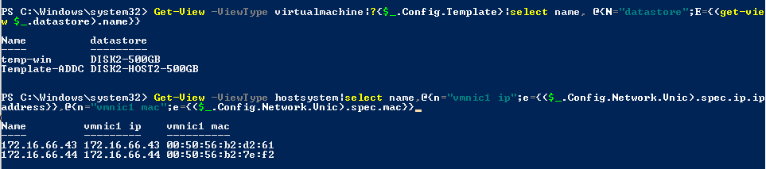

- [Giải thích các câu lệnh nâng cao trên PowerCLI](#giải-thích-các-câu-lệnh-nâng-cao-trên-powercli)
  - [1. Hiển thị danh sách ip và mac của vmkernal đối với từng host](#1-hiển-thị-danh-sách-ip-và-mac-của-vmkernal-đối-với-từng-host)
  - [2. Chuyển đổi tất cả các template từ 1 datastorage thành 1 máy ảo](#2-chuyển-đổi-tất-cả-các-template-từ-1-datastorage-thành-1-máy-ảo)
  - [3. Xem lỗi cảnh báo error và warning trong 2 giờ](#3-xem-lỗi-cảnh-báo-error-và-warning-trong-2-giờ)
- [Tài liệu tham khảo](#tài-liệu-tham-khảo)

# Giải thích các câu lệnh nâng cao trên PowerCLI
## 1. Hiển thị danh sách ip và mac của vmkernal đối với từng host

```
Get-View -ViewType hostsystem|select name,@{n="vmk0 ip";e={($_.Config.Network.Vnic|?{$_.device -match "vmk0"}).spec.ip.ipaddress}},@{n="vmk0 mac";e={($_.Config.Network.Vnic|?{$_.device -match "vmk0"}).spec.mac}}
```
- Lấy ra thông tin của hostsystem
- `select` chọn ra các trường ta muốn hiển thị bao gồm `name`, `vmk0 ip`, `vmk0 mac`
- Định nghĩa trường bằng cách
  ```
  @{
      n = "tên trường";
      e = { Giá trị gắn với trường đó};
  }
  ```
- Tóm lại cấu lệnh này lấy giá trị của biến `($_.Config.Network.Vnic).spec.ip.ipaddress` gắn vào vmk0 ip và `($_.Config.Network.Vnic).spec.mac` gắn vào vmk0 mac rồi in ra 3 trường `Name`, `vmnic1 ip`, `vmnic1 mac`
- Tương tự ta có thể hiển thị máy ảo ứng với từng datastorage bằng lệnh
  ```
  Get-View -ViewType virtualmachine|?{$_.Config.Template}|select name, @{N="datastore";E={(get-view $_.datastore).name}}
  ```
  
  
## 2. Chuyển đổi tất cả các template từ 1 datastorage thành 1 máy ảo
```
Get-View -ViewType Datastore -Filter @{"name" = "^datastore1$"}|%{$_.Vm}|%{(Get-View $_)|?{$_.Config.Template}|%{$_.MarkAsVirtualMachine((Get-View (Get-View $_.Runtime.Host).Parent).ResourcePool,$null)}}
```
- `Get-View -ViewType Datastore -Filter @{"name" = "^datastore1$"}` : Lấy ra datastorage mà có tên là datastorage1
- `%{$_.Vm}|%` kết quả từ bước trước được chuyển qua một vòng lặp foreach (|%{}) để lấy ra các máy ảo (Vm) mà được lưu trữ trên các datastore đã lọc.
- |%{(Get-View $_)|?{$_.Config.Template}|%{$_.MarkAsVirtualMachine((Get-View (Get-View $_.Runtime.Host).Parent).ResourcePool,$null)}}: Trong bước này, mỗi máy ảo được truy cập thông qua cmdlet Get-View. Sau đó, một lọc được áp dụng để chỉ chọn các máy ảo là template ($_Config.Template). Cuối cùng, cho mỗi máy ảo template, phương thức MarkAsVirtualMachine được gọi để chuyển chúng từ trạng thái template sang trạng thái máy ảo thông thường.
## 3. Xem lỗi cảnh báo error và warning trong 2 giờ
```
Get-VIEvent -Start (get-date).AddHours(-2) -Types error,warning |sort CreatedTime|select CreatedTime,FullFormattedMessage
```
- Lệnh này cho phép ta lấy các task loại error và warning và sắp xếp theo thời gian và chọn ra trường hiển thị là CreatedTime,FullFormattedMessage
# Tài liệu tham khảo
https://www.hypervisor.fr/?page_id=3637