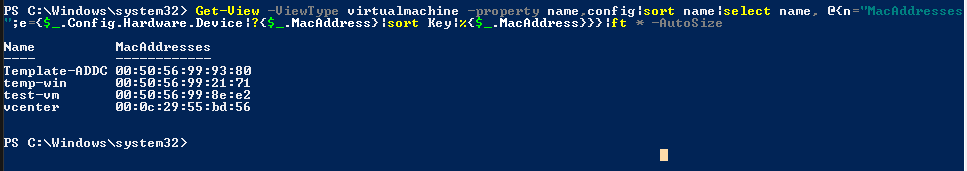

- [Giải thích các câu lệnh nâng cao trên PowerCLI](#giải-thích-các-câu-lệnh-nâng-cao-trên-powercli)
  - [1. Hiển thị danh sách ip và mac của vmkernal đối với từng host](#1-hiển-thị-danh-sách-ip-và-mac-của-vmkernal-đối-với-từng-host)
  - [2. Chuyển đổi tất cả các template từ 1 datastorage thành 1 máy ảo](#2-chuyển-đổi-tất-cả-các-template-từ-1-datastorage-thành-1-máy-ảo)
  - [3. Xem lỗi cảnh báo error và warning trong 2 giờ](#3-xem-lỗi-cảnh-báo-error-và-warning-trong-2-giờ)
  - [4. Huỷ tất cả các tác vụ không thể hoàn tác (annulable) đang chayj trên vCenter](#4-huỷ-tất-cả-các-tác-vụ-không-thể-hoàn-tác-annulable-đang-chayj-trên-vcenter)
  - [5. Đếm tổng số lượng VM running có trên data storage chỉ định](#5-đếm-tổng-số-lượng-vm-running-có-trên-data-storage-chỉ-định)
  - [6. Hiển thị thông tin chi tiết các host đang kết nối đến vCenter](#6-hiển-thị-thông-tin-chi-tiết-các-host-đang-kết-nối-đến-vcenter)
  - [7. Loại bỏ tất cả giới hạn ram, cpu của tất cả VM](#7-loại-bỏ-tất-cả-giới-hạn-ram-cpu-của-tất-cả-vm)
  - [8. Disable memory hot add của máy ảo](#8-disable-memory-hot-add-của-máy-ảo)
  - [9. Liệt kê ra 20 máy ảo có FreeSpace(GB) nhiều nhất](#9-liệt-kê-ra-20-máy-ảo-có-freespacegb-nhiều-nhất)
  - [10. Tạo ra 10 bản sao của máy ảo từ snapshot gần nhất](#10-tạo-ra-10-bản-sao-của-máy-ảo-từ-snapshot-gần-nhất)
  - [11. Ngắt các session đến vCenter không hoạt động trong 6 ngày](#11-ngắt-các-session-đến-vcenter-không-hoạt-động-trong-6-ngày)
  - [12. Lấy ra đường dẫn các file vmx của từng máy ảo](#12-lấy-ra-đường-dẫn-các-file-vmx-của-từng-máy-ảo)
  - [13. Xem thông tin chi tiết về lisence lưu trên vCenter](#13-xem-thông-tin-chi-tiết-về-lisence-lưu-trên-vcenter)
  - [14. Lấy ra danh sách Mac của mỗi VM](#14-lấy-ra-danh-sách-mac-của-mỗi-vm)
  - [15. Chạy DRS trên cả cụm Cluster](#15-chạy-drs-trên-cả-cụm-cluster)
  - [16. Di chuyển nhanh VM (suspend+move+resume=time)](#16-di-chuyển-nhanh-vm-suspendmoveresumetime)
  - [17. Lấy ra danh sách máy ảo không có snapshot và có vmdk bị ẩn](#17-lấy-ra-danh-sách-máy-ảo-không-có-snapshot-và-có-vmdk-bị-ẩn)
  - [18. Mở cổng 80 trên host](#18-mở-cổng-80-trên-host)
  - [19. Cấu hình host gửi log đến server log đối với những host chưa cấu hình](#19-cấu-hình-host-gửi-log-đến-server-log-đối-với-những-host-chưa-cấu-hình)
  - [20. Cấu hình các máy chủ trong cluster gửi log đến server log cụ thể](#20-cấu-hình-các-máy-chủ-trong-cluster-gửi-log-đến-server-log-cụ-thể)
- [Tài liệu tham khảo](#tài-liệu-tham-khảo)

# Giải thích các câu lệnh nâng cao trên PowerCLI
## 1. Hiển thị danh sách ip và mac của vmkernal đối với từng host

```
Get-View -ViewType hostsystem|select name,@{n="vmk0 ip";e={($_.Config.Network.Vnic|?{$_.device -match "vmk0"}).spec.ip.ipaddress}},@{n="vmk0 mac";e={($_.Config.Network.Vnic|?{$_.device -match "vmk0"}).spec.mac}}
```
- Lấy ra thông tin của hostsystem
- `select` chọn ra các trường ta muốn hiển thị bao gồm `name`, `vmk0 ip`, `vmk0 mac`
- Định nghĩa trường bằng cách
  ```
  @{
      n = "tên trường";
      e = { Giá trị gắn với trường đó};
  }
  ```
- Tóm lại cấu lệnh này lấy giá trị của biến `($_.Config.Network.Vnic).spec.ip.ipaddress` gắn vào vmk0 ip và `($_.Config.Network.Vnic).spec.mac` gắn vào vmk0 mac rồi in ra 3 trường `Name`, `vmnic1 ip`, `vmnic1 mac`
- Tương tự ta có thể hiển thị máy ảo ứng với từng datastorage bằng lệnh
  ```
  Get-View -ViewType virtualmachine|?{$_.Config.Template}|select name, @{N="datastore";E={(get-view $_.datastore).name}}
  ```
  
  
## 2. Chuyển đổi tất cả các template từ 1 datastorage thành 1 máy ảo
```
Get-View -ViewType Datastore -Filter @{"name" = "^datastore1$"}|%{$_.Vm}|%{(Get-View $_)|?{$_.Config.Template}|%{$_.MarkAsVirtualMachine((Get-View (Get-View $_.Runtime.Host).Parent).ResourcePool,$null)}}
```
- `Get-View -ViewType Datastore -Filter @{"name" = "^datastore1$"}` : Lấy ra datastorage mà có tên là datastorage1
- `%{$_.Vm}|%` kết quả từ bước trước được chuyển qua một vòng lặp foreach (|%{}) để lấy ra các máy ảo (Vm) mà được lưu trữ trên các datastore đã lọc.
- |%{(Get-View $_)|?{$_.Config.Template}|%{$_.MarkAsVirtualMachine((Get-View (Get-View $_.Runtime.Host).Parent).ResourcePool,$null)}}: Trong bước này, mỗi máy ảo được truy cập thông qua cmdlet Get-View. Sau đó, một lọc được áp dụng để chỉ chọn các máy ảo là template ($_Config.Template). Cuối cùng, cho mỗi máy ảo template, phương thức MarkAsVirtualMachine được gọi để chuyển chúng từ trạng thái template sang trạng thái máy ảo thông thường.
## 3. Xem lỗi cảnh báo error và warning trong 2 giờ
```
Get-VIEvent -Start (get-date).AddHours(-2) -Types error,warning |sort CreatedTime|select CreatedTime,FullFormattedMessage
```
- Lệnh này cho phép ta lấy các task loại error và warning và sắp xếp theo thời gian và chọn ra trường hiển thị là CreatedTime,FullFormattedMessage
## 4. Huỷ tất cả các tác vụ không thể hoàn tác (annulable) đang chayj trên vCenter
```
Get-Task|?{$_.State -eq "Running" -and $_.IsCancelable}|Stop-Task -Confirm:$false
```
- Lấy tất cả các task có biến trạng thái là running và tồn tại biên IsCancelable sau đó stop nó. Confirm:$false có tác dụng không in ra màn hình
## 5. Đếm tổng số lượng VM running có trên data storage chỉ định
```
Get-View -ViewType virtualmachine|?{$_.datastore -match (get-datastore DISK2-500GB).id}|select -ExpandProperty Runtime|Group-Object host|select @{N="ESX";E={(get-view $_.name).name}}, count|ft -AutoSize
```
- `Get-View -ViewType virtualmachine`: Lệnh này lấy tất cả các đối tượng máy ảo trong môi trường vSphere.
- `?{$_.datastore -match (get-datastore DISK2-500GB).id}` : `? = whereobject` để lấy ra các VM có biến datastore trùng với DISK2-500GB
- `select -ExpandProperty Runtime|Group-Object host` : chọn các VM có trạng thái running và nhóm nhưng VM có chung 1 host vào 1 nhóm
- `select @{N="ESX";E={(get-view $_.name).name}}, count` : In ra biến ESX với thuộc tính name của hàm phía trước và thêm 1 cột có thuộc tính count
- `ft -AutoSize` : Định dạng kết quả để hiển thị trên màn hình, với cột tự động điều chỉnh chiều rộng.

## 6. Hiển thị thông tin chi tiết các host đang kết nối đến vCenter
```
get-view -viewtype hostsystem|select -ExpandProperty config|select -ExpandProperty product|Select ProductLineId,Version,Build|Group-Object -property ProductLineId,Version,Build|select count -ExpandProperty group|sort Version,Build,ProductLineId -Unique
```
- `get-view -viewtype hostsystem`: Lấy tất cả các đối tượng máy chủ (host system) trong môi trường vSphere.
- `|select -ExpandProperty config`: Lựa chọn thuộc tính "config" của mỗi máy chủ. Thuộc tính này chứa thông tin cấu hình của máy chủ.
- `|select -ExpandProperty product`: Lựa chọn thuộc tính "product" từ thông tin cấu hình của mỗi máy chủ. Thuộc tính này chứa thông tin về sản phẩm (product) của VMware ESXi cài đặt trên máy chủ.
- `|Select ProductLineId,Version,Build`: Lựa chọn các thuộc tính quan trọng của sản phẩm VMware ESXi để hiển thị, bao gồm ID dòng sản phẩm (ProductLineId), phiên bản (Version) và build.
- `|Group-Object -property ProductLineId,Version,Build`: Nhóm các máy chủ theo các thuộc tính dòng sản phẩm, phiên bản và build. Điều này giúp đưa ra số lượng máy chủ cho mỗi tổ hợp dòng sản phẩm, phiên bản và build.
- `|select count -ExpandProperty group`: Chọn số lượng máy chủ trong mỗi nhóm.
- `|sort Version,Build,ProductLineId -Unique`: Sắp xếp các nhóm theo phiên bản, build và ID dòng sản phẩm, sau đó chọn các bản ghi duy nhất (sử dụng -Unique) để loại bỏ các bản ghi trùng lặp.

## 7. Loại bỏ tất cả giới hạn ram, cpu của tất cả VM
```
Get-View -ViewType VirtualMachine |?{-not $_.Config.Template}|?{$_.Config.MemoryAllocation.Limit -ne "-1" -or $_.Config.CpuAllocation.Limit -ne "-1"}|%{$_.ReconfigVM((New-Object VMware.Vim.VirtualMachineConfigSpec -Property @{memoryAllocation=(New-Object VMware.Vim.ResourceAllocationInfo -Property @{limit="-1"});cpuAllocation=(New-Object VMware.Vim.ResourceAllocationInfo -Property @{limit="-1"})}))}
```
- `Get-View -ViewType VirtualMachine`: Lấy ra các VM
- `?{-not $_.Config.Template}` : Lọc ra các VM không phải template
- `|?{$_.Config.MemoryAllocation.Limit -ne "-1" -or $_.Config.CpuAllocation.Limit -ne "-1"}`: Lọc ra các máy ảo có cấu hình giới hạn bộ nhớ hoặc CPU khác "-1". Giá trị "-1" thường được sử dụng để chỉ ra rằng không có giới hạn cụ thể được đặt.
- `|%{...}`: Duyệt qua từng máy ảo thu được từ bước lọc trước đó
- `$_`: Đại diện cho mỗi máy ảo được duyệt qua trong vòng lặp.
- `$_.ReconfigVM(...)`: Thực hiện việc cấu hình lại máy ảo, cụ thể là cấu hình lại bộ nhớ và CPU của máy ảo.
- `(New-Object VMware.Vim.VirtualMachineConfigSpec -Property @{...})`: Tạo một đối tượng mới của lớp VirtualMachineConfigSpec để cấu hình lại máy ảo với các thông số mới.
- `memoryAllocation=(New-Object VMware.Vim.ResourceAllocationInfo -Property @{limit="-1"})`: Thiết lập giới hạn bộ nhớ của máy ảo thành "-1", tức là loại bỏ bất kỳ giới hạn nào đang được đặt cho bộ nhớ.
- `cpuAllocation=(New-Object VMware.Vim.ResourceAllocationInfo -Property @{limit="-1"})`: Thiết lập giới hạn CPU của máy ảo thành "-1", tức là loại bỏ bất kỳ giới hạn nào đang được đặt cho CPU.
## 8. Disable memory hot add của máy ảo
```
Get-View -ViewType virtualmachine|?{$_.Config.MemoryHotAddEnabled}|%{$_.ReconfigVM((New-Object VMware.Vim.VirtualMachineConfigSpec -Property @{extraconfig=@((New-Object VMware.Vim.optionvalue -Property @{Key="mem.hotadd";Value="false"}))}))}
```
- `Get-View -ViewType virtualmachine`: Lấy tất cả các đối tượng máy ảo
- `?{$_.Config.MemoryHotAddEnabled}`: Lọc ra chỉ các máy ảo có tính năng "Memory Hot Add" 
- `%{...}`: Duyệt qua từng máy ảo thu được từ bước lọc trước đó
- `$_.ReconfigVM(...)`: Thực hiện việc cấu hình lại máy ảo, cụ thể là cấu hình lại các tùy chọn cấu hình. Bên trong dấu () dùng để chỉ định ra đối tượng Reconfig
- `(New-Object VMware.Vim.VirtualMachineConfigSpec -Property @{...})`: Tạo một đối tượng mới của lớp VirtualMachineConfigSpec để cấu hình lại máy ảo với các thông số mới.
- `extraconfig=@((New-Object VMware.Vim.optionvalue -Property @{Key="mem.hotadd";Value="false"}))`: Thiết lập cấu hình cho tùy chọn bổ sung (extraconfig) của máy ảo, ở đây chuyển mem.hotadd thành false
## 9. Liệt kê ra 20 máy ảo có FreeSpace(GB) nhiều nhất 
```
Get-View -ViewType virtualmachine|?{($_.config.Hardware.Device|?{$_.gettype() -match "VirtualDisk"}|?{$_.Backing.ThinProvisioned}) -eq $null}|select name, @{n="FreeSpace";e={"{0:N0}" -f (($_.guest.disk|%{$_.freespace}|measure-object -sum).sum/1GB)}}|sort FreeSpace -Descending|select -first 20|ft -AutoSize
```
- `Get-View -ViewType virtualmachine`: Lấy tất cả các đối tượng máy ảo
- `?{($_.config.Hardware.Device|?{$_.gettype() -match "VirtualDisk"}|?{$_.Backing.ThinProvisioned}) -eq $null}` : Lọc ra các máy chủ không phải ThinProvisioned. Nếu muốn loại ThinProvisioned thì bỏ `-eq $null` đi là được
- `select name, @{n="FreeSpace";e={"{0:N0}" -f (($_.guest.disk|%{$_.freespace}|measure-object -sum).sum/1GB)}}` : In ra tên của máy ảo và FreeSpace, FreeSapce được lấy ra từ biến guest.disk sau đó định dạng lại thành sum/1GB để hiển thị theo GB, 0:N0 là phép toán làm trong các số thập phân thành số nguyên
  

## 10. Tạo ra 10 bản sao của máy ảo từ snapshot gần nhất
```
Get-VM VM_2_Clone|Get-View|?{$_.snapshot}|%{for ($i=0; $i -lt 10; $i++){$_.CloneVM($_.parent,$($_.name + "_" + $i),(new-object Vmware.Vim.VirtualMachineCloneSpec -Property @{Snapshot= (get-view ($_.Snapshot.CurrentSnapshot)).moref;Location = (new-object Vmware.Vim.VirtualMachineRelocateSpec -Property @{DiskMoveType = [Vmware.Vim.VirtualMachineRelocateDiskMoveOptions]::createNewChildDiskBacking })}))}}
```
- `et-VM VM_2_Clone|Get-View` : Lấy ra thông tin chi tiết của máy ảo tên là VM_2_Clone
- `%{for ($i=0; $i -lt 10; $i++)`: Tạo ra 10 vòng lặp i nhận giá trị từ 0-9
- `$_.CloneVM($_.parent,$($_.name + "_" + $i)` : CloneVM mới với snapshot ban đầu và lấy tên của máy ảo mới = tên máy ảo cũ thêm giá trị của i
- `(new-object Vmware.Vim.VirtualMachineCloneSpec -Property @{...})`: Tạo một đối tượng VirtualMachineCloneSpec để chỉ định cấu hình cho việc tạo bản sao mới
- `Snapshot= (get-view ($_.Snapshot.CurrentSnapshot)).moref`: Chọn snapshot hiện tại của máy ảo gốc để tạo VM từ đó.
- `Location = (new-object Vmware.Vim.VirtualMachineRelocateSpec -Property @{DiskMoveType = [Vmware.Vim.VirtualMachineRelocateDiskMoveOptions]::createNewChildDiskBacking })`: Đặt vị trí (location) cho VM  mới và cấu hình nó để sử dụng các tùy chọn di chuyển ổ đĩa tạo mới (createNewChildDiskBacking)

## 11. Ngắt các session đến vCenter không hoạt động trong 6 ngày
```
(Get-View ((Get-View ServiceInstance).Content.sessionManager))|%{$_.SessionList}|?{$_.LastActiveTime -lt (Get-Date).AddDays(-6)}|%{(Get-View ((Get-View ServiceInstance).Content.sessionManager)).TerminateSession($_.Key)}
```
- `(Get-View ((Get-View ServiceInstance).Content.sessionManager))` : Lấy ra thông tin về quản lý phiên trong môi trường vSphere. thuộc tính Content.sessionManager của đối tượng ServiceInstance  chứa thông tin về quản lý phiên trong môi trường vSphere
- `|%{$_.SessionList}`: Duyệt qua danh sách các phiên hiện đang hoạt động trong môi trường vSphere. các phiên này đã được lấy ra danh sách từ lệnh trước
- `?{$_.LastActiveTime -lt (Get-Date).AddDays(-6)}`: Lọc ra các phiên có thời gian hoạt động lớn hơn 6 ngày trước
- `%{(Get-View ((Get-View ServiceInstance).Content.sessionManager)).TerminateSession($_.Key)}`: Duyệt qua các phiên đã lọc được và chấm dứt mỗi phiên bằng cách gọi phương thức TerminateSession() của sessionManager, truyền vào khóa (key) của từng phiên để xác định phiên cần chấm dứt

## 12. Lấy ra đường dẫn các file vmx của từng máy ảo
```
Get-View -ViewType VirtualMachine|%{$_.Summary.Config.VmPathName}
```

## 13. Xem thông tin chi tiết về lisence lưu trên vCenter
```
Get-view (Get-View ServiceInstance).Content.LicenseManager|%{$_.Licenses}|Select Name,Used,Total,CostUnit,LicenseKey|ft -AutoSize
```
- `Get-view (Get-View ServiceInstance).Content.LicenseManager`: Lấy đối tượng ServiceInstance sau đó lấy thuộc tính Content.LicenseManager
- `%{$_.Licenses}` : Tạo ra vòng lặp với biến licenses
- `Select Name,Used,Total,CostUnit,LicenseKey` : In ra các trường Name,Used,Total,CostUnit,LicenseKey


## 14. Lấy ra danh sách Mac của mỗi VM
```
Get-View -ViewType virtualmachine -property name,config|sort name|select name, @{n="MacAddresses";e={$_.Config.Hardware.Device|?{$_.MacAddress}|sort Key|%{$_.MacAddress}}}|ft * -AutoSize
```
- `Get-View -ViewType virtualmachine -property name,config` : Lấy ra các đối tượng là máy ảo và chỉ chọn ra 2 thuộc tính là name và config
- `sort name`: sắp xếp theo tên
- `select name, @{n="MacAddresses";e={$_.Config.Hardware.Device` In ra các trường name, macaddress (được lấy từ biếnConfig.Hardware.Device )
- `|%{$_.MacAddress}}}` : Tạo ra vòng lặp để in ra tất cả các địa chỉ MAC

## 15. Chạy DRS trên cả cụm Cluster
```
Get-View -ViewType ClusterComputeResource -Property Name|%{$_.RefreshRecommendation()}
```
- `Get-View -ViewType ClusterComputeResource -Property Name` : Lấy danh sách các đối tượng Cluster trong môi trường vSphere và chỉ chọn thuộc tính Name
- `{$_.RefreshRecommendation()}`: tạo ra vòng lặp để chạy cho từng Cluster 
## 16. Di chuyển nhanh VM (suspend+move+resume=time)
```
(Measure-Command {Get-VM vm|Suspend-VM -Confirm:$false|?{$_.PowerState -eq "Suspended"}|Move-VM -Destination vmhost -confirm:$false|Start-VM}).TotalSeconds
```
- `Measure-Command` : Dùng để đo thời gian thực hiện lệnh
- `Get-VM vm|Suspend-VM -Confirm:$false`: Lấy ra máy ảo có tên là vm sau đó Suspend nó trong im lặng 
- `?{$_.PowerState -eq "Suspended"}` : Tạo vòng lặp và lấy ra các máy ảo có trạng thái Suspend
- `Move-VM -Destination vmhost -Confirm:$false`: Di chuyển máy ảo đến host có destination có tên là vmhost trong im lặng
- `Start-VM`: Bật lại máy ảo
## 17. Lấy ra danh sách máy ảo không có snapshot và có vmdk bị ẩn
```
Get-View -ViewType VirtualMachine|?{!$_.snapshot}|?{$_|%{$_.layoutex.file}|?{$_.name -match "-delta.vmdk$"}}|select name
```
- `Get-View -ViewType VirtualMachine`: Lấy ra thông tin các máy ảo
- `?{!$_.snapshot}` : điều kiện lấy ra các máy ảo có snapshot
- `?{$_|%{$_.layoutex.file}}` : Lọc ra chỉ các máy ảo có ít nhất một tệp layoutex (tệp này liên quan đến cấu trúc dữ liệu của ổ đĩa) bằng cách sử dụng 1 vòng lặp 
- `?{$_.name -match "-delta.vmdk$"}` : Lọc ra chỉ các tệp có tên kết thúc bằng "-delta.vmdk". 
- `select name` : chỉ in ra trường name

## 18. Mở cổng 80 trên host
```
Get-Cluster toto|Get-VMHost|%{($_|Get-EsxCli).network.firewall.ruleset.set($null,$true,"httpClient")}
```
- `Get-Cluster toto|Get-VMHost`: Lấy ra các host trong cluster toto
- `($_|Get-EsxCli)` : Lấy đối tượng ESXCLI cho từng máy chủ. ESXCLI là một công cụ dòng lệnh cho phép tương tác với các tính năng và dịch vụ của máy chủ ESXi.
- `.network.firewall.ruleset.set($null,$true,"httpClient")` : Set 1 rule với firewall cho phép request http (port 80)
## 19. Cấu hình host gửi log đến server log đối với những host chưa cấu hình
```
Get-View -ViewType HostSystem|?{$_.Runtime.ConnectionState -eq "connected" -and $_.config.product.ProductLineId -eq "embeddedEsx" -and ($_.Config.Option|?{$_.Key -eq "Syslog.global.logHost"}).Value -ne "udp://192.168.0.1:514"}|%{(Get-View $_.ConfigManager.AdvancedOption).UpdateOptions((New-Object VMware.Vim.OptionValue -Property @{Key="Syslog.global.logHost";Value="udp://192.168.0.1:514"}))}
```
- `Get-View -ViewType HostSystem`: Lấy tất cả các đối tượng máy chủ ESXi
- `?{$_.Runtime.ConnectionState -eq "connected" -and $_.config.product.ProductLineId -eq "embeddedEsx" -and ($_.Config.Option|?{$_.Key -eq "Syslog.global.logHost"}` : Chọn ra những đối tượng thỏa mãn điều kiện : kết nối đến vcenter, `embeddedEsx` chỉ định rằng bắt buộc máy chủ phải thuộc sản phẩm ESXi, 
- `($_ .Config.Option|?{$_.Key -eq "Syslog.global.logHost"}).Value -ne "udp://192.168.0.1:514` : Lấy ra thuộc tính config.Option sau đó lọc ra đối tượng có key = Syslog.global.logHost sau đó gắn vào biến Value rồi so sánh giá trị của biến đó phải khác "udp://192.168.0.1:514".
- `%{(Get-View $_.ConfigManager.AdvancedOption).UpdateOptions(...)}`: Duyệt qua mỗi máy chủ thỏa mãn điều kiện và gọi phương thức UpdateOptions() của đối tượng ConfigManager.AdvancedOption của mỗi máy chủ để cập nhật cài đặt syslog.
- `(New-Object VMware.Vim.OptionValue -Property @{Key="Syslog.global.logHost";Value="udp://192.168.0.1:514"})` : Thay đổi giá trị của biến từ Syslog.global.logHost sang udp://192.168.0.1:514

## 20. Cấu hình các máy chủ trong cluster gửi log đến server log cụ thể
```
Get-Cluster toto|Get-VMHost|%{(Get-EsxCli -VMHost $_).system.syslog.config.set($null,$null,$null,$null,$null,"grep.sexilog.fr",$null);(Get-EsxCli -VMHost $_).system.syslog.reload()}
```
-  `Get-Cluster toto|Get-VMHost`: Lấy ra thông tin các host của cluster toto
-  `(Get-EsxCli -VMHost $_)`: Lấy đối tượng ESXCLI cho máy chủ hiện tại.
-  `.system.syslog.config.set(...)` : Gọi phương thức set() để đặt cấu hình syslog của máy chủ.
-  `$null,$null,$null,$null,$null,"grep.sexilog.fr",$null` : null có nghĩa là không thay đổi, grep.sexilog.fr trỏ đến địa chỉ của log server
-  `(Get-EsxCli -VMHost $_).system.syslog.reload()`: Tải lại cấu hình syslog trên mỗi máy chủ để áp dụng thay đổi.
# Tài liệu tham khảo
https://www.hypervisor.fr/?page_id=3637