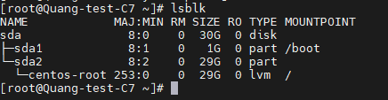

# Tạo template Centos 7 trên VMWare 
Tất cả thao tác mặc định ở đây là đã tạo được Centos 7 trên Vsphere rồi
## 1. Cập nhật lại repo
- Mặc định centos 7 đã được chính nhà phát triển dừng hỗ trợ từ tháng 6/2024 nên các repo của nó sẽ không còn được hỗ trợ chính thức nữa. Ta cần phải sửa lại repo về Vault và epel để có thể sử dụng lệnh yum
- Xóa hết thông tin các repo cũ đi
  ```
  rm -rf /etc/yum.repos.d/*
  ```
- Viết lại thông tin repo mới
  ```
  vi /etc/yum.repos.d/CentOS-Vault.repo
  ```
    ```
    [base]
    name=CentOS-7 - Base
    baseurl=http://vault.centos.org/7.9.2009/os/$basearch/
    gpgcheck=1
    gpgkey=file:///etc/pki/rpm-gpg/RPM-GPG-KEY-CentOS-7

    [updates]
    name=CentOS-7 - Updates
    baseurl=http://vault.centos.org/7.9.2009/updates/$basearch/
    gpgcheck=1
    gpgkey=file:///etc/pki/rpm-gpg/RPM-GPG-KEY-CentOS-7

    [extras]
    name=CentOS-7 - Extras
    baseurl=http://vault.centos.org/7.9.2009/extras/$basearch/
    gpgcheck=1
    gpgkey=file:///etc/pki/rpm-gpg/RPM-GPG-KEY-CentOS-7
    ```
    ```
    vi /etc/yum.repos.d/epel.repo
    ```
    ```
    [epel]
    name=Extra Packages for Enterprise Linux 7 - $basearch
    # It is much more secure to use the metalink, but if you wish to use a local mirror
    # place its address here.
    #baseurl=http://download.example/pub/epel/7/$basearch
    metalink=https://mirrors.fedoraproject.org/metalink?repo=epel-7&arch=$basearch&infra=$infra&content=$contentdir
    failovermethod=priority
    enabled=1
    gpgcheck=1
    gpgkey=file:///etc/pki/rpm-gpg/RPM-GPG-KEY-EPEL-7

    [epel-debuginfo]
    name=Extra Packages for Enterprise Linux 7 - $basearch - Debug
    # It is much more secure to use the metalink, but if you wish to use a local mirror
    # place its address here.
    #baseurl=http://download.example/pub/epel/7/$basearch/debug
    metalink=https://mirrors.fedoraproject.org/metalink?repo=epel-debug-7&arch=$basearch&infra=$infra&content=$contentdir
    failovermethod=priority
    enabled=0
    gpgkey=file:///etc/pki/rpm-gpg/RPM-GPG-KEY-EPEL-7
    gpgcheck=1

    [epel-source]
    name=Extra Packages for Enterprise Linux 7 - $basearch - Source
    # It is much more secure to use the metalink, but if you wish to use a local mirror
    # place it's address here.
    #baseurl=http://download.example/pub/epel/7/source/tree/
    metalink=https://mirrors.fedoraproject.org/metalink?repo=epel-source-7&arch=$basearch&infra=$infra&content=$contentdir
    failovermethod=priority
    enabled=0
    gpgkey=file:///etc/pki/rpm-gpg/RPM-GPG-KEY-EPEL-7
    gpgcheck=1
    ```
    ```
    vi /etc/yum.repos.d/epel-testing.repo
    ```
    ```
    [epel-testing]
    name=Extra Packages for Enterprise Linux 7 - Testing - $basearch
    # It is much more secure to use the metalink, but if you wish to use a local mirror
    # place its address here.
    #baseurl=http://download.example/pub/epel/testing/7/$basearch
    metalink=https://mirrors.fedoraproject.org/metalink?repo=testing-epel7&arch=$basearch&infra=$infra&content=$contentdir
    failovermethod=priority
    enabled=0
    gpgcheck=1
    gpgkey=file:///etc/pki/rpm-gpg/RPM-GPG-KEY-EPEL-7

    [epel-testing-debuginfo]
    name=Extra Packages for Enterprise Linux 7 - Testing - $basearch - Debug
    # It is much more secure to use the metalink, but if you wish to use a local mirror
    # place its address here.
    #baseurl=http://download.example/pub/epel/testing/7/$basearch/debug
    metalink=https://mirrors.fedoraproject.org/metalink?repo=testing-debug-epel7&arch=$basearch&infra=$infra&content=$contentdir
    failovermethod=priority
    enabled=0
    gpgkey=file:///etc/pki/rpm-gpg/RPM-GPG-KEY-EPEL-7
    gpgcheck=1

    [epel-testing-source]
    name=Extra Packages for Enterprise Linux 7 - Testing - $basearch - Source
    # It is much more secure to use the metalink, but if you wish to use a local mirror
    # place it's address here.
    #baseurl=http://download.example/pub/epel/testing/7/source/tree/
    metalink=https://mirrors.fedoraproject.org/metalink?repo=testing-source-epel7&arch=$basearch&infra=$infra&content=$contentdir
    failovermethod=priority
    enabled=0
    gpgkey=file:///etc/pki/rpm-gpg/RPM-GPG-KEY-EPEL-7
    gpgcheck=1
    ```
- Tiến hành cập nhật lại thông tin
  ```
  yum clean all
  yum makecache
  yum repolist
  ```
## 2. Cài đặt VMware tool
```
yum install open-vm-tools -y
yum install wget byobu curl git byobu python-setuptools python-virtualenv -y
sudo systemctl disable NetworkManager
sudo systemctl stop NetworkManager
sudo systemctl enable network
sudo systemctl start network
sed -i 's/SELINUX=enforcing/SELINUX=disabled/g' /etc/sysconfig/selinux
sed -i 's/SELINUX=enforcing/SELINUX=disabled/g' /etc/selinux/config
echo "net.ipv6.conf.all.disable_ipv6 = 1" >> /etc/sysctl.conf
timedatectl set-timezone Asia/Ho_Chi_Minh
init 6
```
## 3. Cài đặt cmd.log
```
cd ~
yum install wget -y
wget https://raw.githubusercontent.com/thanhquang99/thuctap2023/main/thuctap/03-Linux/03-linuxapplication.md/Rsyslog/11.cmdlog.sh
chmod +x 11.cmdlog.sh
. 11.cmdlog.sh
```
## 4. Tự động mở rộng phân vùng


```
ls /sys/class/scsi_device/
echo 1 > /sys/class/scsi_device/0\:0\:0\:0/device/rescan
yum -y install cloud-utils-growpart
vi /etc/rc.local
```
```
growpart /dev/sda 2 > /dev/null 2>&1
pvresize /dev/sda2 > /dev/null 2>&1
lvextend -l +100%FREE -r /dev/mapper/centos/root > resize.txt 2>&1; cat resize.txt | grep GiB
resize2fs /dev/centos/root
```            
Bây giờ ta đã có thể tắt máy vào tạo template như bình thường
# Tài liệu tham khảo
https://suncloud.vn/huong-dan-tao-template-centos-7-chi-tiet-tren-vmware