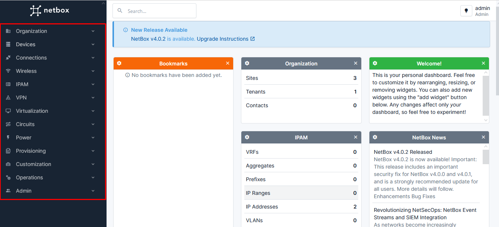
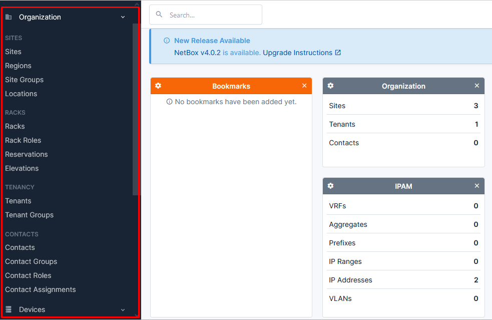

# 1. Giới thiệu về Netbox
NetBox là một ứng dụng web nguồn mở được thiết kế kế để giúp quản lý hạ tầng mạng máy tính. 

Ban đầu nó được tạo ra bởi đội ngũ kỹ thuật mạng tại DigitalOcean. Nó được phát triển để giải quyết các nhu cầu của các kỹ sư mạng và hạ tầng

Netbox được sử dụng để quản lý hạ tầng mạng, bao gồm các thiết bị mạng, địa chỉ IP, subnet, tài liệu kỹ thuật và các thông tin khác liên quan đến hệ thống mạng.(Quản lý các thiết bị trên IDC)

Netbox đem lại cho bạn cái nhìn trục quan khi đưa các thông tin của thiết bị lên GUI nên mối quan hệ ghép nối của chúng cũng dễ dàng được nắm bắt qua GUI

# 2. Chức năng chính của NetBox
- Quản lý Thiết bị Mạng: NetBox cho phép bạn lưu trữ và quản lý thông tin về các thiết bị mạng như switch, router, firewall, server, và nhiều loại thiết bị khác. Bạn có thể lưu trữ thông tin chi tiết như mô hình, số serial, địa chỉ IP, và nhiều thuộc tính khác của từng thiết bị
- Quản lý Tài nguyên IP: NetBox cung cấp công cụ để quản lý và theo dõi việc sử dụng địa chỉ IP, bao gồm cả IPv4 và IPv6. Bạn có thể tổ chức các phạm vi IP, gán địa chỉ IP cho các thiết bị và ghi lại lịch sử sử dụng IP
- Quản lý Cấu hình Mạng: NetBox cho phép bạn lưu trữ cấu hình của các thiết bị mạng, bao gồm cấu hình của router, switch, firewall, và các thiết bị khác. 
- Mô hình Hóa Dữ liệu: NetBox hỗ trợ mô hình hóa dữ liệu về cơ sở hạ tầng mạng, giúp bạn hiểu rõ hơn về cấu trúc và mối quan hệ giữa các tài nguyên mạng.
- Tìm kiếm và Lọc Dữ liệu
# 3. Phân tích các thành phần của Netbox

## 3.1 Organization

Khi ta mở trường Organization ra thì sẽ có rất nhiều trường con bên trong ta cần phải hiểu biết các trường này là gì.
- Sites : thường biểu diễn một địa điểm vật lý mà bạn quản lý các thiết bị mạng và tài nguyên kỹ thuật khác.chẳng hạn như các trung tâm dữ liệu, văn phòng chi nhánh, hoặc các cơ sở khác
- Regions: là một thuật ngữ được sử dụng để đề cập đến các khu vực địa lý hoặc phân đoạn trong cơ sở hạ tầng mạng của bạn
- Site Groups : Khi ta nhóm các site có chung 1 vài đặc điểm lại sẽ thành 1 Site Group
- Racks: nó tương đưởng với tủ rack trên IDC 
- Rack Roles : Được sử dụng để miêu tả vai trò của tủ Rack, một số role như sử dụng cho KH, sử dụng cho VPS,...
- Rack Reservations (đặt chỗ rack)
- Rack Elevations  (bản vẽ rack) : Đưa cho ta hình vẽ trực quan các thiết bị đang đặt trên tủ Rack
- Tenancy đề cập đến một khách hàng cá nhân hoặc 1 tổ chức. 
- Contacts: Quản lý thông tin liên lạc của 1 người nào đó
- Contact Groups : Những người có chung 1 đặc điểm nào đó sẽ được đưa vào 1 nhóm để quản lý
- Contact Roles : Xác định vai trò, chức vụ của contacts
- "Contact Assignments" (gán liên hệ) là một tính năng cho phép người dùng gán các liên hệ cụ thể vào các tài nguyên hoặc mục trong cơ sở dữ liệu NetBox.
## 3.2 Device

- Device : để cập đến thiết bị chi tiết ví dụ như server có tên là gì, mục đích chính của nó để làm gì
- Modules: Là phần mở rộng được bổ xung thêm cho hệ thống
- Device Roles : Vai trò của các thiết bị trên hệ thống, ví dụ như Server, Switch
- Platforms : Thông thường dùng để chỉ ra OS hay các hãng tạo ra thiết bị
- Device Types : Thông thường là tên chi tiết của thiết bị
- Module Types : Loại module mở rộng có thể là PCI ...
- Manufacturers : Thông tin của nhà sản xuất
- Interfaces : Đây là các card mạng được gắn lên device, ta có thể đặt tên giống nhau nhưng việc kết nối đến device phải khác nhau
- Console Ports : Đề cập đến cổng console điều khiển thiết bị 
- Power Ports : Đề cập đến các cổng nguồn của thiết bị

# Tài liệu tham khảo
https://docs.netbox.dev/en/stable/getting-started/planning/