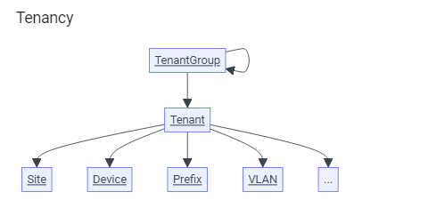
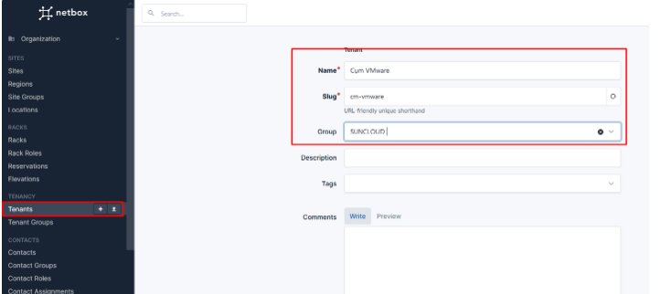

# Quy trình note lại thông tin tenacy trên group
## 1. Planning
- Thuật ngữ Planning này dùng để chỉ quá trình thêm tenacy phải trải qua. Ta có thể làm theo hoặc không, nhưng việc làm theo sẽ giúp chúng ta tiết kiệm thời gian, tránh bỏ sót những thông tin ghi chú

Hình vẽ chính là mô hình quản lý tenacy. Các tenantGroup sẽ quản lý các Tenant, các tenant sẽ quản lý các site, device,... ở bên dưới
## 2.1 Quá trình triển khai Tenant
- Tạo TenantGroup:
  

  Slug : chính là định danh của đối tượng trong netbox, có thể kết hợp vơi URL để định danh
- Tạo Tenant:
  

  Nếu ta không tạo TenantGroup trước thì đã không thể khai báo Group khi tạo Tenant rồi như thế thông tin sẽ bị mất
# Tài liệu tham khảo
https://docs.netbox.dev/en/stable/getting-started/planning/