- [Quy trình note Sites, Racks, and Devices](#quy-trình-note-sites-racks-and-devices)
- [Tài liệu tham khảo](#tài-liệu-tham-khảo)

# Quy trình note Sites, Racks, and Devices

Ở phần trước đã giới thiệu cho các bạn biết cách mà các mũi tên hoạt động rồi. Bây giờ ta sẽ áp dụng quy tắc đó để bắt đầu note lại Sites, Racks, and Devices
- Tạo Regions
  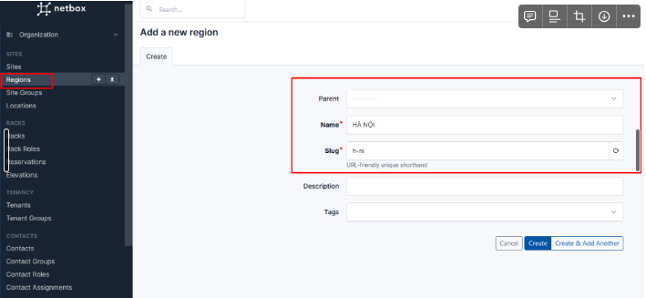
- Tạo Site Group
  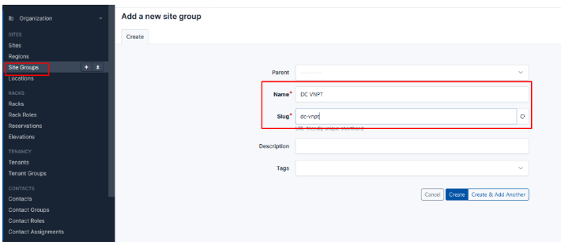
- Tạo Site
  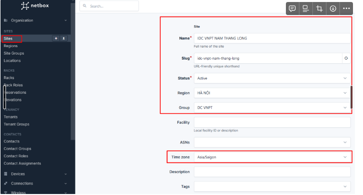
- Tạo Location 
- 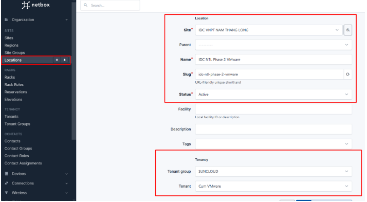
- Tạo manufacturer
  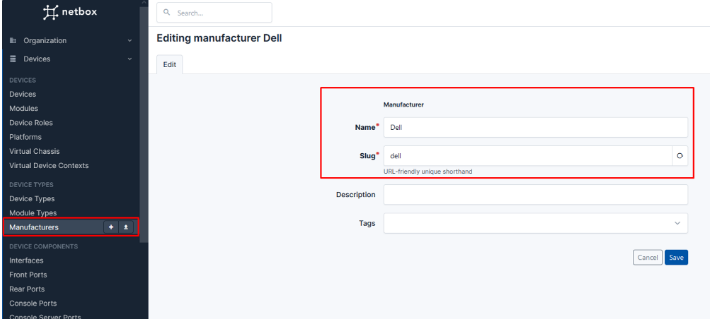
- Device Roles
  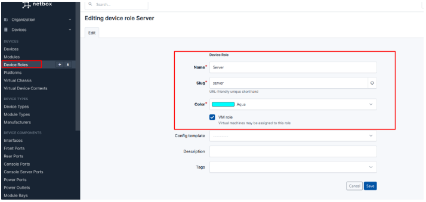
- Tạo Platforms
  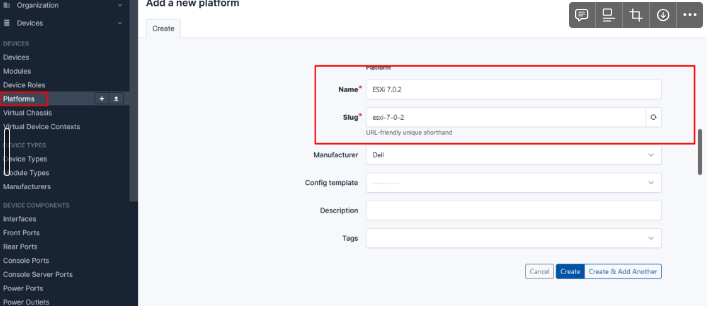
- Tạo Rack
  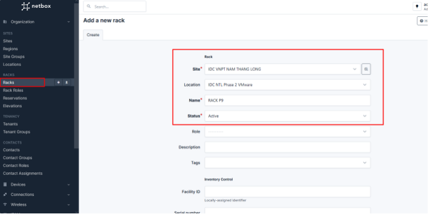
  
- Tạo Device Types
  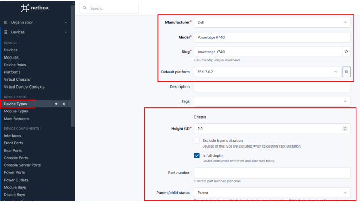
- Tạo Device
  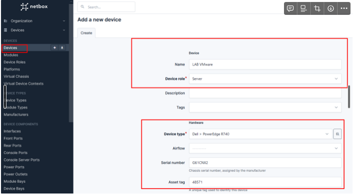
  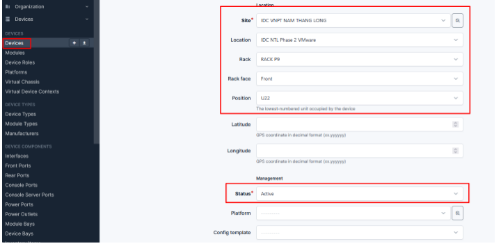
  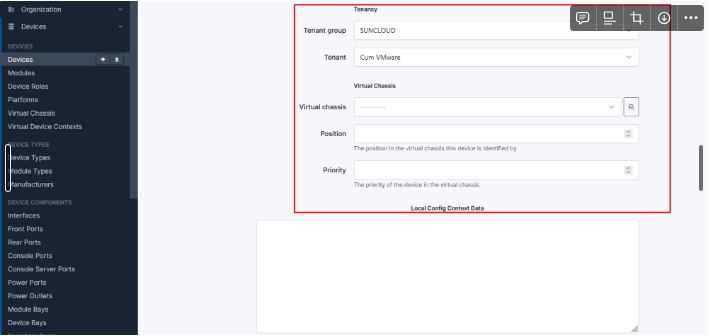
- Thêm Module Types
  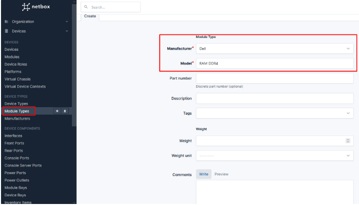
  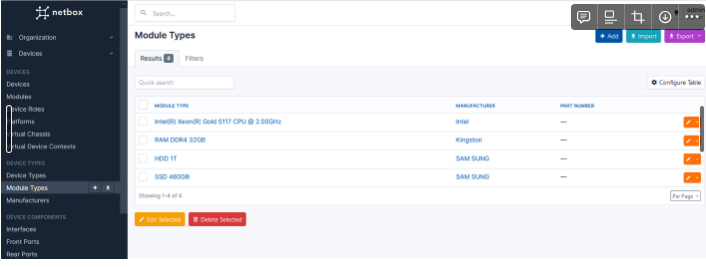
- Thêm Module
- Tạo Interface
  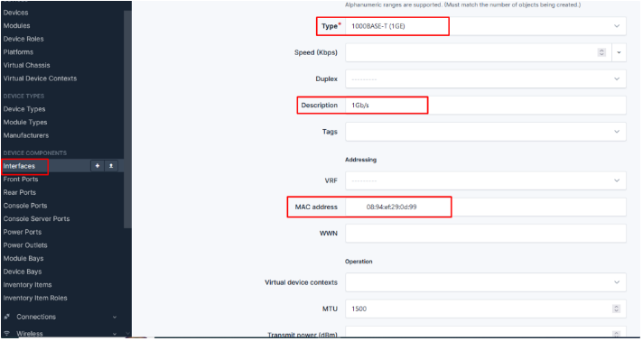
  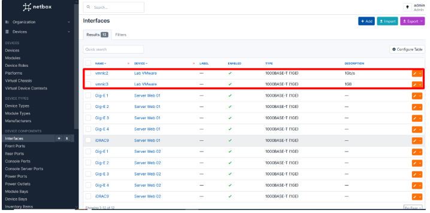

# Tài liệu tham khảo
https://docs.netbox.dev/en/stable/getting-started/planning/