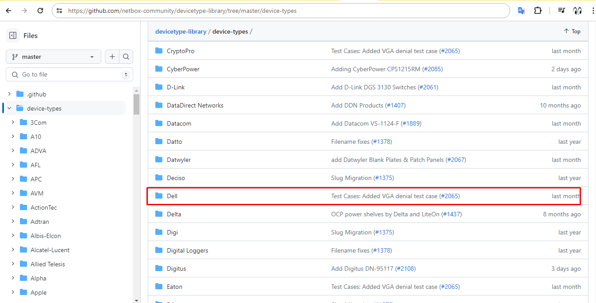
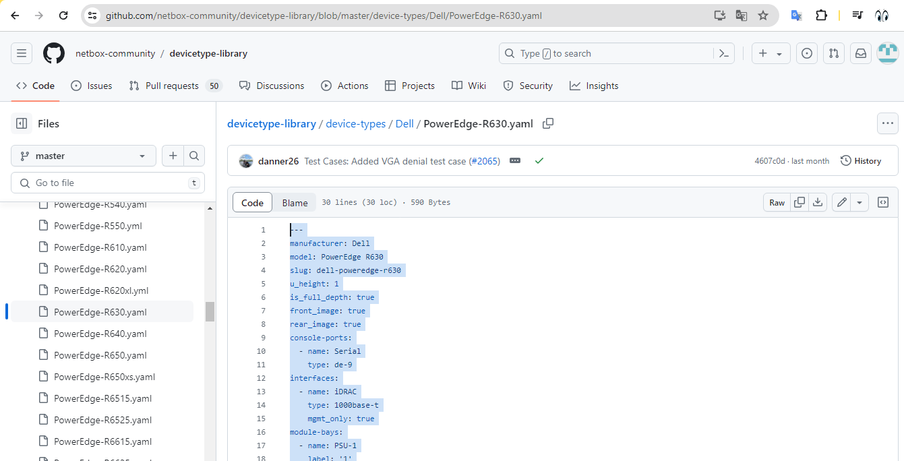
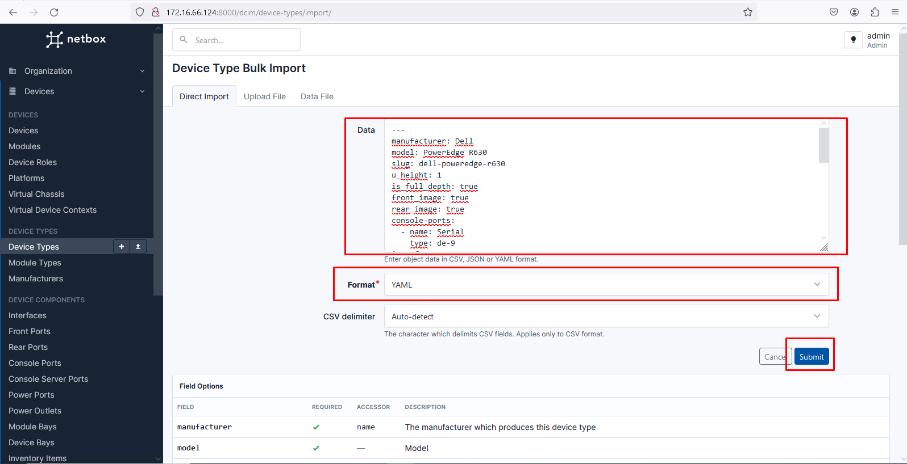
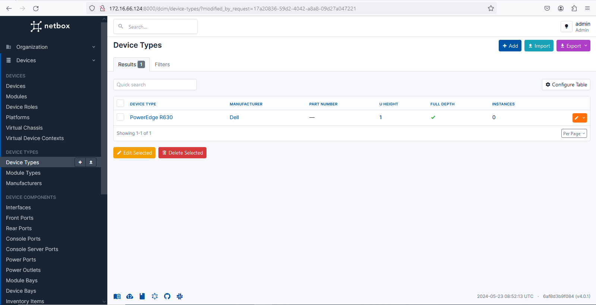

- [Hướng dẫn import device type vào Netbox](#hướng-dẫn-import-device-type-vào-netbox)
  - [1. Quy trình import device type](#1-quy-trình-import-device-type)
- [Tài liệu tham khảo](#tài-liệu-tham-khảo)
# Hướng dẫn import device type vào Netbox
- Khi ta tạo một device bất kỳ sẽ có mục khai báo device type. Device type ta sẽ hiểu nó như là một template để từ đó device sẽ dựa theo mẫu đó và tạo sẵn
- Sẽ có rất nhiều device dùng chung device type giống nhau. Ta cần phải tạo ra các device có sẵn để sử dụng
- Trên github cung cấp cho ta các file yaml chứa các device type làm mẫu, ta sẽ dùng cách import file này vào đê lấy được mẫu device type
## 1. Quy trình import device type
- Truy cập vào github để lấy các file device type `https://github.com/netbox-community/devicetype-library/tree/master/device-types`
  
- Ta sẽ vào copy code của thiết bị ta cần tìm, Trong ví dụ này tôi sẽ lấy file `PowerEdge-R630.yaml`
  
- Truy cập vào Netbox và tiến hành import
  
- Tiến hành paste nội dung vào phần data và submit
  
- Kết quả:
  

Tương tự ta có thể làm với nhiều devicetype khác
- Yêu cầu khi sử dụng file yaml này là manufacturer phải đúng trùng tên với manufacturer ta đã khai báo trước. Bạn có thể thay đổi text sao cho đúng với manufacturer của bạn

# Tài liệu tham khảo
https://github.com/netbox-community/devicetype-library/tree/master/device-types