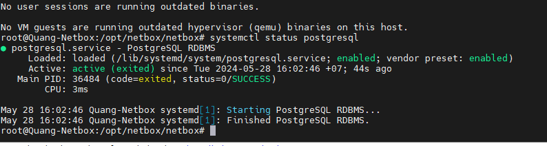
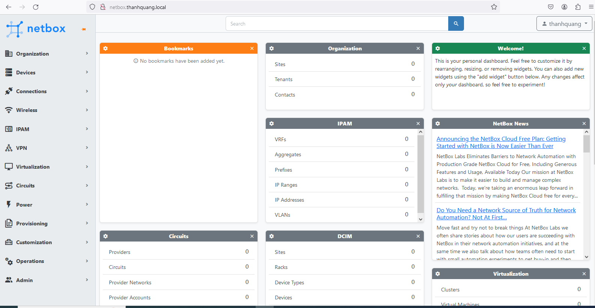

- [Hướng dẫn cài đặt Netbox 3.7.8](#hướng-dẫn-cài-đặt-netbox-378)
  - [1. Yêu cầu cần thiết](#1-yêu-cầu-cần-thiết)
  - [2. Các bước cài đặt](#2-các-bước-cài-đặt)
    - [2.1 Cài đặt PostgreSQL](#21-cài-đặt-postgresql)
    - [2.2 Cài đặt Redis](#22-cài-đặt-redis)
    - [2.3 Cài đặt Python và các gói phụ trợ](#23-cài-đặt-python-và-các-gói-phụ-trợ)
    - [2.4 Cài đặt Netbox](#24-cài-đặt-netbox)
    - [2.5 Cài đặt nginx](#25-cài-đặt-nginx)
- [Tài liệu tham khảo](#tài-liệu-tham-khảo)
# Hướng dẫn cài đặt Netbox 3.7.8
## 1. Yêu cầu cần thiết
Để có thể cài đặt Netbox 3.7.8 thì cân các yếu tố sau:
- PostgreSQL : Dùng để làm cơ sở dữ liệu cho Netbox sử dụng
- Redis : NetBox sử dụng Redis để làm Caching ( lưu trữ các kết quả truy vấn cơ sở dữ liệu thường xuyên được yêu cầu), Session Storage (Redis có thể được sử dụng để lưu trữ thông tin session của người dùng.), Task Queue (hàng đợi tác vụ)
- wget: Dùng để tải xuống Netbox owr trên github
- nginx : Dùng để truy cập vào web của Netbox
- Python và các thư viện của nó : gcc python36 python36-devel python36-setuptools libxml2-devel libxslt-devel libffi-devel openssl-devel redhat-rpm-config
easy_install-3.6 pip
## 2. Các bước cài đặt
### 2.1 Cài đặt PostgreSQL
- Cài đặt SQL
    ```
    apt update -y
    apt install postgresql postgresql-contrib -y
    ```
- Kiểm tra xem postgresql đã thực hiện chưa
  ```
  systemctl status postgresql
  ```
  

- Đăng nhập và postgresql
  ```
  sudo -i -u postgres psql
  ```
- Tạo user và passwd để sử dụng postgresql
  ```
  CREATE USER netbox WITH PASSWORD 'password';
  ```
- Tạo database cho Netbox sử dụng
  ```
  CREATE DATABASE netbox;
  ```
- Gắn quyền sử dụng database mới tạo cho người dùng
  ```
  ALTER DATABASE netbox OWNER TO netbox;
  ```
- Thoát
  ```
  \q
  ```
### 2.2 Cài đặt Redis
- Cài đặt redis
  ```
  apt install redis -y
  ```
- Bạn có thể kiểm tra mình đã cài đặt Redis bằng lệnh
  ```
  root@Quang-Netbox:# redis-server -v
  Redis server v=6.0.16 sha=00000000:0 malloc=jemalloc-5.2.1 bits=64 build=a3fdef44459b3ad6
  ```
- Sử dụng redis-cli để đảm bảo dịch vụ redis hoạt động
  ```
  root@Quang-Netbox:~# redis-cli ping
  PONG
  ```
### 2.3 Cài đặt Python và các gói phụ trợ 

- Cài đặt Python và các gói phụ trợ
  ```
  apt install -y python3 python3-pip python3-venv python3-dev build-essential libxml2-dev libxslt1-dev libffi-dev libpq-dev libssl-dev zlib1g-dev
  ```
### 2.4 Cài đặt Netbox
- Tải xuống Netbox
  ```
  install -y wget
  wget https://github.com/netbox-community/netbox/archive/refs/tags/v3.7.8.tar.gz
  sudo tar -xzf /tmp/v3.7.8.tar.gz -C /opt
  sudo ln -s /opt/netbox-3.7.8/ /opt/netbox
  ```
- Tạo user Netbox và chuyển chủ sở hữu cho thư mục netbox
  ```
  sudo adduser --system --group netbox
  sudo chown --recursive netbox /opt/netbox/netbox/media/
  sudo chown --recursive netbox /opt/netbox/netbox/reports/
  sudo chown --recursive netbox /opt/netbox/netbox/scripts/
  ```
- Tạo file configuaration.py
  ```
  cd /opt/netbox/netbox/netbox/netbox/
  cp configuration.example.py configuration.py
  ```
- Tạo a secret key
  ```
  python3 ../generate_secret_key.py
  ```
  ```
  Sor-X^(KL5o5%dj8cJD_C4K9y-M3mSQgpZV^mgVTEA&ht+3QWU
  ```
- Sửa file cấu hình 
  ```
  vi configuration.py
  ```
  - Khai báo địa chỉ IP hoặc domain mà bạn có thể truy cập vào NetBox
  ```
  ALLOWED_HOSTS = ['172.16.66.54']
  ```
  - Khai báo thông tin database
  ```
  DATABASE = {
      'NAME': 'netbox',               # Database name
      'USER': 'netbox',               # PostgreSQL username
      'PASSWORD': 'your_password', # PostgreSQL password
      'HOST': 'localhost',            # Database server
      'PORT': '',                     # Database port (leave blank for default)
      'CONN_MAX_AGE': 300,            # Max database connection age
  }
  ```
  - Nếu bạn ko thay đổi cấu hình redis thì giữ nguyên ko cần khai báo bên dưới
  ```
    REDIS = {
        'tasks': {
            'HOST': 'localhost',
            'PORT': 6379,
            # Comment out `HOST` and `PORT` lines and uncomment the following if using Redis Sentinel
            # 'SENTINELS': [('mysentinel.redis.example.com', 6379)],
            # 'SENTINEL_SERVICE': 'netbox',
            'PASSWORD': '',
            'DATABASE': 0,
            'DEFAULT_TIMEOUT': 300,
            'SSL': False,
        },
        'caching': {
            'HOST': 'localhost',
            'PORT': 6379,
            # Comment out `HOST` and `PORT` lines and uncomment the following if using Redis Sentinel
            # 'SENTINELS': [('mysentinel.redis.example.com', 6379)],
            # 'SENTINEL_SERVICE': 'netbox',
            'PASSWORD': '',
            'DATABASE': 1,
            'DEFAULT_TIMEOUT': 300,
            'SSL': False,
        }
    }
  ```
- Cài đặt Netbox
  ```
  /opt/netbox/netbox/upgrade.sh
  ```
- Tạo Netbox User Admin
  ```
  source /opt/netbox/venv/bin/activate
  cd /opt/netbox/netbox
  python3 manage.py createsuperuser
  ```
  - Ta đặt user theo mẫu bên dưới
  ```
  Username (leave blank to use 'root'): nadmin
  Email address: admin@example.com
  Password: 
  Password (again): 
  Superuser created successfully.
  ```
- Tạo symbolic link to the NetBox service file.
  ```
   ln -s /opt/netbox/contrib/netbox-housekeeping.sh /etc/cron.daily
   ```
- Để biết Netbox đã cài đặt thành công hay chưa ta sẽ chạy thử nghiệm trước
  ```
  python3 manage.py runserver 0.0.0.0:8000 --insecure
  ```
  Bây giờ ta có thể truy cập vào netbox bằng trình duyệt `http://IP:8000`
  - Để kết thúc thử nghiệm ta chạy lệnh
  ```
  deactivate
  ```
- Để Netbox sử dụng được bằng systemctl như các service bình thường
  ```
  cp /opt/netbox/contrib/gunicorn.py /opt/netbox/gunicorn.py
  cp -v /opt/netbox/contrib/*.service /etc/systemd/system/
  systemctl daemon-reload
  systemctl start netbox netbox-rq
  systemctl enable netbox netbox-rq
  ```
### 2.5 Cài đặt nginx
- Khi ta kết thúc thử nghiệm thì netbox sẽ không thể truy cập được bằng trình duyệt nữa. Bây giờ ta cần cài đặt Nginx để hoàn thiện 
- Cài đặt nginx
  ```
  apt install nginx
  ```
- Sửa file cấu hình chính của nginx. Thêm vào sau dòng http{:
  ```
  server_names_hash_bucket_size  64;
  ```
- Tạo file cấu hình nginx cho netbox. Ta thay thế bằng IP và domain của mình
  ```
  server {

    listen         80;
    server_name    netbox.example.com;
    access_log                /var/log/nginx/netbox.access.log;
    error_log                 /var/log/nginx/netbox.error.log;

    client_max_body_size 25m;

    # Proxy everything over to the netbox server
    location /static/ {
      alias /opt/netbox/netbox/static/;
    }

    location / {
      proxy_set_header        X-Real-IP $remote_addr;
      proxy_set_header        X-Forwarded-Proto $scheme;
      proxy_set_header	    X-Forwarded-Host $http_host;
      proxy_pass              http://127.0.0.1:8001;
    }
  }
  ```
- Kiểm tra cấu hình nginx đã đúng chưa
  ```
  nginx -t
  ```
- Khởi động lại và chạy dịch vụ nginx
  ```
  systemctl restart nginx
  systemctl start nginx
  systemctl enable nginx
  ```
- Tiến hành sửa file host của laptop để có thể truy cập được bằng domain
- Lên trình duyệt gõ domain kiểm tra kết quả


# Tài liệu tham khảo
https://www.atlantic.net/dedicated-server-hosting/how-to-install-netbox-irm-on-ubuntu-22-04/

https://news.cloud365.vn/netbox-phan-1-huong-dan-cai-dat-netbox-tren-centos-7/