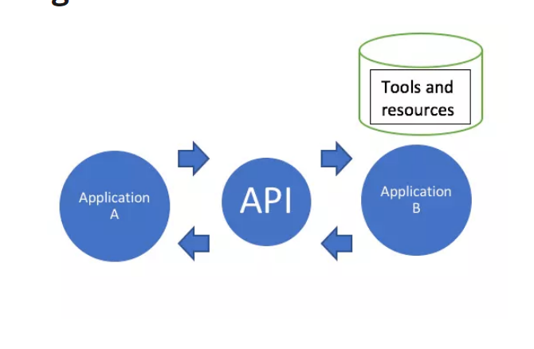
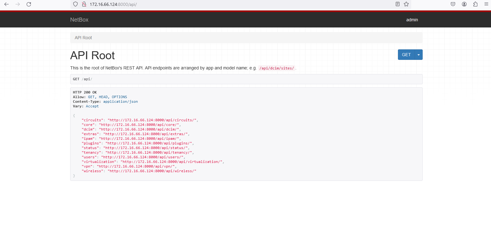
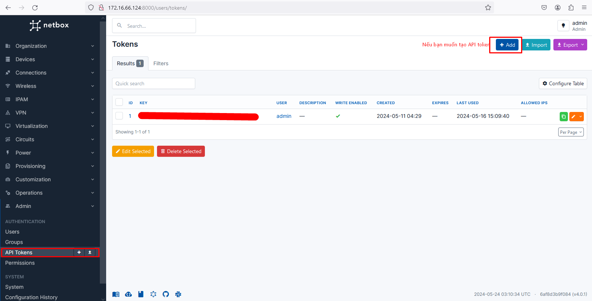
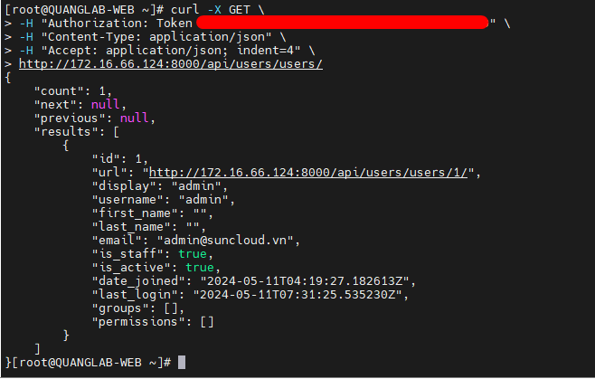

- [Tìm hiểu về API trong Netbox](#tìm-hiểu-về-api-trong-netbox)
  - [1. API là gì?](#1-api-là-gì)
  - [2. API làm việc như thế nào?](#2-api-làm-việc-như-thế-nào)
    - [2.1 Request](#21-request)
    - [2.2 Response](#22-response)
  - [3. API trong Netbox](#3-api-trong-netbox)
    - [3.1 Các API cơ bản trong Netbox](#31-các-api-cơ-bản-trong-netbox)
    - [3.2 API token trong Netbox](#32-api-token-trong-netbox)
    - [Ví dụ](#ví-dụ)
- [Tài liệu tham khảo](#tài-liệu-tham-khảo)
# Tìm hiểu về API trong Netbox
## 1. API là gì?
API là viết tắt của Giao diện lập trình ứng dụng (Application Programming Interface).



Ta sẽ hiểu rằng API là một trung gian phần mềm cho phép 2 ứng dụng có thể giao tiếp được với nhau. API cung cấp các chức năng và dữ liệu từ một ứng dụng cho các ứng dụng khác, giúp chúng tương tác mà không cần biết chi tiết nội bộ của nhau

## 2. API làm việc như thế nào?
API được xây dựng trên chính 2 thành phần: Request và Reponse. API chính là được dựa trên http để hoạt động
### 2.1 Request
Mỗi 1 Request chuẩn sẽ cần 4 thành phần
- URL :
- Method: Phương thức giao tiếp với URL đó thông thường gồm 2 loại chính là GET và POST
  - GET: Sử dụng để lấy thông tin từ server theo URI đã cung cấp.
  -  HEAD: Giống với GET nhưng response trả về không có body, chỉ có header.
  -  POST: Gửi thông tin tới sever thông qua các parameters HTTP.
  -  PUT: Ghi đè tất cả thông tin của đối tượng với những gì được gửi lên.
  -  PATCH: Ghi đè các thông tin được thay đổi của đối tượng.
  -  DELETE: Xóa resource trên server.
  -  CONNECT: Thiết lập một kết nối tới server theo URI.
  -  OPTIONS: Mô tả các tùy chọn giao tiếp cho resource.
  -  TRACE: Thực hiện một bài test loop-back theo đường dẫn đến resource.
- Headers: Là nơi chứa các thông tin cần thiết của 1 request nhưng end-users không biết có sự tồn tại của nó. Ví dụ: độ dài của request body, thời gian gửi request, loại thiết bị đang sử dụng, loại định dạng cái response mà client có đọc được…
- Body : Nơi chứa thông tin mà Client muốn truyền tải đến Server
### 2.2 Response
Sau khi nhận được request từ phía client, server sẽ xử lý cái request đó và gửi ngược lại cho client 1 cái response. Cấu trúc của 1 response tương đối giống phần request nhưng Status code sẽ thay thế cho URL và Method. Tóm lại, nó có cầu trúc 3 phần:

- Status code
- Headers
- Body

## 3. API trong Netbox
### 3.1 Các API cơ bản trong Netbox
Toàn bộ các API của Netbox cung cấp sẽ được truy xuất theo theo đường dẫn `http://172.16.66.124:8000/api/`


Trên hình ảnh là những API mà ta có thể tương tác với  Netbox
- circuits: Đây là một endpoint để truy cập vào thông tin về các mạch (circuits), có thể là các kết nối mạng hoặc các mạch điện.

- core: Endpoint này cung cấp truy cập vào các thông tin cơ bản hoặc chính của hệ thống, thường là các cấu hình cốt lõi.

- dcim: Đây là endpoint cho việc quản lý thông tin về dữ liệu trung tâm và hệ thống quản lý trung tâm dữ liệu (DCIM).

- extras: Endpoint này có thể cung cấp truy cập vào các thông tin bổ sung hoặc mở rộng, như các tính năng không bắt buộc.

- ipam: Endpoint này liên quan đến quản lý địa chỉ IP (IP Address Management), cung cấp thông tin về các địa chỉ IP và việc quản lý chúng.

- plugins: Đây là endpoint cho việc quản lý các plugin được tích hợp vào hệ thống.

- status: Endpoint này có thể cung cấp thông tin về trạng thái hoạt động của hệ thống, như tình trạng kết nối hoặc tình trạng sức khỏe.

- tenancy: Đây là endpoint cho việc quản lý thông tin về quản lý tài nguyên hoặc thuê bao trong hệ thống.

- users: Endpoint này cung cấp truy cập vào thông tin về người dùng trong hệ thống.

- virtualization: Endpoint này có thể cung cấp truy cập vào thông tin về ảo hóa, như máy ảo và máy chủ ảo.

- vpn: Endpoint này liên quan đến quản lý mạng VPN (Virtual Private Network), cung cấp thông tin về các kết nối VPN.

- wireless: Đây là endpoint cho việc quản lý thông tin về mạng không dây hoặc WiFi.


Khi chúng ta muốn thêm bất kỳ 1 thông tin gì về thiết bị hay user thì ta gửi một http request đến đúng đường dẫn API mà Netbox cung cấp với phương thức POST

### 3.2 API token trong Netbox
Các bạn hãy tường tượng xem nếu Netbox được phơi ra môi trường Internet mà ai cũng muốn POST hay thay đổi các thông tin trong Netbox của bạn thì sẽ thế nào?

Để giải quyết vẫn đề này Netbox sẽ cung cấp cho bạn 1 API token dùng để định danh, xác thực bạn xem bạn có quyền gì để thao tác với API trong Netbox

Để có thể xem hoặc tạo API token thì bạn có thể làm theo hình ảnh bên dưới



### Ví dụ
Ta sẽ sử dụng Curl và GET để tương tác với Netbox nhé
```
curl -X GET \
-H "Authorization: Token $token" \
-H "Content-Type: application/json" \
-H "Accept: application/json; indent=4" \
http://172.16.66.124:8000/api/users/users/ \
```



# Tài liệu tham khảo
https://viblo.asia/p/tim-hieu-kien-thuc-co-ban-ve-api-maGK7A4Mlj2

https://github.com/huydv398/netbox-sync

https://netboxlabs.com/docs/netbox/en/stable/integrations/rest-api/#authentication