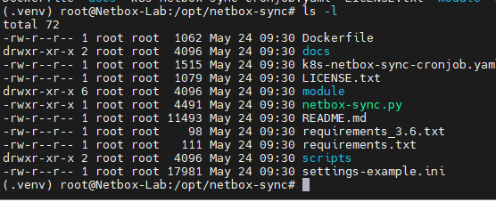

- [Cài đặt Netbox Sync](#cài-đặt-netbox-sync)
  - [1. Netbox Sync là gì?](#1-netbox-sync-là-gì)
  - [2. Cài đặt Netbox Sync kết hợp vCenter trên U22](#2-cài-đặt-netbox-sync-kết-hợp-vcenter-trên-u22)
    - [2.1 Các thư viện phụ trợ](#21-các-thư-viện-phụ-trợ)
    - [2.2 Cài đặt](#22-cài-đặt)
    - [2.3 Cấu trúc chạy Script trong Netbox Sync](#23-cấu-trúc-chạy-script-trong-netbox-sync)
- [Tài liệu tham khảo](#tài-liệu-tham-khảo)
# Cài đặt Netbox Sync
## 1. Netbox Sync là gì?
NetBox Sync là một tính năng của NetBox. Tính năng này cho phép NetBox tự động đồng bộ dữ liệu với các thiết bị và note nó lên trên Netbox

Những thiết bị mà Netbox Sync có thể đồng bộ được
- Switch 
- Router
- Server
- Virtual Machine
- ...

## 2. Cài đặt Netbox Sync kết hợp vCenter trên U22
### 2.1 Các thư viện phụ trợ
- python >= 3.6
- packaging
- urllib3==1.26.9
- wheel
- requests==2.27.1
- pyvmomi==7.0.3
- aiodns==2.0.0
- setuptools>=62.00.0
- pyyaml==6.0
- vsphere-automation-sdk

### 2.2 Cài đặt
- Update và cài đặt python
  ```
  apt-get update && apt-get install python3-venv
  ```
- Sao chép repo và cài đặt phụ thuộc
  ```
  cd /opt
  git clone https://github.com/bb-Ricardo/netbox-sync.git
  cd netbox-sync
  python3 -m venv .venv
  . .venv/bin/activate
  pip3 install --upgrade pip || pip install --upgrade pip
  pip3 install wheel || pip install wheel
  pip3 install -r requirements.txt || pip install -r requirements.txt
  ```
- Cài đặt `vsphere-automation-sdk` để có thể thao tác với VMware với câu lệnh chuẩn
  ```
  pip install --upgrade git+https://github.com/vmware/vsphere-automation-sdk-python.git
  ```

Đây là các thư mục ta thu được khi cài đặt thành công 



### 2.3 Cấu trúc chạy Script trong Netbox Sync
- Trong Netbox Sync có hỗ trợ 2 file cấu hình là yaml và ini 
- Dưới đây là cách sử dụng 2 file cấu hình đó
  ```
  usage: netbox-sync.py [-h] [-c settings.ini [settings.ini ...]] [-g]
                      [-l {DEBUG3,DEBUG2,DEBUG,INFO,WARNING,ERROR}] [-n] [-p]

  Sync objects from various sources to NetBox

  Version: 1.4.0 (2023-03-20)
  Project URL: https://github.com/bb-ricardo/netbox-sync

  options:
    -h, --help            show this help message and exit
    -c settings.ini [settings.ini ...], --config settings.ini [settings.ini ...]
                        points to the config file to read config data from
                        which is not installed under the default path
                        './settings.ini'
    -g, --generate_config
                        generates default config file.
    -l {DEBUG3,DEBUG2,DEBUG,INFO,WARNING,ERROR}, --log_level {DEBUG3,DEBUG2,DEBUG,INFO,WARNING,ERROR}
                        set log level (overrides config)
    -n, --dry_run         Operate as usual but don't change anything in NetBox.
                        Great if you want to test and see what would be
                        changed.
    -p, --purge           Remove (almost) all synced objects which were create
                        by this script. This is helpful if you want to start
                        fresh or stop using this script.
  ```
# Tài liệu tham khảo
https://github.com/huydv398/netbox-sync

https://github.com/bb-Ricardo/netbox-sync/blob/main/README.md