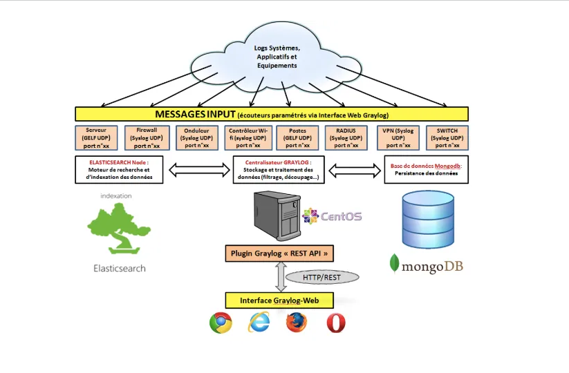

- [1. Giới thiệu về Gray log](#1-giới-thiệu-về-gray-log)
- [2. Các thành phần chính của Gray Log](#2-các-thành-phần-chính-của-gray-log)
- [Tài liệu tham khảo](#tài-liệu-tham-khảo)
# 1. Giới thiệu về Gray log
- Ngày nay do nhiều microservice được lưu trữ trên các máy khác nhau nên việc phân tích log không chỉ đòi hỏi trên một dịch vụ nữa mà cần phân tích log trên nhiều dịch vụ nên cần 1 log server quản lý tập trung để phân tích log dễ dàng
- Graylog là một nền tảng quản lý log mã nguồn mở, giúp thu thập, phân tích và hiển thị các log từ nhiều nguồn khác nhau. Đây là một công cụ mạnh mẽ giúp các tổ chức quản lý log của họ một cách hiệu quả, đảm bảo rằng các sự kiện quan trọng được ghi nhận và có thể dễ dàng phân tích.
- Bên cạnh đó Gray log cũng cung cấp rất nhiều chức năng như:
  - Thu thập log: Graylog có thể thu thập log từ nhiều nguồn khác nhau như máy chủ, ứng dụng, mạng và các thiết bị khác.
  - Phân tích log: Graylog cung cấp các công cụ mạnh mẽ để phân tích log, bao gồm khả năng tìm kiếm, lọc và phân loại log. Người dùng có thể tạo các quy tắc tùy chỉnh để phát hiện sự kiện quan trọng hoặc bất thường.
  - Hiển thị log: Graylog có giao diện người dùng đồ họa (GUI) cho phép người dùng dễ dàng xem và tương tác với log
  - Cảnh báo: Graylog cho phép thiết lập các cảnh báo dựa trên các điều kiện tùy chỉnh, giúp người dùng nhanh chóng nhận biết và phản ứng với các vấn đề.
  - Mở rộng: Graylog có kiến trúc mở rộng, cho phép tích hợp với các công cụ và dịch vụ khác thông qua plugin và API.
# 2. Các thành phần chính của Gray Log

Gray Log sẽ gồm 3 thành phần chính cấu tạo lên
- Graylog Server: Thành phần chính xử lý các log nhập vào, thực hiện các truy vấn tìm kiếm và quản lý cấu hình hệ thống.
- Elasticsearch: Được sử dụng để lập chỉ mục và tìm kiếm log. Elasticsearch giúp Graylog có thể tìm kiếm log một cách nhanh chóng và hiệu quả.
- MongoDB: Được sử dụng để lưu trữ cấu hình và metadata của Graylog

# Tài liệu tham khảo
https://medium.com/@gouthamr102/graylog-5265748cace0

https://graylog.org/