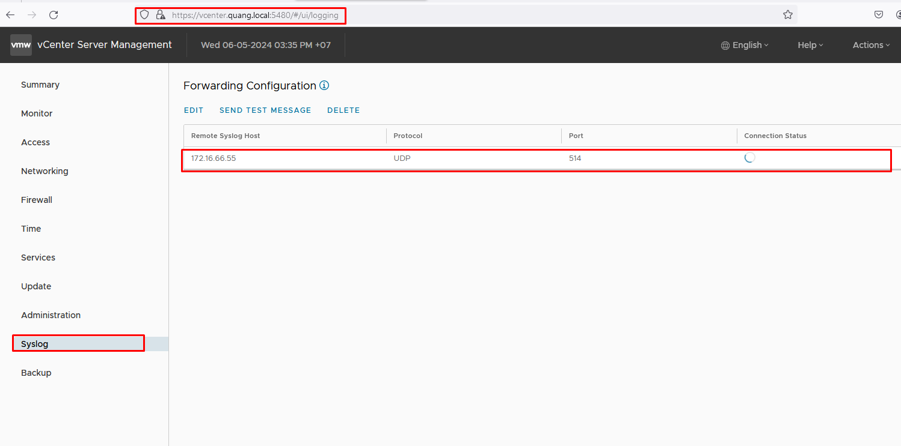
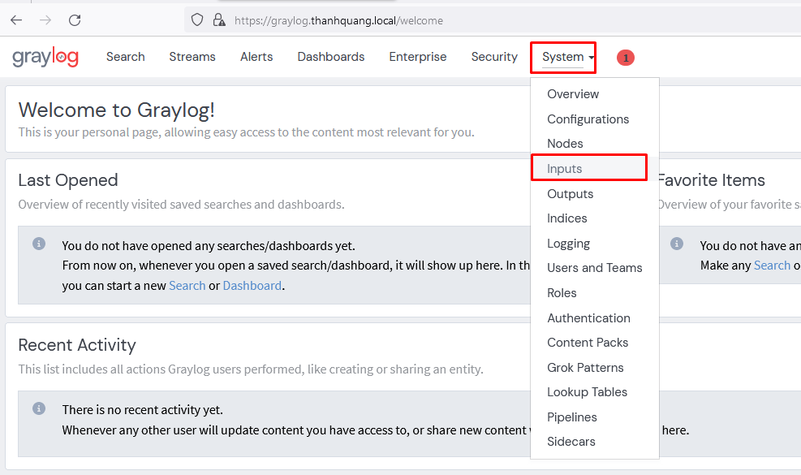
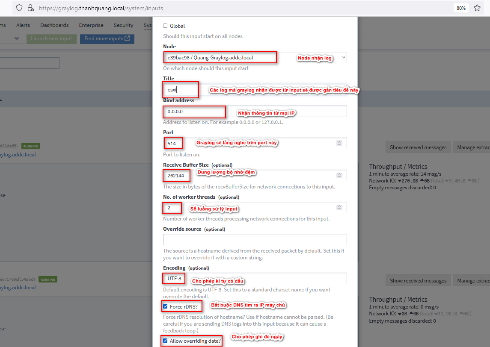
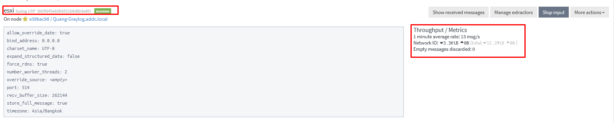
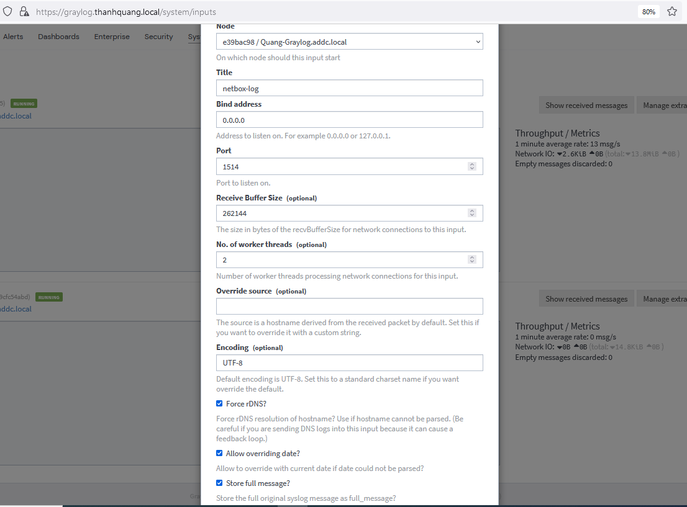
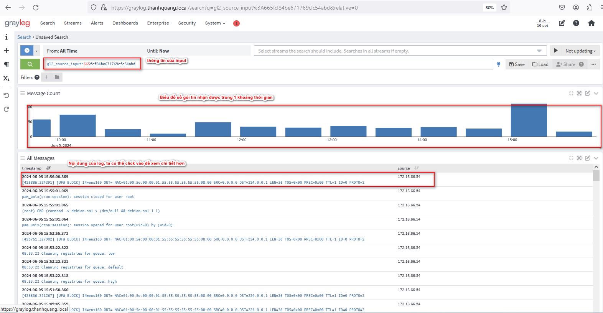

- [Cấu hình đẩy log từ client sang graylog](#cấu-hình-đẩy-log-từ-client-sang-graylog)
  - [1. Cấu hình đẩy log từ vCenter sang graylog](#1-cấu-hình-đẩy-log-từ-vcenter-sang-graylog)
    - [1.1 Thực hiện trên vCenter](#11-thực-hiện-trên-vcenter)
    - [1.2 Thực hiện cấu hình trên gray log](#12-thực-hiện-cấu-hình-trên-gray-log)
  - [2. Cấu hình bất kỳ máy chủ Linux nào gửi log đến graylog](#2-cấu-hình-bất-kỳ-máy-chủ-linux-nào-gửi-log-đến-graylog)
    - [2.1 Trên Client](#21-trên-client)
    - [2.2 Trên graylog Server](#22-trên-graylog-server)
- [Tài liệu tham khảo](#tài-liệu-tham-khảo)
# Cấu hình đẩy log từ client sang graylog
## 1. Cấu hình đẩy log từ vCenter sang graylog
### 1.1 Thực hiện trên vCenter
- Ta truy cập vào trang VAMI của vCenter `vcenter.quang.local:5480`  sau đó khai báo thông tin IP của graylog server và giao thức đẩy log ,ở đây minhg chọn syslog UDP
   
### 1.2 Thực hiện cấu hình trên gray log
- Đầu tiên cần phải mở firewall cho port 514/udp
  ```
  ufw allow 514/udp
  ```
- Tiếp theo ta sẽ lên GUI của graylog và tiến hành add input
  
- Bây giờ ta tiến hành chọn giao thức nhận log và khai báo các thông tin theo hình
  
- Sau khi thành công kết quả sẽ như trên
  
## 2. Cấu hình bất kỳ máy chủ Linux nào gửi log đến graylog
### 2.1 Trên Client
- Ta sửa lại file cấu hình để client chuyển log đi
  ```
  echo '*.*  @172.16.66.55:1514;RSYSLOG_SyslogProtocol23Format' >> /etc/rsyslog.conf
  ```
  - Ở đây là chuyển log UDP nhé
### 2.2 Trên graylog Server
- Ta cấu hình tương tự như cấu hình cho vcenter
  
  
- Kiểm tra log
  
# Tài liệu tham khảo
https://www.youtube.com/watch?v=uCrhZcTsFQ8&list=PLxiGkbpIzunRMMMkus7V84Z75sYoXfOmq&index=2

https://news.cloud365.vn/graylog-lab-phan-3-thu-thap-log-cua-linux-thong-qua-syslog/