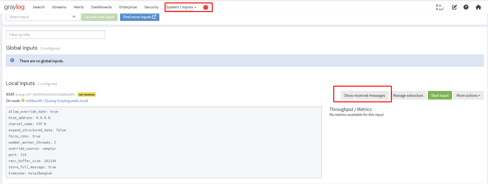
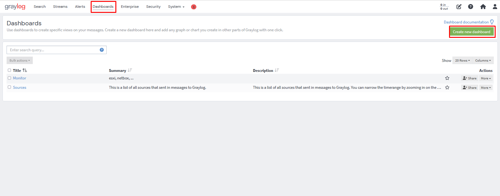
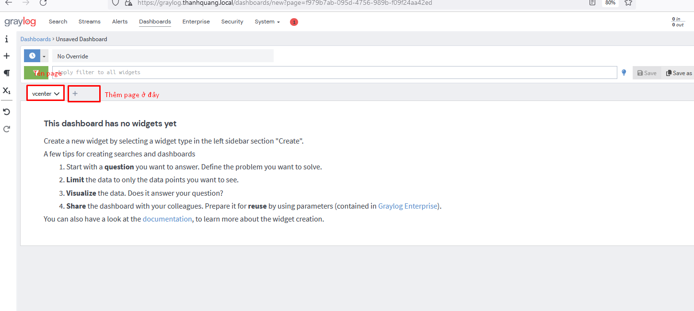
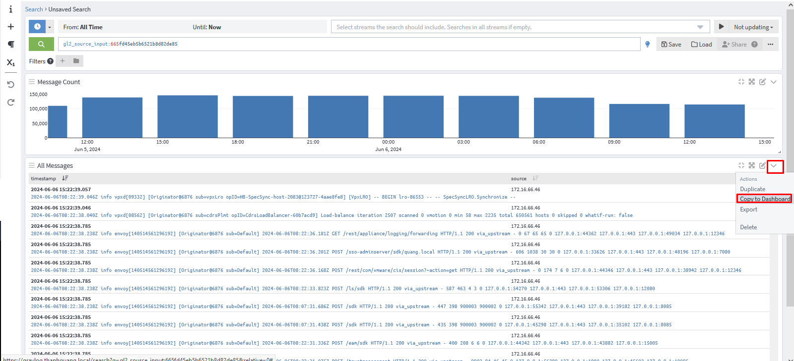
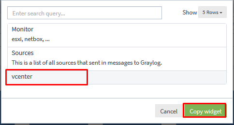
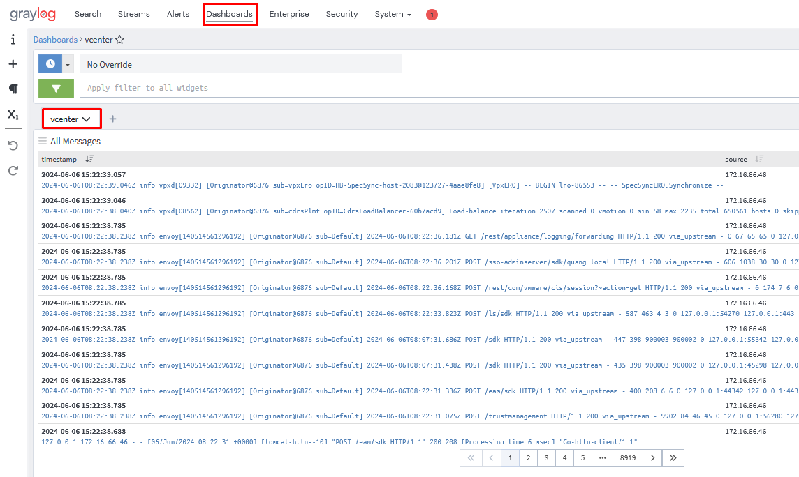
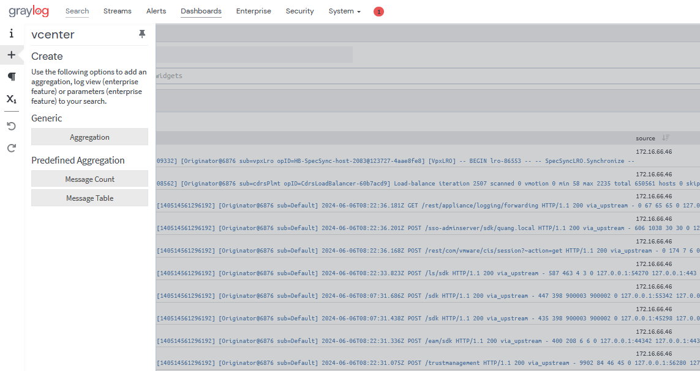
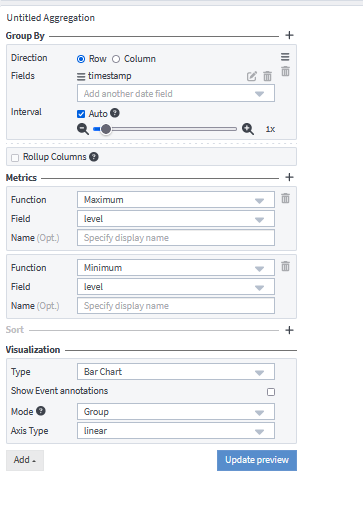
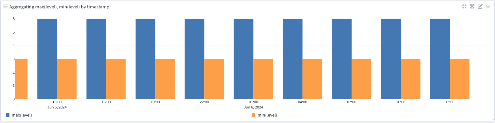

# Hướng dẫn tạo Dashboards trên Graylog
Dashboards trong Graylog cho phép bạn tạo các giao diện hiển thị dữ liệu tùy chỉnh để giám sát và phân tích log. Dưới đây là hướng dẫn chi tiết từng bước để tạo Dashboards trong Graylog
## 1. Tại sao lại cần Dashboards
Khi chúng ta sử dụng các Input trong Graylog để xem chi tiết các Message trong thì ta cần phải làm rất nhiều bước vào Input và chọn từng Input để rồi mới xem Message

Khi ta sử dụng Dashboards ta có thể gắn thông tin cho từng input vào từng trang khác nhau để thuận tiện cho việc theo dõi. Dashboards cũng hỗ trợ nhiều tính năng như biểu đồ, đếm số gói tin đã nhận trong thời gian nhất định,...
## 2. Tạo Dashboards cho 1 Input bất kỳ
- Đầu tiên ta chọn vào biểu tường Dashboards và Create new Dashboards
  
- Ta có thể đổi tên page để phù hợp với input hoặc thêm page để có thể thêm input khác
  
- Bây giờ ta tiến hành gắn những Message của Input vCenter vào page vCenter. Ta cần di chuyển đến show message input và tiến hành copy về dashboards
  
  
- Tiến hành chọn Dashboards ta đã tạo từ trước
  
- Lúc này message đã có trên page vcenter của dashbroad ta tạo ra
  
- Lợi ích của Dashboards còn cung cấp cho ta những tiện ích tuyệt vời như biểu đồ hay đếm số gói tin
- Ta có thể tạo thêm Widget cho Dashboards 
  - Aggregation : Tạo một Widget mới để ta tự cấu hình
  - Message Count : đếm số Message theo thời gian
  - Message Table : Bảng liệt kê các Message
  
- Trong Aggregation tôi sẽ hướng dẫn bạn tạo một wedget cho riêng bạn
  - Group By : Bạn sẽ nhóm các đối tượng theo dạng gì. Bạn hãy chọn Fields để lọc , ở đây tôi chọn timestamp
  - Metric chính là phương thức chọn. Bạn muốn chọn cái gì để hiển thị, ở đây tôi chọn maximum và Minimum
  - Visualization : đây là cách bạn chọn để hiển thị. Tôi muốn chọn biểu đồ nên sẽ chọn Bar Chart
  
- Kết quả
  
- Bạn có thể update thêm nhiều thông tin cho việc hiển thị phù hợp với mục đích của mình hơn nhé
# Tài liệu tham khảo
https://graylog2zh-cn.readthedocs.io/zh-cn/latest/pages/getting_started/create_dashboard.html
  

  