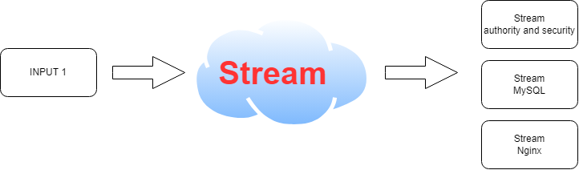
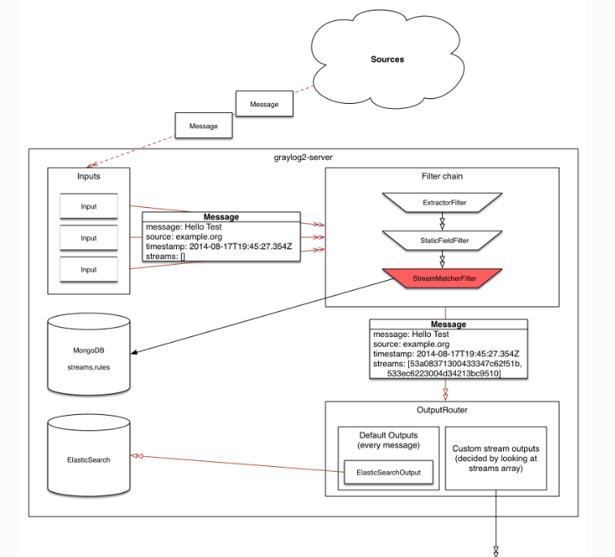

- [Tìm hiểu về Stream trong Graylog](#tìm-hiểu-về-stream-trong-graylog)
  - [1. Stream là gì? Tác dụng của nó ra sao](#1-stream-là-gì-tác-dụng-của-nó-ra-sao)
  - [2. Cấu trúc của Stream ra sao?](#2-cấu-trúc-của-stream-ra-sao)
  - [3. Các thành phần có trong Stream](#3-các-thành-phần-có-trong-stream)
- [Tài liệu tham khảo](#tài-liệu-tham-khảo)
# Tìm hiểu về Stream trong Graylog
## 1. Stream là gì? Tác dụng của nó ra sao

- Streams trong Graylog là cách bạn tổ chức và phân loại log dựa trên các tiêu chí cụ thể
- Mặc định các Input đi vào `Default Stream` và được lưu trữ ở `Default index set`. Nhưng khi ta muốn lọc log xác thực (authority and security) ra một luồng, log của http (nginx) ra một luồng thì ta cần đến stream
- Lý do tại sao ta cần phải dùng đến Stream là để lọc và phân chia ra các loại log thiết yếu. Ví dụ log xác thực thì cần có thời gian lưu trữ lâu và cần phải có cảnh báo nên ta cần tạo ra các luồng dữ liệu như thế để quản lý dễ dàng
## 2. Cấu trúc của Stream ra sao?

- Đầu tiên từ các Input (hay Source) sẽ gửi các message (log). Lúc này gray log nhận được log thì nó sẽ đến việc lọc log
- Extractor Filter : sẽ là trường lọc log đầu tiên. Lúc này cấu trúc các biến trong log sẽ thay đổi
- Tiếp đó đến Static Field Filter sẽ bắt đầu lọc tiếp trường này để phân loại log
- Tiếp đến Stream Matcher Filter sẽ bắt đầu lọc ra các luồng mà chúng ta mong muốn. (Mỗi luồng sẽ có các tiêu chí phù hợp để lọc)
- Từ Stream lọc ra lúc này sẽ được duyệt qua các Stream rules từ đó sẽ cho ta biết các thức mà log đó được lưu trữ trong MongoDB (lưu bao nhiêu bản, dung lượng bao nhiêu, bao lâu thì xóa)
- Ngoài ra Stream cũng cung cấp các chức năng đến output trực tiếp và dựa vào Elastic Search để lập chỉ mục

## 3. Các thành phần có trong Stream 
**Stream Rules (Quy tắc của Stream)**

- **Field Content Alert**: Kiểm tra xem một trường cụ thể có chứa một giá trị nhất định hay không.
- **Field Presence**: Kiểm tra xem một trường cụ thể có tồn tại trong thông điệp hay không.
- **Field Value**: Kiểm tra xem một trường cụ thể có giá trị lớn hơn, nhỏ hơn, bằng, hoặc không bằng một giá trị nhất định.
- **Regex Match**: Kiểm tra xem một trường cụ thể có khớp với một biểu thức chính quy hay không.

**Stream Alerts (Cảnh báo của Stream)**

- Thiết lập cảnh báo dựa trên các điều kiện của stream. Ví dụ, cảnh báo khi có một số lượng nhất định các thông điệp khớp với quy tắc của stream trong một khoảng thời gian nhất định.

**Stream Outputs (Đầu ra của Stream)**

- Định tuyến các thông điệp log khớp với quy tắc của stream đến các đầu ra cụ thể như một index khác, một hệ thống bên ngoài (qua HTTP, email, hoặc các plugin khác).

**Permissions (Quyền hạn)**

- Quản lý quyền truy cập vào stream cho các người dùng hoặc nhóm người dùng khác nhau. Bạn có thể thiết lập ai có quyền đọc, ghi, hoặc quản lý stream.

**Associated Pipelines (Các Pipeline Liên quan)**

- Áp dụng các pipeline rule cụ thể cho các thông điệp log khớp với stream để thực hiện các xử lý bổ sung như làm sạch dữ liệu, thêm hoặc sửa đổi các trường, hoặc định tuyến thêm.

# Tài liệu tham khảo
https://www.youtube.com/watch?v=tVXgRtyhfNk&list=PLECxNUHStsl9nUhMyZNb3Qnpj1cWYftm5&index=14

https://graylog2zh-cn.readthedocs.io/zh-cn/latest/pages/streams.html

https://app.diagrams.net/#G1qUzrPbbR0H3KFpEtTWgjT8AWY3FkFWYU#%7B%22pageId%22%3A%22anWe3pDeG8z6ANBYrixT%22%7D