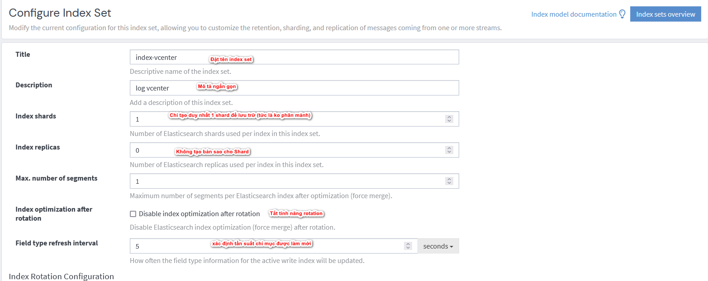
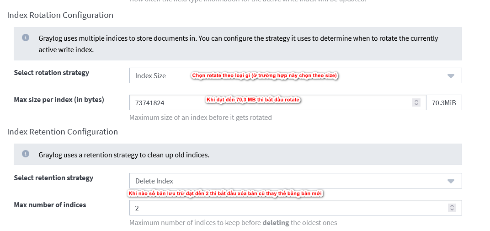

- [Tìm hiểu về Indices trong Graylog](#tìm-hiểu-về-indices-trong-graylog)
  - [1. Indices là gì?](#1-indices-là-gì)
  - [2. Các thành phần chính của Indices](#2-các-thành-phần-chính-của-indices)
  - [3. Thực hành](#3-thực-hành)
- [Tài liệu tham khảo](#tài-liệu-tham-khảo)
# Tìm hiểu về Indices trong Graylog
Ở phần trước ta đã tìm hiểu về về Stream rồi tiếp theo ta sẽ tìm hiểu về Indices 
## 1. Indices là gì?
Indices (chỉ mục) là cách Graylog lưu trữ dữ liệu log trên backend. Mỗi index chứa một tập hợp các log và có các cài đặt cụ thể như kích thước tối đa, số lượng phân đoạn, và thời gian giữ lại dữ liệu.

2 Mục đích chính để sử dụng Indices
-  Quản lý lưu trữ: Khi bạn cần quản lý lưu trữ dữ liệu log và kiểm soát cách dữ liệu được lưu trữ, phân đoạn và giữ lại.
-  Quản lý vòng đời dữ liệu: Khi bạn cần thiết lập chính sách vòng đời dữ liệu để tự động xóa hoặc lưu trữ dữ liệu cũ sau một khoảng thời gian nhất định.
-  
## 2. Các thành phần chính của Indices
**Index Set (Tập Chỉ Mục)**

- Một tập hợp các chỉ mục được quản lý như một đơn vị logic duy nhất. Mỗi index set có các cấu hình cụ thể như pattern, retention, và rotation.

**Index Rotation (Vòng đời Chỉ Mục)**

- **Size-based rotation**: Xoay vòng khi kích thước của index đạt đến một ngưỡng cụ thể.
- **Time-based rotation**: Xoay vòng theo chu kỳ thời gian (hàng giờ, hàng ngày, hàng tuần, hoặc hàng tháng).
- **Message Count-based rotation**: Xoay vòng khi số lượng thông điệp trong index đạt đến một ngưỡng cụ thể.

**Index Retention (Giữ Lại Chỉ Mục)**

- **Delete**: Xóa các index cũ sau một khoảng thời gian hoặc khi số lượng index đạt đến một ngưỡng cụ thể.
- **Close**: Đóng các index cũ nhưng giữ lại chúng trên hệ thống.
- **Archive**: Lưu trữ các index cũ để lưu trữ lâu dài nhưng không còn được truy cập thường xuyên.

**Index Configuration (Cấu Hình Chỉ Mục)**

- **Shards**: Số lượng phân đoạn mà index sẽ được chia nhỏ để tối ưu hóa hiệu suất truy vấn và lưu trữ.
- **Replicas**: Số lượng bản sao của mỗi phân đoạn để đảm bảo khả năng chịu lỗi và hiệu suất.

**Index Mappings (Ánh Xạ Chỉ Mục)**

- Xác định cấu trúc của dữ liệu được lưu trữ trong index, bao gồm các loại dữ liệu và các trường cụ thể. Mappings giúp Elasticsearch hiểu cách lưu trữ và truy vấn dữ liệu.

**Retention Strategy (Chiến Lược Giữ Lại)**

- Chiến lược để xác định khi nào các dữ liệu log cũ nên được xóa hoặc lưu trữ để quản lý không gian lưu trữ hiệu quả.

## 3. Thực hành
Bây giờ mình sẽ lọc các log nhận được do vCenter và lưu nó vào 1 index set

Ta sẽ hiểu các index set này sẽ tạo ra các thư mục lưu trữ và Stream sẽ chịu trách nghiệm đẩy các luông log vào thư mục này. Tất cả các dữ liệu khi đi vào phải tuân theo quy tắc đã thiết lập

# Tài liệu tham khảo
https://www.youtube.com/watch?v=68NsEh2X2xI&list=PLxiGkbpIzunRMMMkus7V84Z75sYoXfOmq&index=4

https://www.youtube.com/watch?v=tVXgRtyhfNk&list=PLECxNUHStsl9nUhMyZNb3Qnpj1cWYftm5&index=14
