- [Thực hành tạo cảnh báo đến Telegram khi có ai đó ssh thất bại quá nhiều lân](#thực-hành-tạo-cảnh-báo-đến-telegram-khi-có-ai-đó-ssh-thất-bại-quá-nhiều-lân)
  - [1. Mô hình xử lý](#1-mô-hình-xử-lý)
  - [2. Thực hành](#2-thực-hành)
    - [2.1 Tạo Notifications để cảnh báo](#21-tạo-notifications-để-cảnh-báo)
    - [2.2 Tạo Event Definitions](#22-tạo-event-definitions)
  - [3. Kết quả](#3-kết-quả)
- [Tài liệu tham khảo](#tài-liệu-tham-khảo)
# Thực hành tạo cảnh báo đến Telegram khi có ai đó ssh thất bại quá nhiều lân
## 1. Mô hình xử lý
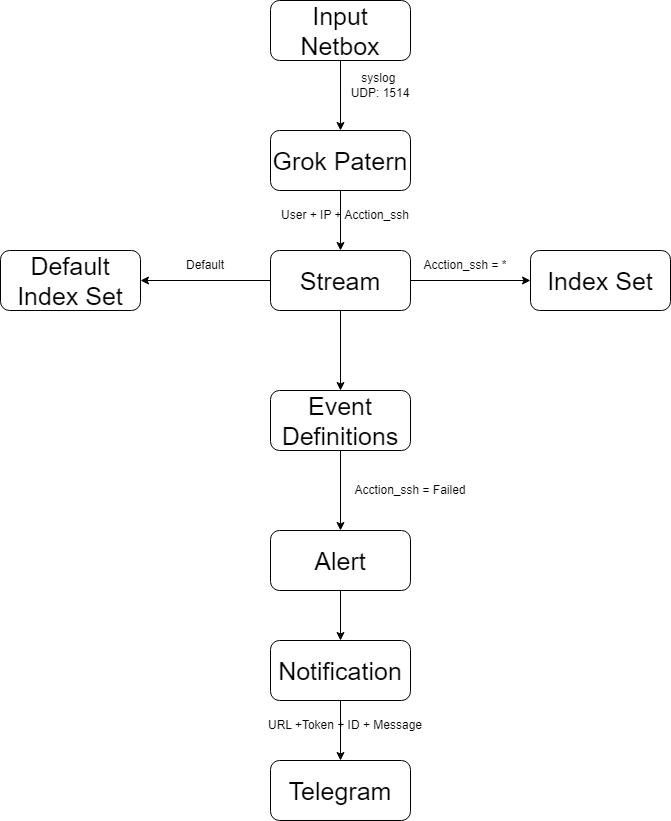
## 2. Thực hành
- Mặc định gray log 5.2 không cung cấp bản cảnh báo về telegram ta cần vào trực tiếp server graylog và download xuống
  ```
  cd /usr/share/graylog-server/plugin/
  wget https://github.com/irgendwr/TelegramAlert/releases/download/v2.2.0/telegram-alert-2.2.0.jar
  ```
- Khởi động lại dịch vụ graylog server
  ```
  systemctl restart graylog-server
  ```
### 2.1 Tạo Notifications để cảnh báo
- Vào mục Alerts -> Notifications và chọn Create Notifications
  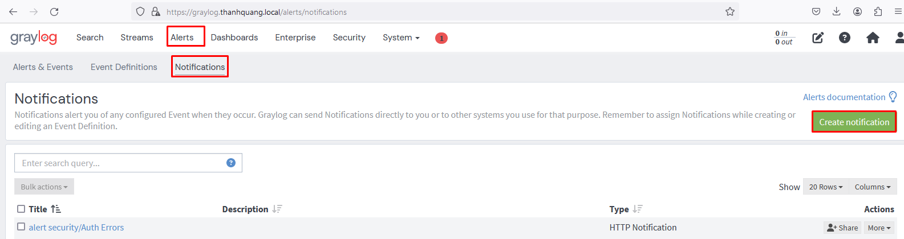
- Tiếp theo ta sẽ tùy chỉnh cấu hình
  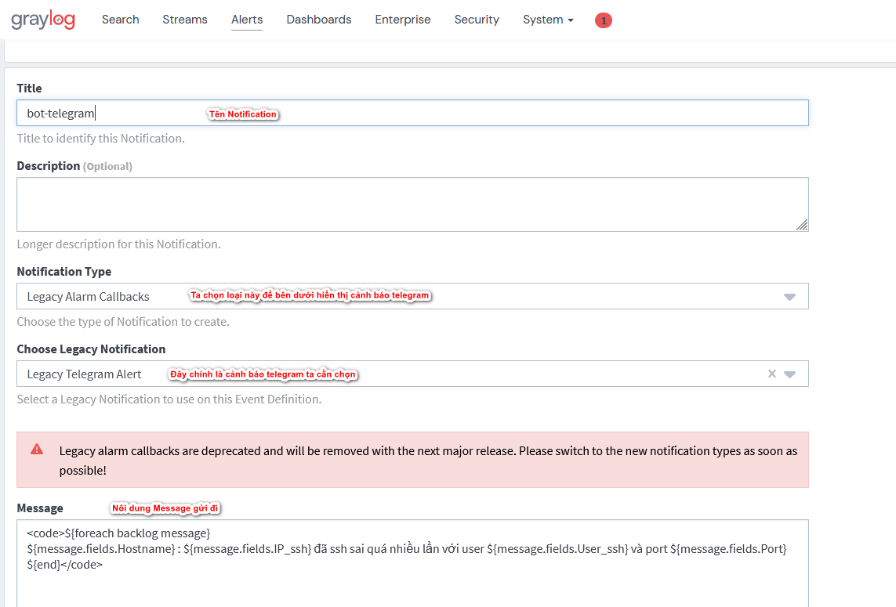
    ```
    <code>${foreach backlog message}
    ${message.fields.Hostname} : ${message.fields.IP_ssh} đã ssh sai quá nhiều lần với user ${message.fields.User_ssh} và port ${message.fields.Port}
    ${end}</code>
    ```
    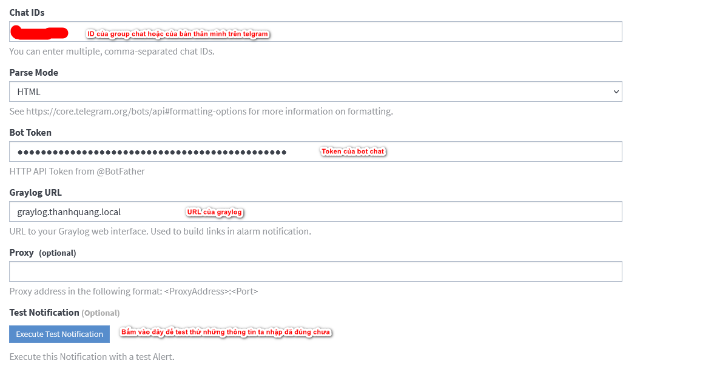
    
- Lưu ý rằng do ta muốn gửi cảnh báo SHH đăng nhập thất bại về Telegram nên cần phải có User, IP, Hostname nên phần message tôi đã chỉnh sửa
### 2.2 Tạo Event Definitions
- Tạo Event Definitions
  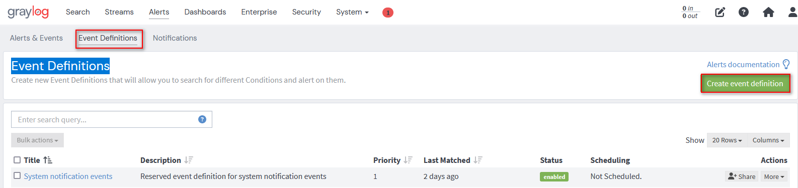
- Đặt tên
  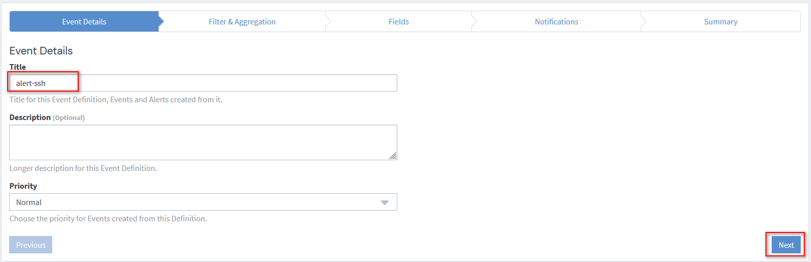
- Cấu hình gửi điều kiện cảnh báo
  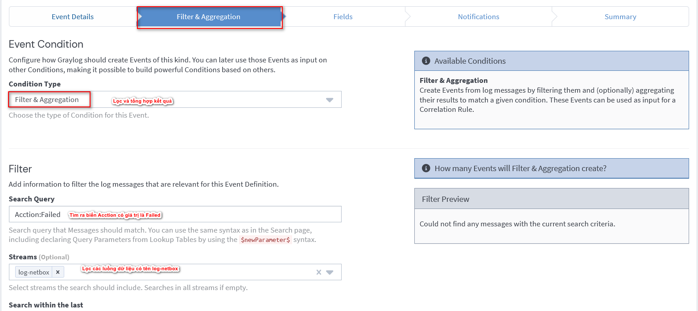
  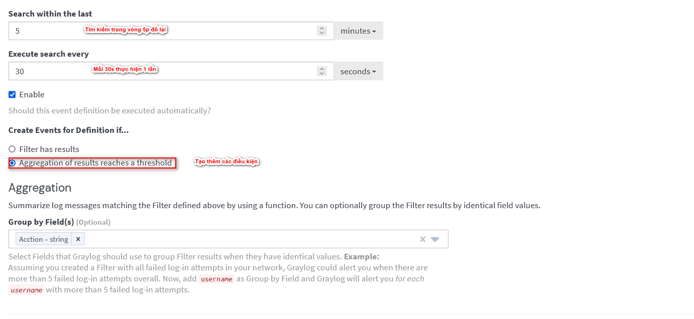
  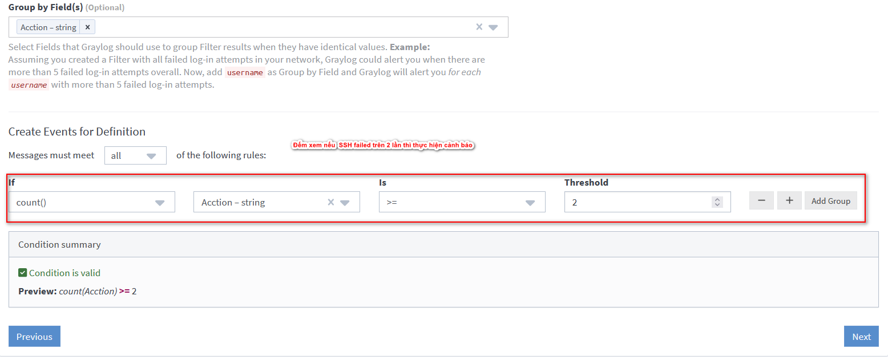
- Chọn Notifications ta đã thiết lập từ trước
  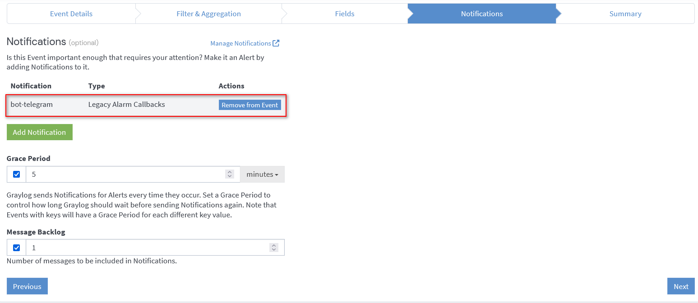
- Tổng kết lại. Bật Alert lên
  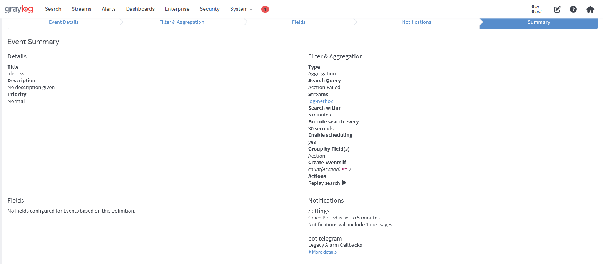
## 3. Kết quả
- Bây giờ ta hãy thử ssh sai nhiều lần để kiểm tra kết quả
  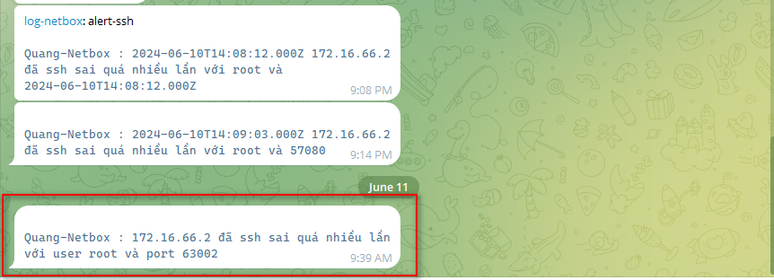
# Tài liệu tham khảo
https://news.cloud365.vn/graylog-lab-phan-10-cau-hinh-graylog-server-tich-hop-canh-bao-qua-telegram/

https://app.diagrams.net/#G1fgJJarjGDsXbKfTKkU3GQlrh6y4fOCRb#%7B%22pageId%22%3A%22SusIE26a6fdFw_H8cj9W%22%7D