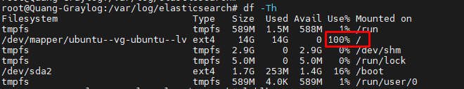
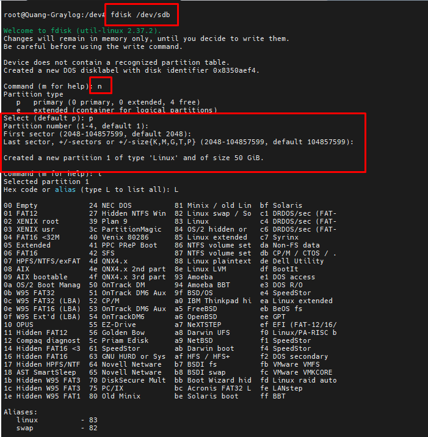

- [Hướng dẫn extend disk khi graylog sử dụng hết dung lượng](#hướng-dẫn-extend-disk-khi-graylog-sử-dụng-hết-dung-lượng)
  - [1. Nâng cấp lvm](#1-nâng-cấp-lvm)
- [Tài liệu tham khảo](#tài-liệu-tham-khảo)
# Hướng dẫn extend disk khi graylog sử dụng hết dung lượng
Đôi khi ta sử dụng graylog mà không quản lý indices hợp lý sẽ dẫn đến việc máy ảo không đủ bộ nhớ dẫn đến không thể truyy cập được graylog interface. 

## 1. Nâng cấp lvm
- Việc đầu tiên ta cần làm add disk thêm cho VM rồi
- Tiếp theo ta cần phải tạo physical volume
  ``` 
  fdisk /dev/sdb
  ```

- Tiếp theo ta cần mở rộng virtual group
  ```
  vgextend ubuntu-vg /dev/sdb1
  ```
- Tiếp theo ta cần mở rộng logical volume
  ```
  lvextend -L +50G /dev/lv--ubuntu
  ```
- Nhưng mới chỉ như này thì vẫn chưa nhận được thêm phân vùng đâu. Ta cần reload lại
  ```
  resize2fs /dev/ubuntu-vg/ubuntu-lv
  ```
- Bây giờ ta cần tiến hành restart lại tất cả các dịch vụ
  ```
  systemctl restart mongodb
  systemctl restart elasticsearch
  systemctl restart graylog-server
  ```
# Tài liệu tham khảo
