# Gửi cảnh báo về Telegram khi hành động liên quan đến Permission trên vCenter
## 1. Tóm tắt bài trước
- Ở bài trước ta đã sử dụng Grok Pattern kèm theo stream và index set để có thể lọc ra các luồng thông tin cần thiết. Bây giờ ta sẽ sử dụng các luồng stream đó để có thể gửi cảnh báo về Telegram
- Nói đến Permission thì sẽ gồm 4 yếu tố chính:
  - Tạo User
  - Xóa User
  - Tạo quyền cho User (Khi ta thay đổi quyền nó cũng tương tự)
  - Xóa quyền của User
## 2. Tạo cảnh báo về Telegram khi add user
- Mình sẽ lấy ví dụ minh họa về cảnh báo về Telegram khi có 1 user add và mấy trường hợp khác sẽ làm tương tự
- Đầu tiên ta cần phải xác nhận nội dung tin nhắn muốn chuyển chuyển sẽ là gì?
  ```
  2024-06-26T07:52:20.848Z : User Administrator@VCENTER.ADDC.LOCAL Creating local person user  
  Details:
  '','','','','thanhquang@vcenter.addc.local'
  ```
- Từ đây ta cần tạo Notifications trước với message sẽ như trên
    ```
    <code>${foreach backlog message}
    ${message.fields.time} 
    User ${message.fields.user_action} ${message.fields.action}  ${message.fields.user_created}
    Details:
    ${message.fields.detail}
    ${end}</code>
    ```
    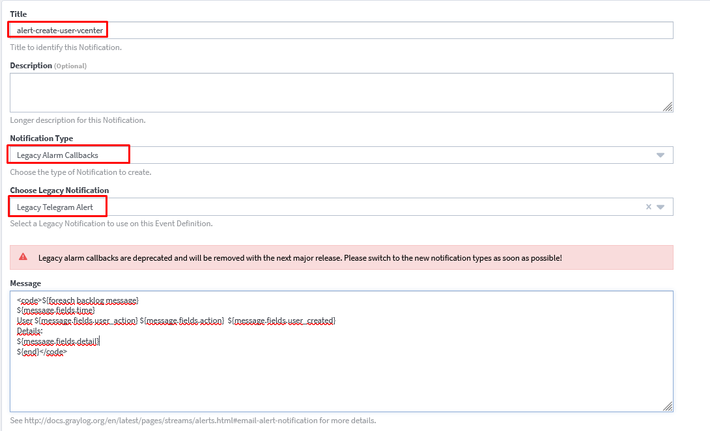
    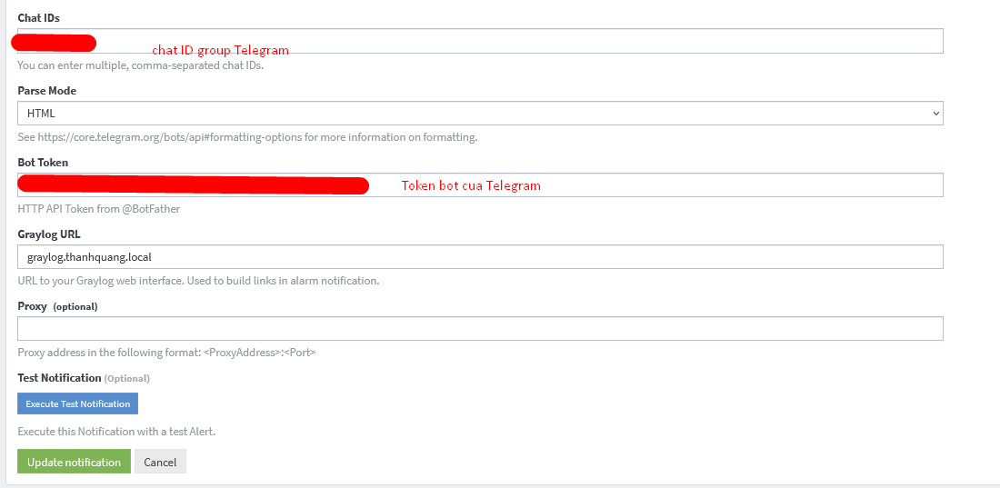

- Tiếp theo ta cần tạo Event Definitions (Điều kiện cảnh báo)
   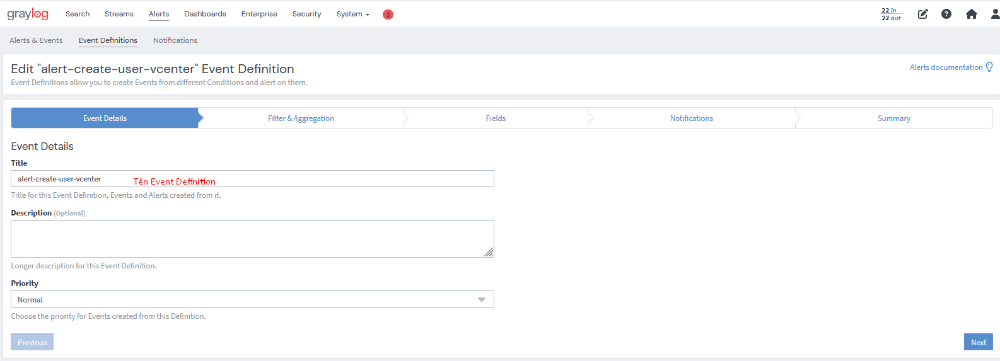
   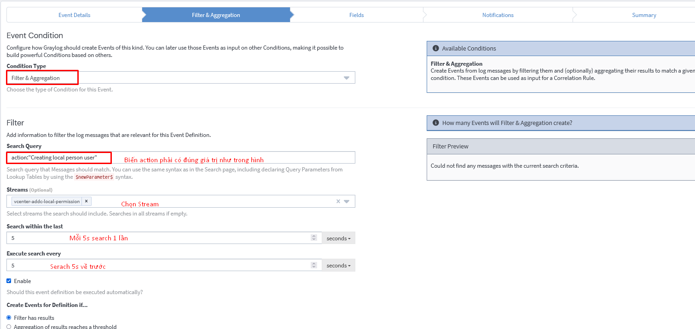

- Tiếp theo chọn Notification đã tạo trước đó
  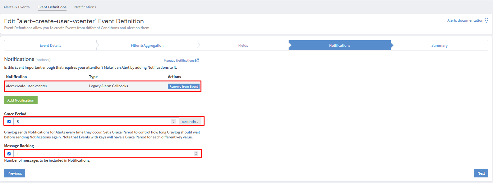
- Xem lại và hoàn tất
  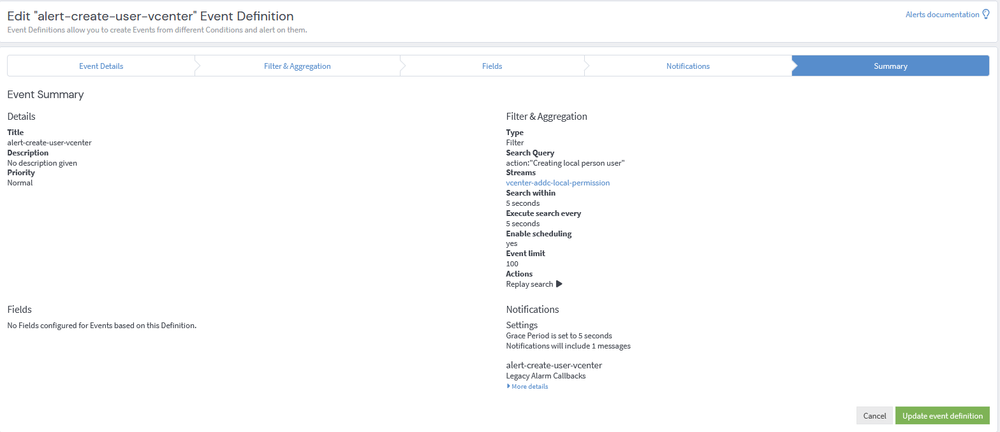
- Bây giờ hãy thử tạo User và tiến hành xem cảnh báo
  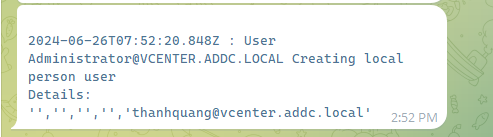

## 3. Mội dung Message tương tự
- Message khi xóa user
    ```
    <code>${foreach backlog message}
    ${message.fields.time} 
    User ${message.fields.user} ${message.fields.action} user  ${message.fields.user_action}  source ${message.fields.source}
    ${end}</code>
    ```
- Message khi tạo global permission
    ```
    <code>${foreach backlog message}
    ${message.fields.time} 
    action ${message.fields.action} 
    User ${message.fields.user_action} add role  ${message.fields.role} for ${message.fields.user_added} source ${message.fields.source}
    ${end}</code>
    ```
- Message khi xóa Global Permission
    ```
    <code>${foreach backlog message}
    ${message.fields.time} 
    action: ${message.fields.action} 
    User ${message.fields.user_action} remove   ${message.fields.user_added} source  ${message.fields.source}
    ${end}</code>
    ```
- Kết quả tin nhắn nhận được trên telegram
    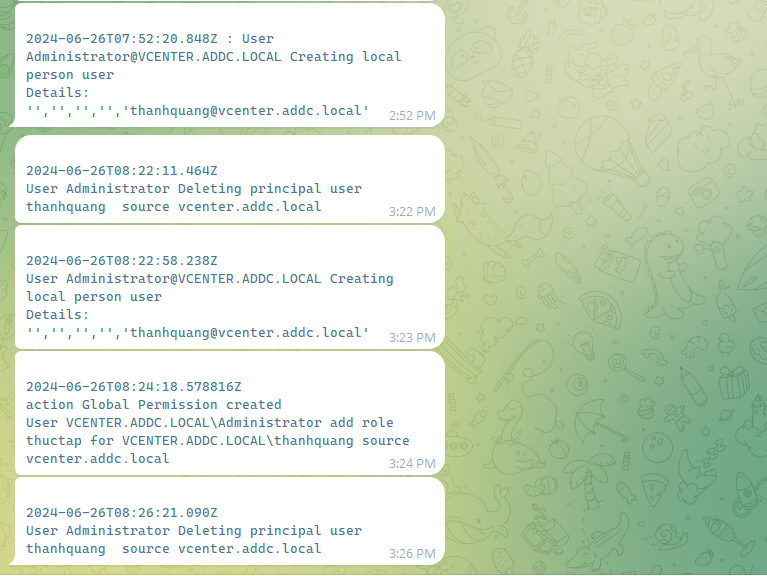

## 4. Cảnh báo về Telegram khi có User đăng nhập thành công
- Tạo Notifications
  ```
  <code>${foreach backlog message}
  ${message.fields.time} 
  User ${message.fields.user_login} ${message.fields.action}  SSO vcenter.addc.local
  ${end}</code>
  ```
  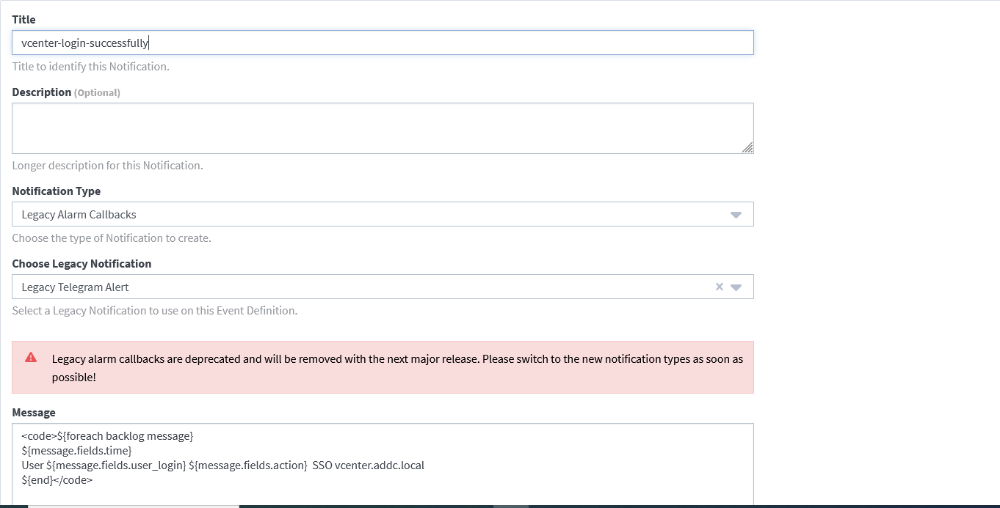
  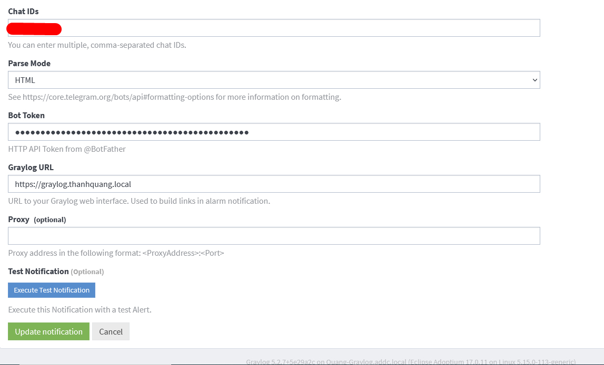
- Tạo điều kiện cảnh báo
  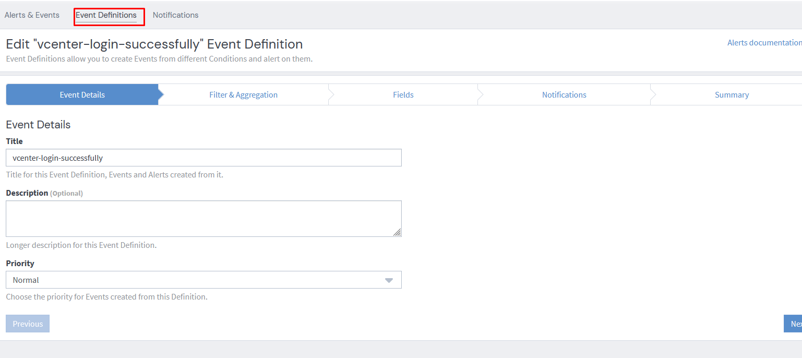
  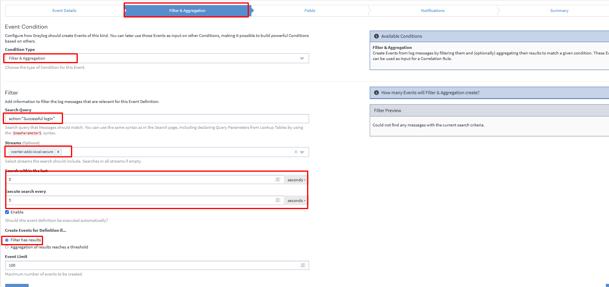
  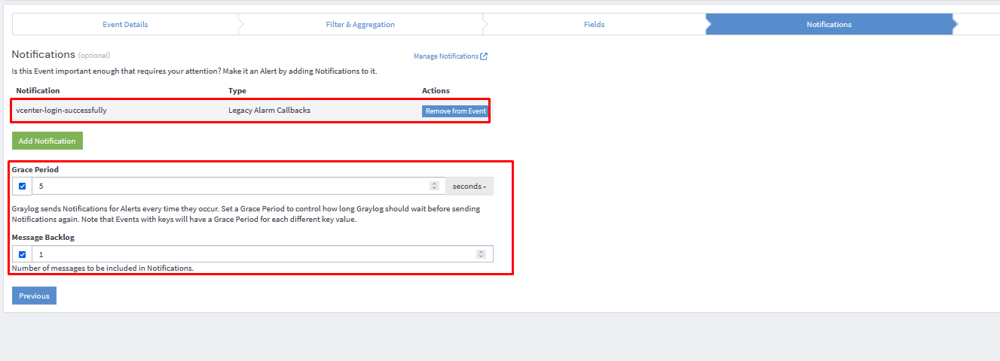
  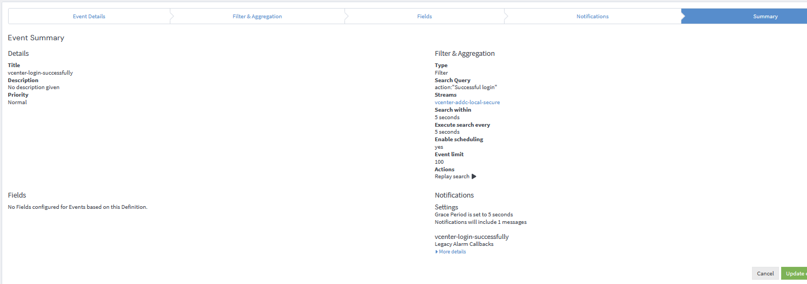
- Kết quả:
  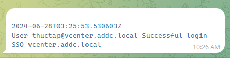
## 5. Cảnh báo về Telegram khi có User ssh
- Tạo Notifications
  ```
  <code>${foreach backlog message}
  ${message.fields.timestamp}
  ${message.message}
  ${end}</code>
  ```
  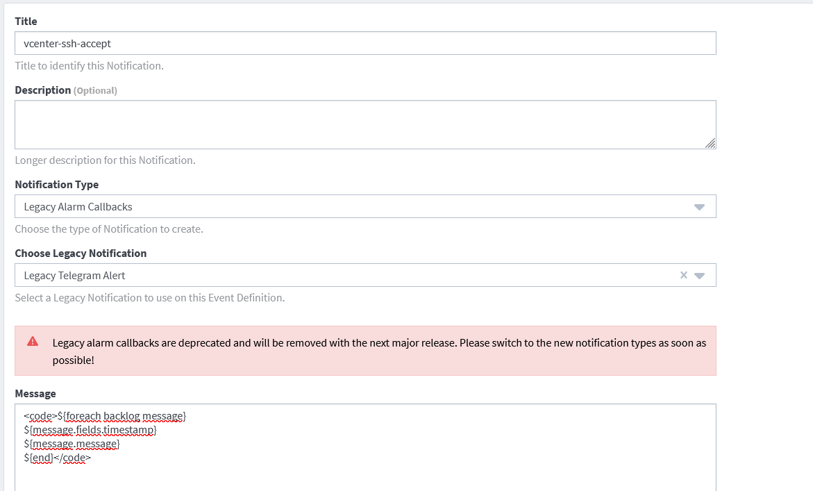
- Tạo điều kiện cảnh báo
  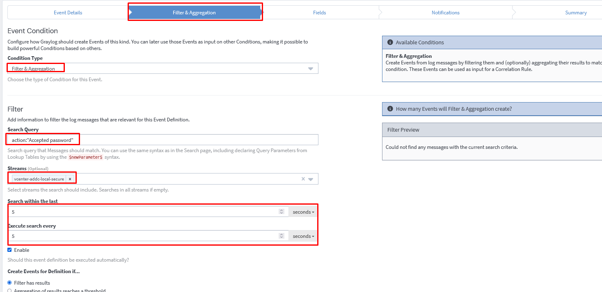
  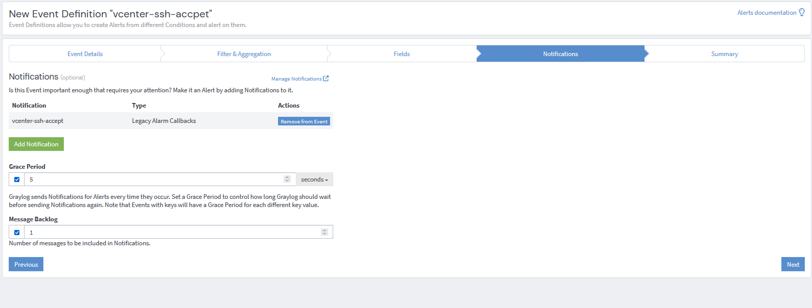
  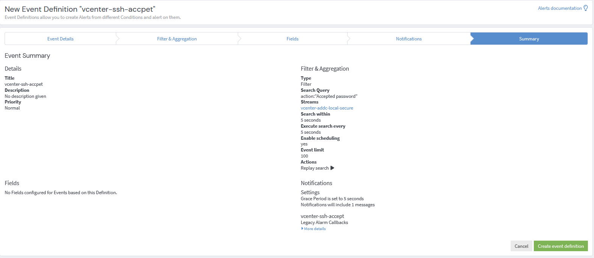
- Kết quả
  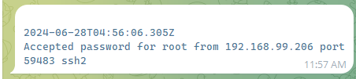