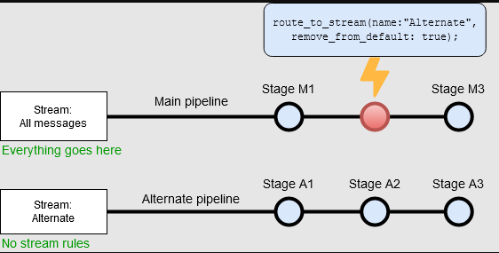
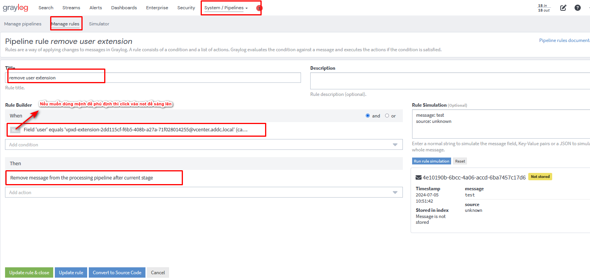
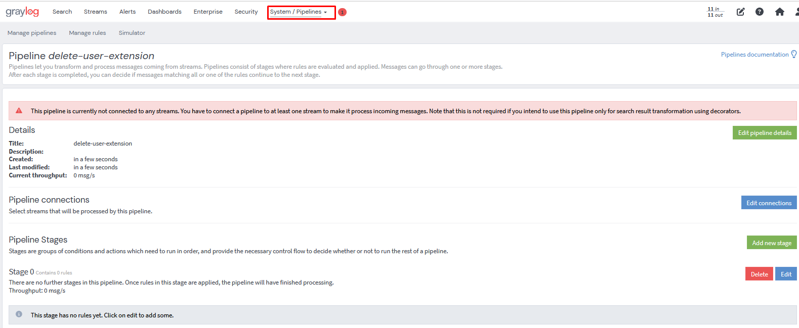
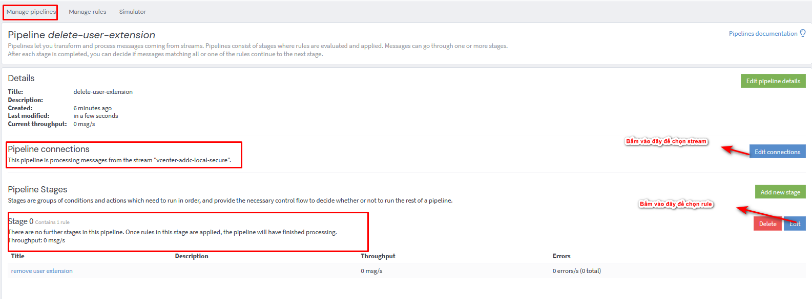
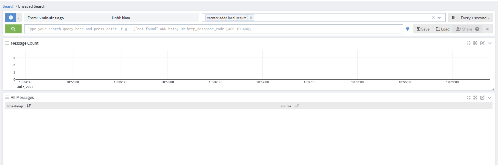

- [Pipeline là gỉ? Cấu hình pipeline thực tế](#pipeline-là-gỉ-cấu-hình-pipeline-thực-tế)
  - [1. Pipeline là gì?](#1-pipeline-là-gì)
  - [2. Cấu trúc hoạt động của Pipeline](#2-cấu-trúc-hoạt-động-của-pipeline)
  - [3. Các functions mà pipeline được cung cấp hay dùng](#3-các-functions-mà-pipeline-được-cung-cấp-hay-dùng)
    - [3.1 Điều kiện when](#31-điều-kiện-when)
    - [3.2 Hành động then](#32-hành-động-then)
  - [4. Thực hành](#4-thực-hành)
- [Tài liệu tham khảo](#tài-liệu-tham-khảo)
# Pipeline là gỉ? Cấu hình pipeline thực tế
## 1. Pipeline là gì?

- Khi các bạn tìm hiểu về Linux chắc hẳn đã gặp được ký tự `|` khi gõ các câu lệnh. Ý nghĩa của nó dùng để để  chuyển đầu ra của một lệnh thành đầu vào của lệnh khác.
- Tương tự Pipeline trong graylog nó cũng sẽ tạo ra các điều kiện và điều chỉnh đầu ra của các log phù hợp với mục đích của chính chúng ta
- Mục đích của pipeline:
  - Pipeline cho phép bạn áp dụng các quy tắc, điều kiện và biến đổi để tách, lọc, hoặc biến đổi logs trước khi lưu trữ hoặc hiển thị chúng.
  - Pipeline có thể giúp đỡ giảm thiểu quá trình sử lý của graylog bằng cách xóa những message không cần thiết giúp giảm tài nguyên sử dụng
## 2. Cấu trúc hoạt động của Pipeline

- Đầu tiên thì pipeline sẽ lấy các message từ 1 luồng stream nào đó mà ta đã chọn
- Trong Pineline sẽ có các Rule (Các rule này quy định sẽ đưa ra điều kiện tìm message và được làm gì với message đó) và các rule sẽ được gắn vào các Stage
- Các Stage sẽ được đi kèm với các con số, Con số càng thấp thì sẽ ưu tiên thực hiện stage đó trước
- Sau khi các message đi qua pipeline sẽ được giữ lại hay biến đổi tùy theo các rule mà ta áp dụng và kết quả cuối cùng sẽ được lưu vào các index set
## 3. Các functions mà pipeline được cung cấp hay dùng
### 3.1 Điều kiện when
- `Check for grok pattern`: Kiểm tra xem message có sử dụng grok pattern này không (không kiểm tra các biến bên trong)
- `Check source input`: Kiểm tra xem source có phải của input chỉ định không
- `Field` + `>,<,=,equals` : Kiểm tra xem các biến có thỏa mãn giá trị đã được thiết lập không
- `has field`: điều kiện chỉ cần có biến 
- Ta cũng có thể kiểm tra xem biến là số hay thời gian,... như: `Field is ip`
### 3.2 Hành động then
Sau khi các điều kiện được thỏa mãn thì làm gì với những message thỏa mãn điều kiện đó

Thông thường các action sẽ chia ra làm 2 dạng chính là
- `Function calls`: Gọi hàm như drop message hay drop field
- `Variable assignments` :Gắn biến, ta có thể tạo ra một biến mới từ 1 biến nào đó trong message

`let ip_address = to_ip($message.source_ip);`: Giá trị của biến `source_ip` trong message sẽ được chuyển vào biến `ip_address` mới
## 4. Thực hành
Hiện tại stream secure của vcenter.addc.local bị spam user `vpxd-extension-2dd115cf-f6b5-408b-a27a-71f028014255@vcenter.addc.local` đăng nhập liên tục. Mình muốn sử dụng Pipeline để xóa các đăng nhập do user này đi
- Tạo rule cho pipeline
  
- Tạo Pipeline
  
- Tiếp theo ta cần phải gắn stream và rule vào
  
Bây giờ đã hoàn thành tạo 1 pipe line đơn giản, bạn có thể vào và kiểm tra các log liên quan đến extension không còn nữa
  
# Tài liệu tham khảo

https://graylog.org/post/achieve-more-streamlining-your-logs/

https://graylog2zh-cn.readthedocs.io/zh-cn/latest/pages/pipelines.html