- [Hướng dẫn cài đặt graylog sidecar trên winserver 2019](#hướng-dẫn-cài-đặt-graylog-sidecar-trên-winserver-2019)
  - [1. Graylog sidecar là gì ?](#1-graylog-sidecar-là-gì-)
  - [2. Hướng dẫn cài đặt](#2-hướng-dẫn-cài-đặt)
    - [2.1 Tạo Tạo token và input trên Server](#21-tạo-tạo-token-và-input-trên-server)
    - [2.2 Cài đặt graylog sidecar trên windows](#22-cài-đặt-graylog-sidecar-trên-windows)
    - [2.3 Cấu hình hoàn thiện nhận log trên graylog server](#23-cấu-hình-hoàn-thiện-nhận-log-trên-graylog-server)
- [Tài liệu tham khảo](#tài-liệu-tham-khảo)
# Hướng dẫn cài đặt graylog sidecar trên winserver 2019
## 1. Graylog sidecar là gì ?
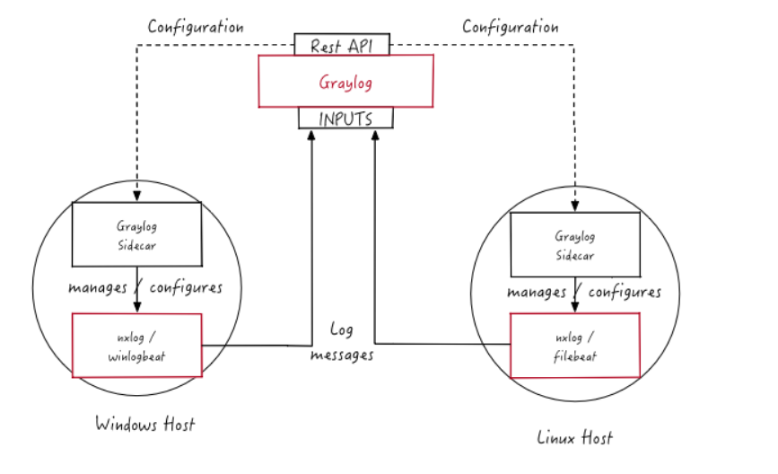
- Ở những bài trước ta đã tìm hiểu cách đẩy log vào graylog bằng syslog. Bên cạnh syslog thì graylog còn cung cấp cho ta một phương thức nữa là sidecar
- Khác với syslog thì sidecar được coi như là một phần mềm điều kiển, client và server được giao tiếp thông qua cây cầu là sidecar
- Sidecar cung cấp các collector như NXLog, Beats
  - NXlog : là một công cụ mạnh mẽ để thu thập, chuyển đổi, và chuyển tiếp log từ nhiều nguồn khác nhau (tệp, SQL, syslog, Windows Event Log, v.v.)
  - winlogbeat: là một công cụ thu thập log dành riêng cho windows, nó thu thập log từ Windows Event Log
  - filebeat: là một công cụ thu thập nhật ký dành riêng cho linux, nó thu thập nhật ký từ các file /var/log
- Điều khác biệt mà sidecar đem lại là nó trên các OS sử dụng GUI nó hỗ trợ giao diện để ta thao tác dễ dàng. Ngoài ra khi sử dụng sidecar ta chỉ cần đứng trên graylog server cấu hình mà không cần vào các máy client để cấu hình (Chỉ cần vào cài đặt lần đầu)
## 2. Hướng dẫn cài đặt
### 2.1 Tạo Tạo token và input trên Server
- Sidecar sử dụng API để có thể liên lạc được từ client đến server. Ta cần phải tạo token đầu tiên, nhớ copy token vì nó chỉ hiện 1 lần
  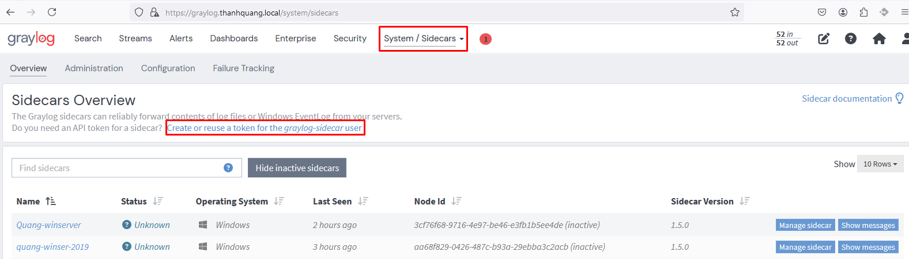
  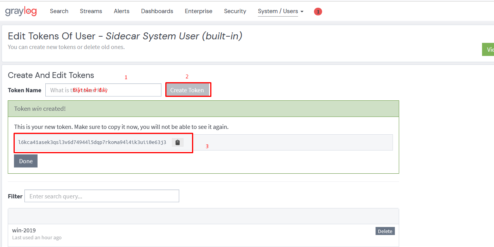
   
- Tiếp theo ta cần phải tạo 1 input để nhận log. Mình dùng port mặc định là 5044
  

- Bây giờ ta cần mở port 5044 cho graylog server
  ```
  ufw allow 5044/tcp
  ufw reload
  ```
### 2.2 Cài đặt graylog sidecar trên windows
- [Link tải file cài đặt](https://github.com/Graylog2/collector-sidecar/releases)
  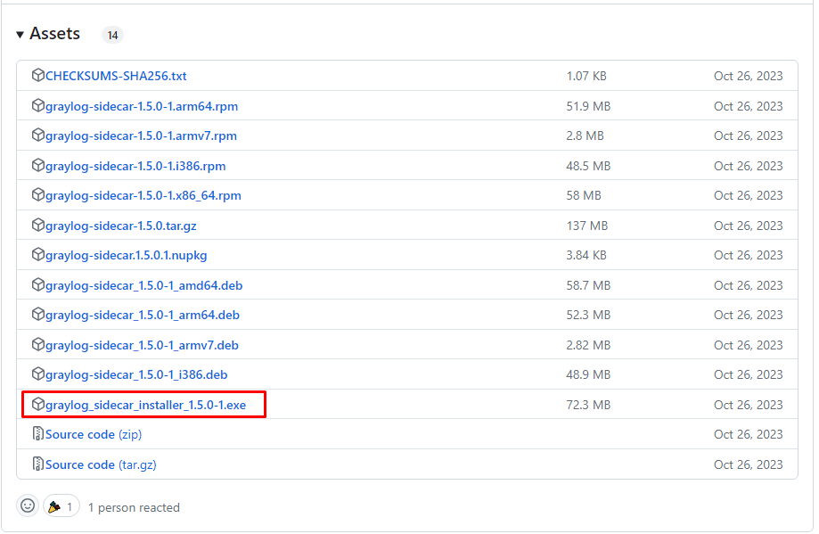
- Cài đặt file 
  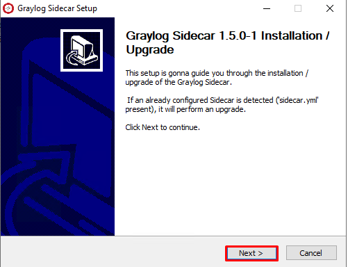
  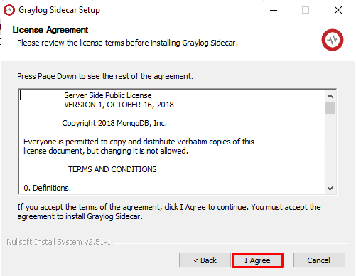
  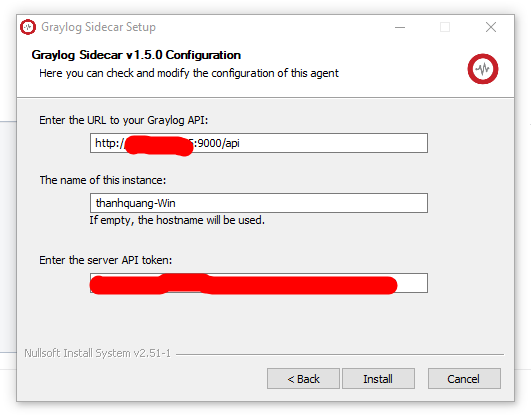
  Lưu ý ta cần khai báo đúng api với url `http://{IP}:9000/api` và token ta đã tạo trước đó

### 2.3 Cấu hình hoàn thiện nhận log trên graylog server
- Sau khi cấu hình xong thì trên giao diện graylog phải hiện ra được như này
  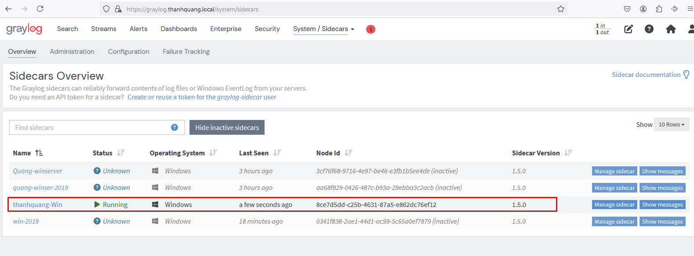
- Tiếp theo ta cần sửa lại cấu hình 
   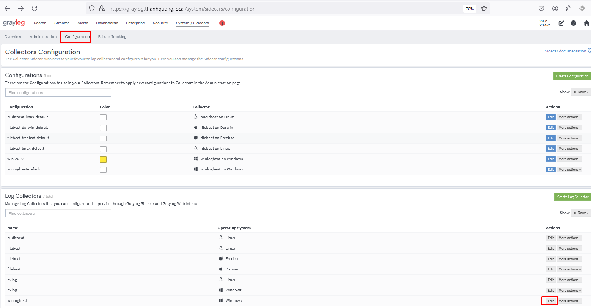
   
- Tiếp theo ta tạo cấu hình mới 
  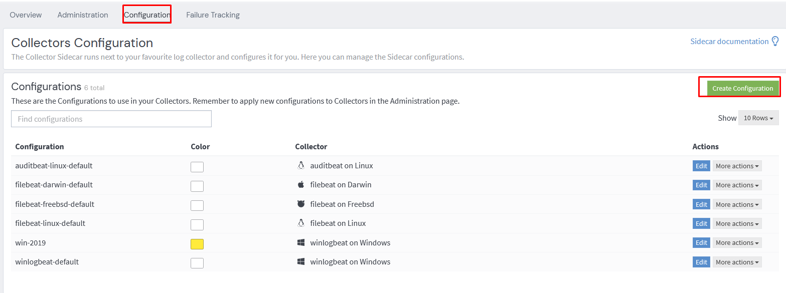
  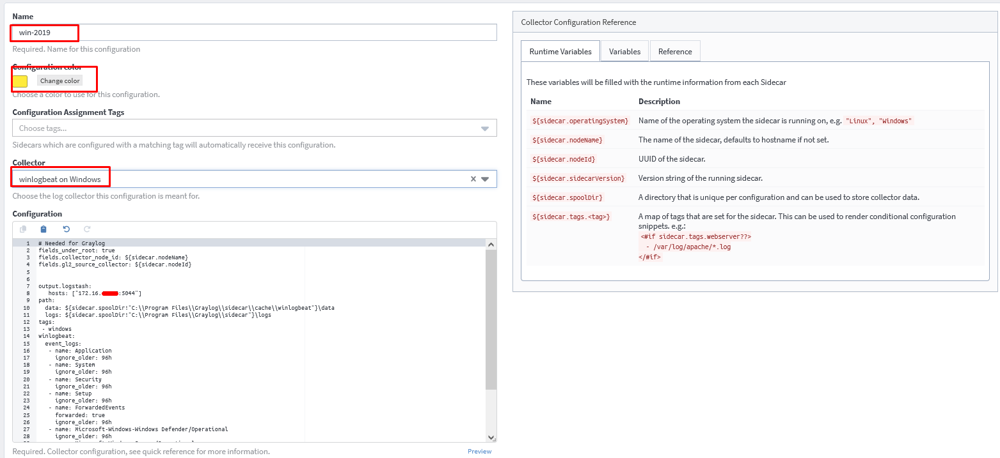
- Áp dụng cấu hình mới vào
  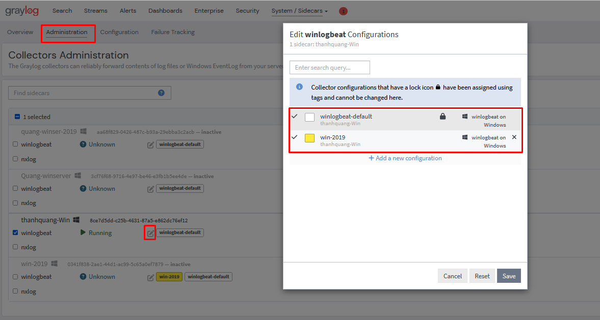
- Như vậy là đã cấu hình xong. Bây giờ ta có thể check xem đã nhận được log chưa
  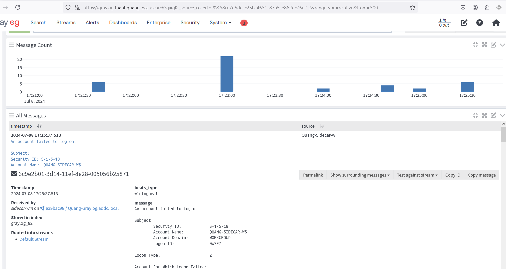
  
# Tài liệu tham khảo
https://news.cloud365.vn/graylog-lab-phan-2-thu-thap-log-cua-linux-thong-qua-graylog-sidecar/

https://go2docs.graylog.org/5-2/getting_in_log_data/install_sidecar_on_windows.htm

https://github.com/Graylog2/collector-sidecar/releases