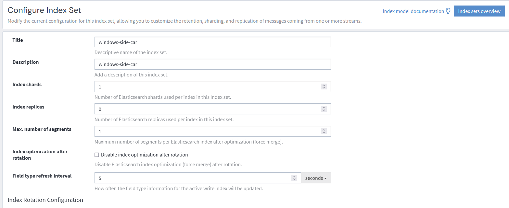
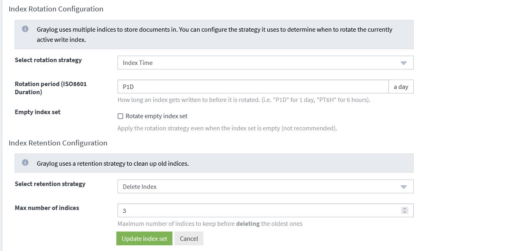
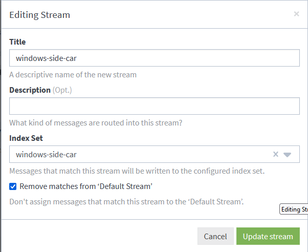
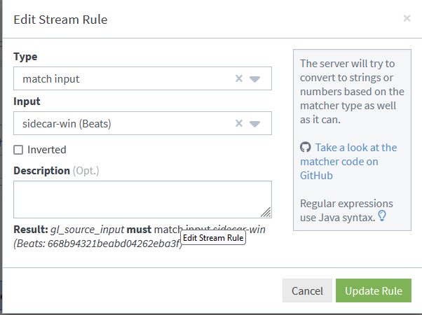
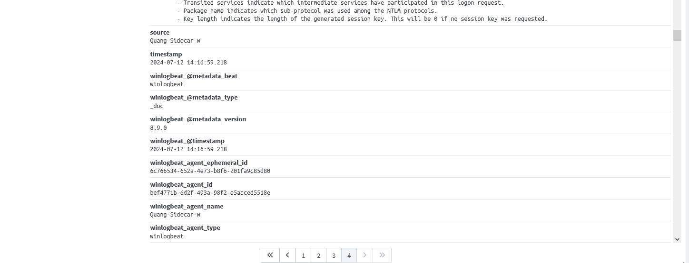
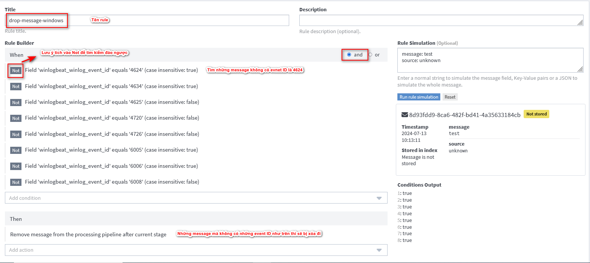
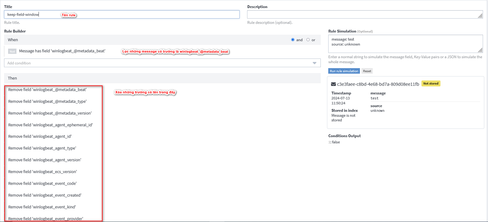
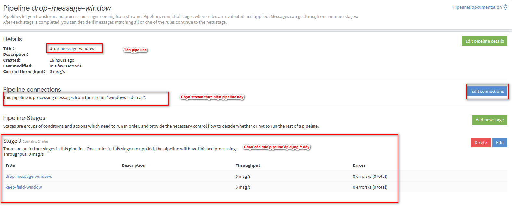
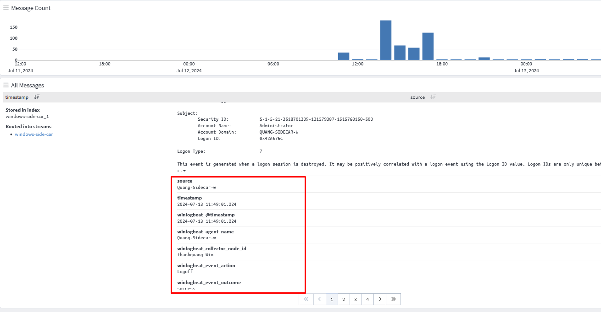
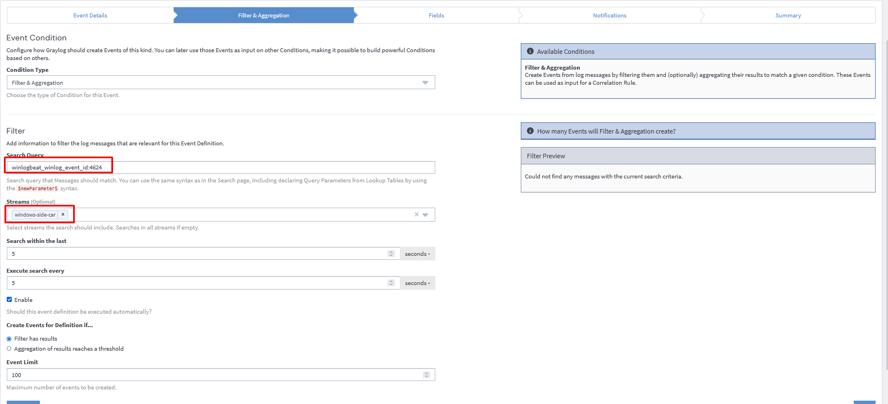

# Cấu hình tối ưu log sidecar cho Windows
## 1. Tạo Index set và Stream
- Tạo index set. Nếu muốn hiểu rõ các bước (tham khảo ở đây)[https://github.com/thanhquang99/thuctap2023/tree/main/thuctap/09-Graylog]
  
  
- Tạo Stream 
  
- Tạo stream rule
  
## 2. Tạo pipe line để lọc ra các log phù hợp
- Mặc định khi chúng ta chưa tạo pipe line thì sidecar cung cấp cho ta rất nhiều trường trong log, ta cần tối ưu lại các trường cho phù hợp
  
- Bây giờ ta cần tạo pipeline rule. Ở đây mình tạo ra 2 rule
  - Rule 1: drop những message không cần thiết
  - Rule 2: remove những fields không sử dụng
### 2.1 Những event quan trọng cần biết
Trên windows để biết log này là của sự kiện gì thì cần phải xác định thông qua event ID. Dưới đây là một số event ID tôi quan tâm:
- 4624 : Sự kiện đăng nhập hệ thống thành công
- 4634 : Sự kiện đăng xuất hệ thống thành công
- 4625 : Sự kiện đăng nhập hệ thống thất bại
- 4720 : Sự kiện tạo User mới
- 4726 : Sự kiện xóa tài khoản 
- 6005 : Khởi động một service 
- 6006 : Tắt một service
- 6008 : Sự kiện tắt máy không đúng cách như là mất điện hoặc lỗi hệ thống
### 2.2 Tạo Pipeline Rule và add vào Pipeline
- Rule 1: Drop message của các log không cần thiết
  
- Rule 2 : 
  
- Tiếp theo tạo pipeline vào add rule vào
  
- Kiểm tra kết quả
  
## 3. Alert logon windows
- Tạo nội dung thông báo
  ```
  ${foreach backlog message}
  ${message.fields.winlogbeat_@timestamp}
  User ${message.fields.winlogbeat_winlog_event_data_TargetUserName} from IP ${message.fields.winlogbeat_winlog_event_data_IpAddress} logon server ${message.fields.winlogbeat_collector_node_id}
  ${end}
  ```
- Tạo điều kiện gửi cảnh báo
  
- Kiểm tra kết quả
  