- [Chuyển cmdlog của máy chủ linux lên graylog server](#chuyển-cmdlog-của-máy-chủ-linux-lên-graylog-server)
  - [1. cmd log là gì?](#1-cmd-log-là-gì)
  - [2. Hướng dẫn đẩy cmdlog lên graylog server](#2-hướng-dẫn-đẩy-cmdlog-lên-graylog-server)
    - [2.1 Cấu hình trên máy log client](#21-cấu-hình-trên-máy-log-client)
    - [2.2 Cấu hình trên graylog server](#22-cấu-hình-trên-graylog-server)
  - [3. Cảnh báo về telegram khi sử dụng các câu lệnh nhạy cảm](#3-cảnh-báo-về-telegram-khi-sử-dụng-các-câu-lệnh-nhạy-cảm)
- [Tài liệu tham khảo](#tài-liệu-tham-khảo)
# Chuyển cmdlog của máy chủ linux lên graylog server
## 1. cmd log là gì?
Cmd log chính là file log ghi lại những câu lệnh mà bạn đã thực hiện trên máy chủ linux

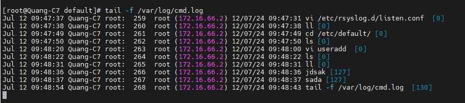

Trong hình những câu lênh thực hiện được và trả lời kết quả là OK thì sẽ có thêm [0] ở cuối còn số khác [0] thì sẽ là các câu lệnh sai hoặc chưa hoàn thành kết quả 

Nếu bạn chưa cài đặt có thể tham khảo script cài đặt ở đây
`https://github.com/thanhquang99/thuctap2023/blob/main/thuctap/03-Linux/03-linuxapplication.md/Rsyslog/11.cmdlog.sh`


## 2. Hướng dẫn đẩy cmdlog lên graylog server
### 2.1 Cấu hình trên máy log client
- Biến local6 dùng để thu thập log cmd nên ta cần chỉnh file cấu hình rsyslog để gửi log đi
  ```
  echo local6.info  @IP-graylog-server:Port
  ```
  ```
  local6.info  @172.16.66.59:1516
  ```
- Restart lại dịch vụ
  ```
  systemctl restart rsyslog
  ```
### 2.2 Cấu hình trên graylog server
- Việc đầu tiên ta cần phải mở port 1516
  ```
  ufw allow 1516/udp
  ```
- Tiếp theo ta cần thêm input mới trên giao diện graylog, nhớ chọn input là syslog UPD nhé
  
- Kiểm tra kết quả
  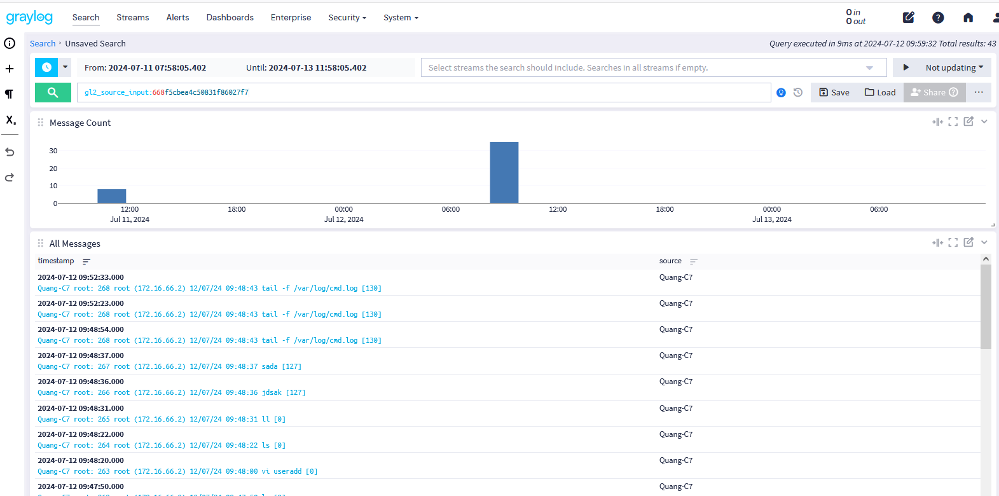
## 3. Cảnh báo về telegram khi sử dụng các câu lệnh nhạy cảm
- Tạo index-set để lưu trữ log của cmd-log
  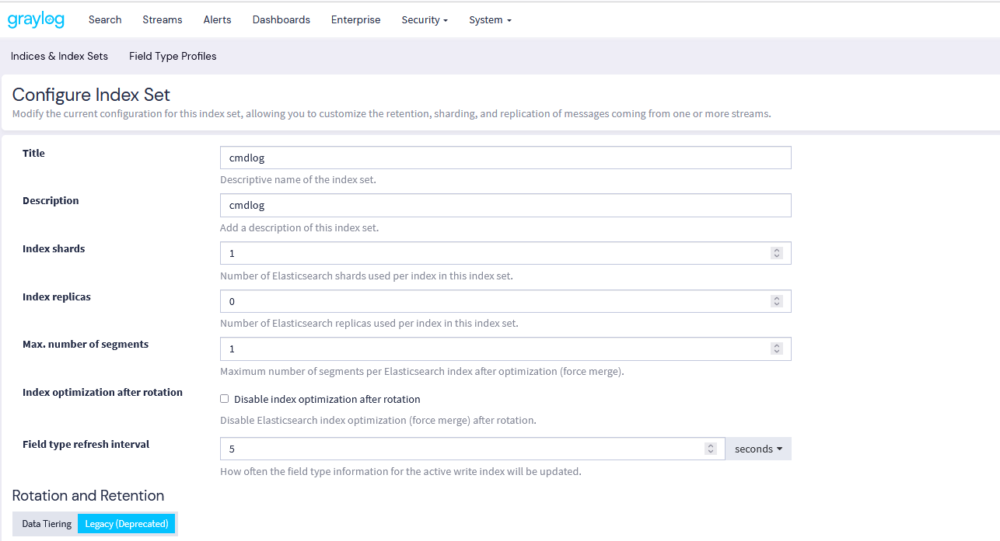
  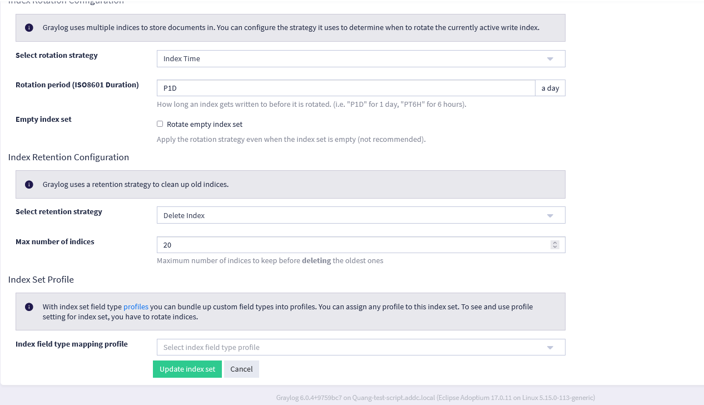
- Tạo stream cho cmdlog
  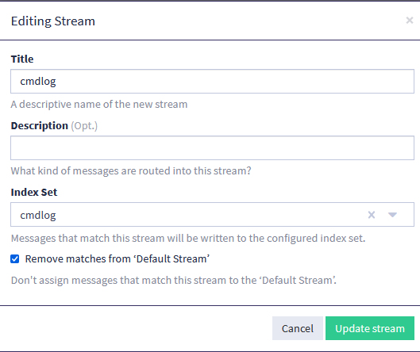
- Tạo rule cho stream
  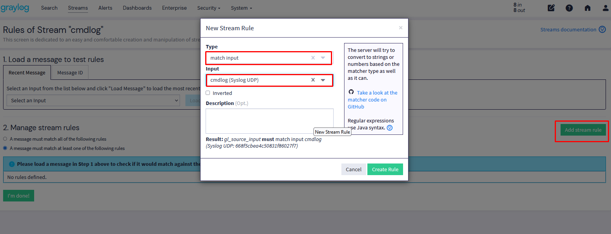
- Tiếp theo ta tạo 1 grok pattern cho cmdlog
  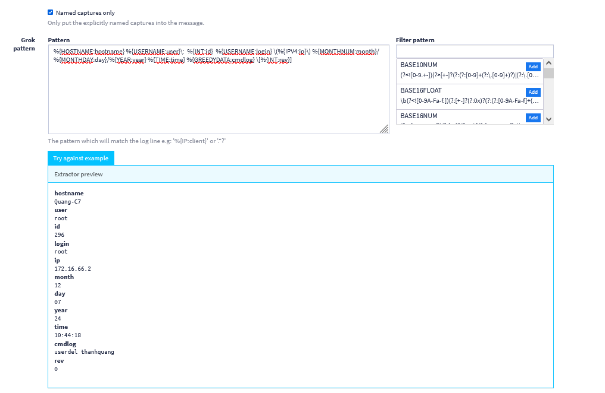
  ```
  %{HOSTNAME:hostname} %{USERNAME:user}\:  %{INT:id}  %{USERNAME:login} \(%{IPV4:ip}\) %{MONTHNUM:month}/%{MONTHDAY:day}/%{YEAR:year} %{TIME:time} %{GREEDYDATA:cmdlog} \[%{INT:rev}]
  ```
- Tiếp theo ta tạo nội dung cảnh báo về telegram
   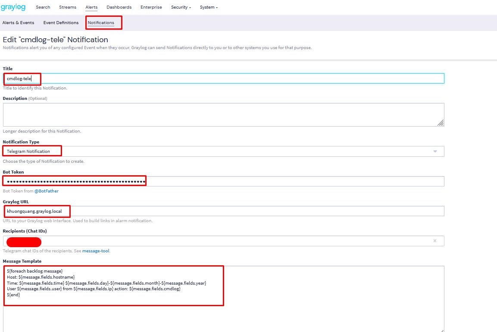
   ```
   ${foreach backlog message}
   Host: ${message.fields.hostname}
   Time: ${message.fields.time} ${message.fields.day}-${message.fields.month}-${message.fields.year}
   User ${message.fields.user} from ${message.fields.ip} action: ${message.fields.cmdlog}[${message.fields.rev}]
   ${end}
   ```
- Tiếp theo tạo điều kiện cảnh báo
  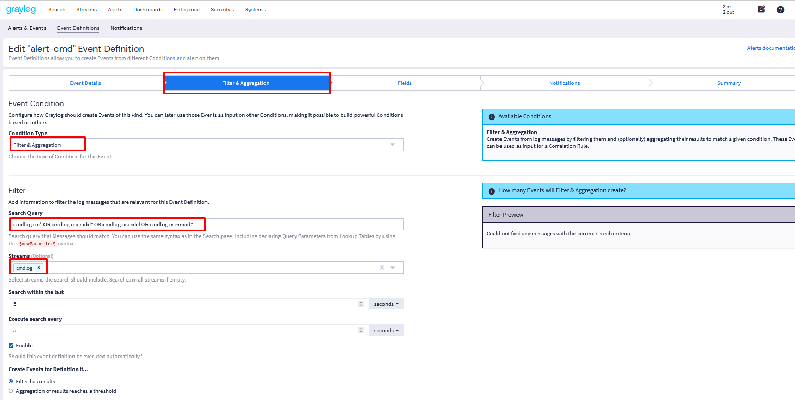
  
  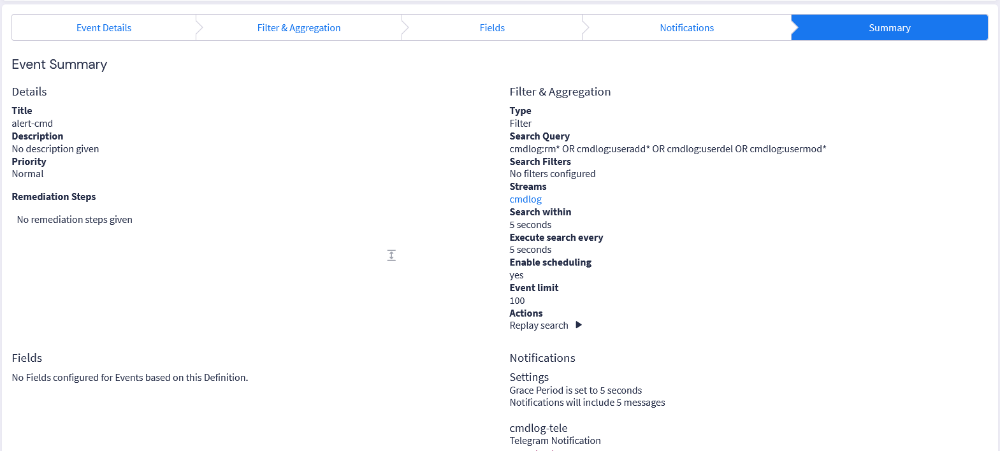
  ```
  cmdlog:rm* OR cmdlog:useradd* OR cmdlog:adduser* OR cmdlog:userdel* OR cmdlog:deluser* cmdlog:usermod*
  ```
- Kiểm tra kết quả
  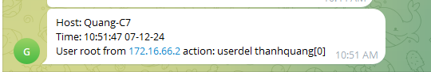
# Tài liệu tham khảo
https://go2docs.graylog.org/5-2/making_sense_of_your_log_data/writing_search_queries.html?TocPath=Searching%20Your%20Log%20Data%7C_____1